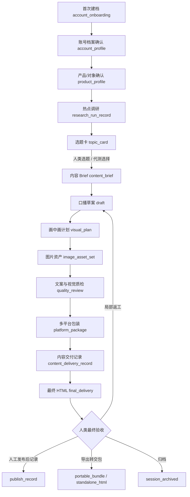
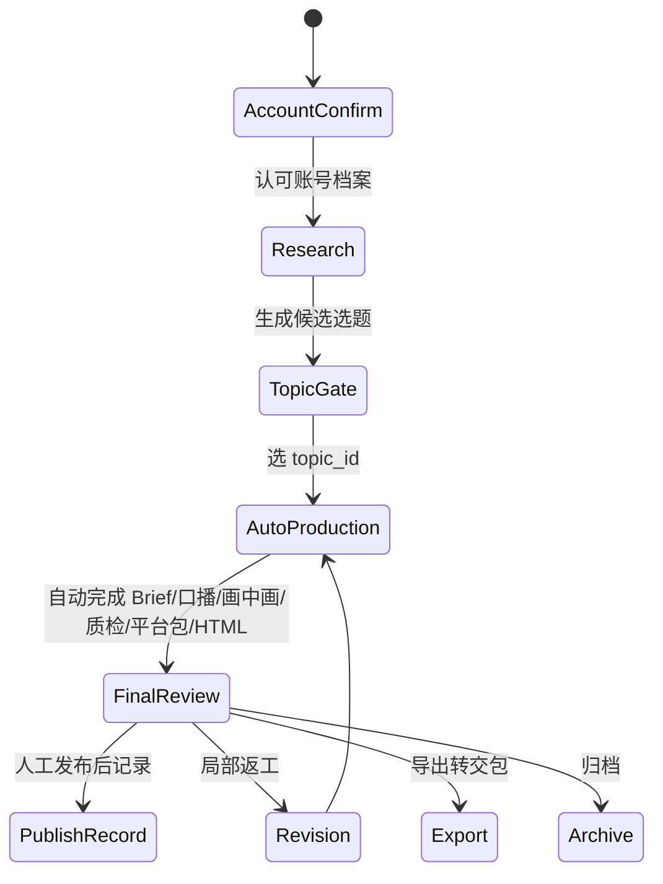
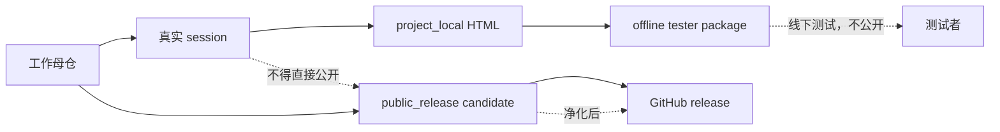

# 业务状态流转图

> 状态：active  
> 主责：给人和 AI 快速理解涛哥创作工作流如何从账号档案走到最终交付、转交包和开源包。  
> 交互版：`workflow-business-state-flow.html`

## 1. 内容生产主链路



## 2. 人类停顿点



## 3. 工程状态与包边界



## 4. 一句话解释

```text
涛哥创作工作流不是自动发布工具，而是一套“账号档案 -> 热点选题 -> 文案 -> 图片资产 -> 质检 -> 平台包装 -> HTML 交付 -> 可转交包 / 开源样例”的内容生产与资产治理 workflow。
```
