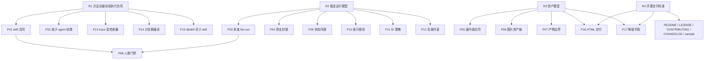

# GitHub 开源上线前 Workflow 修复路线图

> 状态：r1_r4_issue_localization_active
> 目标：把本项目从“agent 扶着能跑通”推进到“陌生用户下载后，人能读懂、AI 能按合同跑、维护者能接手”。
> 边界：本文件只做产品开发拆解和修复排序；不改业务代码、不接外部 API、不登录平台、不发版。

<!-- ai-nav:start -->
## AI 阅读导航

- 了解原始问题和优先级：读第 1-7 节。
- 查历史批次：在第 8 节按批次号搜索，不要顺序全文读取。
- 当前 P0 结果：搜索 `8.15.23 P0-H6A-D`。
- 最新防复发产品合同：搜索 `8.15.24 P0-H6E`，再转 [R3 产品确认清单](./R3-产品确认清单.md)。
- 当前最终交付产品返修：搜索 `8.15.26 P0-H7`；该节是 H6 HTML 业务审计后的现行待确认入口。
- 当前 Windows 环境产品返修：先搜索 `8.15.27 R4-WIN` 看合同，再搜索 `8.15.28 R4-WIN-H1` 至 `8.15.33 R4-WIN-H6` 看基础闭环；扩展环境与远端证据看 `8.15.34 R4-WIN-H7`。
- 当前项目状态以 [STATUS](../../STATUS.md) 和 [current-state](../../state/current-state.yaml) 为准，本路线图历史章节不覆盖状态真源。
<!-- ai-nav:end -->

---

## 1. 产品开发任务卡

```text
产品目标：GitHub 开源上线前的 workflow 稳定化。
核心用户：创作者 / 运营者 / 下载 skill 的 AI 使用者 / 后续维护者。
核心场景：一个用户管理多个账号，每个账号能独立完成选题、Brief、文案、画中画、质检、平台包装和最终交付。
成功标准：用户不需要理解内部全部方法论，也能按引导完成内容；AI 不需要靠临场发挥，也能按交接物继续执行；产物目录不串账号、不串 session。
当前阶段：R1-R4 产品定义和规则 / skill 编译已闭合，综合 dry-run 已完成并定位问题；当前进入 checker / validator 产品开发与编译前修复。
```

本轮产品判断采用四个优先级：

| 等级 | 含义 |
|---|---|
| P0 | 开源上线前必须解决，否则别人下载后很容易跑偏 |
| P1 | 开源 alpha 必须收敛，否则只能内部试用 |
| P2 | beta 阶段增强，可先用规则和人工验收兜底 |
| P3 | 1.0 后增强，不阻塞首个开源版本 |

---

## 2. 成熟 Workflow 解法参考

这些参考不表示本项目要重写成同类系统，而是用来校准“成熟 workflow 通常怎么避免断链”。

| 成熟做法 | 参考系统 | 对本项目的启发 |
|---|---|---|
| Workflow Definition / 确定性执行 | Temporal Workflow Definition | skill 不能只是方法论文章，必须有固定输入、固定输出、固定停顿点和可恢复状态 |
| Child Workflow / 分支隔离 | Temporal Child Workflows | 用户选择 3 个选题时，应 fan-out 成 3 条独立内容链路，而不是混在同一条链里 |
| Side Effect / 外部副作用记录 | Temporal Side Effects | 出图、联网调研、人工确认这类不可重复动作要记录状态和来源，不能只写在正文里 |
| Dynamic Task Mapping | Apache Airflow | 多选题、多平台包装、多个图片资产，都应声明动态任务集合和 fan-in 汇总规则 |
| Task Runner / 并发执行状态 | Prefect | 并行任务必须有独立状态和错误收口，不应靠 agent 临时判断“做完没” |
| Software-defined Assets | Dagster | HTML、图片、发布物料、manifest 都应该是可追溯资产，不只是散落文件 |
| Persistence / Interrupts | LangGraph | 账号确认、选题确认、最终采用是人类中断点；其他步骤应自动推进并可恢复 |
| dbskill 式编译 | dbskill 方法论 | 讨论稿应编译成小 skill：触发词、边界、输入、输出、下一步，而不是让 agent 每次重读大段理念 |
| Repository Health | GitHub Docs / OpenSSF | 开源不仅是上传文件，还要有 README、License、贡献指南、示例、变更记录、安全边界和可复现样例 |

调研来源：

- Temporal Workflow Definition：https://docs.temporal.io/workflow-definition
- Apache Airflow Dynamic Task Mapping：https://airflow.apache.org/docs/apache-airflow/stable/authoring-and-scheduling/dynamic-task-mapping.html
- Prefect Task Runners：https://docs.prefect.io/v3/concepts/task-runners
- Dagster Assets：https://docs.dagster.io/guides/build/assets
- LangGraph Persistence / Interrupts：https://docs.langchain.com/oss/python/langgraph/persistence
- GitHub 开源仓库健康文档：https://docs.github.com/en/communities/setting-up-your-project-for-healthy-contributions
- OpenSSF Scorecard：https://securityscorecards.dev/

---

## 3. 父问题

17 个问题不是平级的。当前最大的工程问题有四个父问题：

| 父问题 | 说明 | 覆盖问题 |
|---|---|---|
| R1：方法论没有编译成执行合同 | skill 还像“说明书”，不是“可执行契约” | P01、P02、P13、P14、P15，并间接影响 P05、P08、P16 |
| R2：没有稳定运行模型 | 多选、旁支、状态、编号、索引没有统一编排 | P03、P04、P09、P10、P11、P12 |
| R3：资产模型不足 | 画中画、图片、最终 HTML、外部模型降级没有形成资产链 | P05、P06、P07、P16、P17 |
| R4：开源交付标准不足 | 项目能内部跑，但还不是下载即懂、可贡献、可维护的开源包 | P01、P07、P13、P16、P17 |

因此修复时不要从单点补丁开始，先修父问题。父问题修好后，部分子问题会自然消失或变成校验项。

### 3.1 推进节奏

本项目不采用“17 个问题全部产品化后再编译”，也不采用“破一个小问题就立刻编译一个 skill”。

统一采用：

```text
按 R1-R4 父问题成组推进
-> 产品定义
-> 涛哥确认
-> skill 编译 / 规则编译
-> sample run 验证
-> 再进入下一组
```

原因：

| 方案 | 问题 |
|---|---|
| 17 个问题全部做完再编译 | 周期太长，缺少真实执行反馈，容易写出漂亮但跑不动的规范 |
| 破一个问题就编译一个 | 父子依赖未稳定，容易反复返工，例如 P01 会被 P13 / P14 / P15 / P08 反复影响 |
| 按 R1-R4 成组推进 | 每组有闭环，能确认、编译、验证，也能避免单点补丁污染后续设计 |

因此：

```text
R1 完成并确认后，才进入第一轮 skill 编译。
R2 完成并确认后，再进入运行模型和分支规则编译。
R3 完成并确认后，再进入视觉资产和最终交付规则编译。
R4 完成并确认后，再进入 GitHub 开源上线包整理。
```

### 3.2 SAMPLE-HISTORICAL-005 后的节奏修订

SAMPLE-HISTORICAL-005 证明：R1 单篇主链路能跑通，但只完成 R1 后立刻跑完整真实测试，容易产生“表面跑通、实际靠 agent 扶着补齐”的假阳性。

因此路线修订为：

```text
R1-R4 产品定义
-> R1-R4 skill / 规则编译
-> 静态合同检查
-> 小样本 dry run
-> 完整真实测试
```

这次样本保留为问题样本，不再作为“完整测试通过”的证据。它只证明：

```text
R1 主链路产品方向成立。
R1 编译存在缩水和漏检。
R2-R4 未完成时，完整测试会过早暴露跨组问题。
```

后续判断口径：

| 测试类型 | 前置条件 | 作用 |
|---|---|---|
| R1 sample run | R1 产品确认 + R1 skill 编译完成 | 验证单篇主链路、自动推进、trace 和 HTML 是否闭合 |
| R1 返修样本 | R1 编译后暴露产品 / 编译缺口 | 只验证 R1 修复项，不扩展到多篇、导出包或外部模型 |
| 小样本 dry run | R1-R4 产品定义和编译均完成 | 验证全链路静态合同是否能运行 |
| 完整真实测试 | 小样本通过，且无 P0 阻断 | 用真实账号、真实热点、真实图片和 HTML 做开源前验收 |

也就是说：

```text
R1 通过，不等于可以跑完整真实测试。
R1-R4 编译闭合，才是完整真实测试的前置条件。
```

### 3.3 成熟项目对本轮问题的借鉴

本轮补充调研后，成熟 workflow 对“断流、日志、恢复、人工门禁”的共性做法如下：

| 成熟做法 | 参考项目 | 对本项目的吸收 |
|---|---|---|
| Event History | Temporal | 关键动作、外部副作用和结果必须形成事件历史；断流后先读历史，不盲目重跑 |
| Task as Transaction | Airflow | 每个阶段应避免产出半成品；能重跑的步骤必须有幂等边界 |
| Checkpointer + Interrupt | LangGraph | 人类门禁必须保存状态，用户回来后从同一状态恢复 |
| Flow State + Logs | Prefect | 运行状态和日志要能被单独查看，不能只藏在最终正文里 |

本项目的取舍：

```text
R1：只要求 manifest + execution_trace + current_artifact 能支持 AI / 人工恢复判断。
R2：再做真正的 checkpoint、resume_from、stage 状态、幂等、run lock 和 branch lock。
R3：把图片生成这类外部副作用做成资产状态和重试 / 降级。
R4：把日志样例、恢复说明、validator / checker 放进开源包。
```

因此 R1 不能声称具备“脚本级断点续跑”；R1 只能声称“单篇链路有恢复证据”。如果 R1 文档或测试报告把它说成可脚本级恢复，必须判为测试范围误报。

---

## 3.4 成熟度口径

本路线图采用 `docs/reference/skill执行透明度与成熟度规范.md` 的成熟度等级。

当前 P01 合同草案成熟度判断：

```text
当前成熟度：L2.5
目标成熟度：R1 完成后达到 L3 可发布候选
```

为什么当前不是 L3：

```text
已经有输入、输出、前置条件、路径、人类门禁、自动推进、失败处理和验收样例。
但还没有 validator / scorecard。
还没有把讨论稿到 skill 的编译规则固定下来。
还没有 skill 粒度标准和废弃入口策略。
还没有 sample run 验证合同能被另一个 agent 稳定执行。
```

参考成熟 workflow 的取舍：

| 成熟系统做法 | 本项目吸收 | 本阶段不做 |
|---|---|---|
| Temporal 的 workflow definition 和确定性执行 | 固定输入、输出、状态、失败处理 | 不引入真正 workflow engine |
| Airflow 的 dynamic task mapping | 后续 R2 做 fan-out / fan-in | P01 阶段不解决多选并行 |
| Prefect 的 task runner 和状态 | 后续 R2 做运行状态收口 | 不做并发执行器 |
| Dagster 的 software-defined assets | 后续 R3 做图片和 HTML 资产链 | P01 不做 asset materialization 检查 |
| LangGraph 的 interrupts / persistence | 固化人类门禁和恢复点 | 暂不实现持久化执行图 |

取舍逻辑：

```text
本项目是轻量 skill / 内容 workflow，不是服务端编排平台。
开源 alpha 的目标是“人和 AI 能按合同跑通”，不是“具备企业级 workflow runtime”。
因此先用文档合同 + sample run + validator 清单达到 L3，再决定是否需要脚本化检查或更重的 runtime。
```

---

## 4. 17 个问题逐项拆解

| ID | 当前现象 | 成熟解法 | 本项目应做到的程度 | 父问题 | 修复产物 | 验收标准 | 优先级 |
|---|---|---|---|---|---|---|---|
| P01 | skill 不是执行合同 | Workflow Definition | 每个 skill 有输入、输出、前置条件、停顿点、失败处理、下一步 | R1 | `skill_contract` 模板 | 新 agent 不问隐藏上下文也能继续 | P0 |
| P02 | 依赖 agent 扶着跑 | Deterministic workflow + validator | agent 可协助表达，但关键流转由规则判断 | R1 | 执行透明度记录 + validator 清单 | 每轮标出 skill 独立完成比例 | P0 |
| P03 | 多选题会把后续流程跑废 | Dynamic Task Mapping / Child Workflow | 多个选题必须拆成多个 content_run_id | R2 | fan-out / fan-in 规则 | “三篇都做”不会混成一篇 | P0 |
| P04 | 旁支任务没有封锁 | State Machine | 产品设计、开源路线、内容生产互不污染 | R2 | branch_lock 规则 | 旁支只改允许文件，不影响生产 session | P0 |
| P05 | 画中画逻辑没有按讨论稿执行 | Asset contract | 每篇内容有明确图片数量、用途、插入段落、生成状态 | R3 | `visual_asset_plan` 合同 | 不是看心情出图 | P0 |
| P06 | 图片资产链路不健壮 | Asset lineage | 图片、提示词、模型、状态、下载路径分开记录 | R3 | image asset manifest | HTML 可下载，MD 可追溯 | P1 |
| P07 | 中间产物和最终产物边界混乱 | Asset materialization | 最终给人 HTML，中间给 AI / 追溯 MD | R3/R4 | deliverables 规则 | 人类验收入口不是一堆 MD | P0 |
| P08 | 人类门禁不合理 | Interrupts | 只在账号确认、选题确认、最终采用停；其他自动到底 | R1/R2 | human_gate 表 | 不再让用户说“继续写口播” | P0 |
| P09 | 状态同步残留旧说法 | Persistent state | `STATUS`、manifest、运行记录同源更新 | R2 | 状态字段规则 | current_stage 不再和真实产物冲突 | P1 |
| P10 | 根目录汇总表靠手工写 | Asset index | 根汇总只做索引，session manifest 才是事实源 | R2 | index 更新规则 | 人看索引，AI 追 manifest | P1 |
| P11 | ID 编号有撞车风险 | Run ID / content ID policy | session、topic、content、asset 分层编号 | R2 | ID 命名规范 | 多账号、多篇并行不撞号 | P0 |
| P12 | 目录治理无自动约束 | Repository structure check | 账号 / session / intermediate / deliverables 强约束 | R2/R4 | 目录验收清单 | 根目录不再散落新旧产物 | P1 |
| P13 | Execution trace 只是记录不是检查器 | Validator / Scorecard | trace 要能判定缺字段、断链、人工扶跑 | R1/R4 | validator 设计 | 失败能指出哪一步不合格 | P0 |
| P14 | 讨论稿没有充分编译成 skill | Skill compiler | 方法论必须进入 skill、字段词典或合同模板 | R1 | skill 编译流程 | 讨论稿不再停留在解释文档 | P0 |
| P15 | dbskill 式编译不足 | Small composable skills | 每个 skill 小而清楚，有触发、边界、下一步 | R1 | skill 粒度标准 | AI 不会读晕，也不靠全文检索猜 | P0 |
| P16 | 最终交付不够产品化 | Human-readable delivery | 每篇交付一个 HTML：选题、文案、图片、平台包、追溯链接 | R3/R4 | final HTML 模板 | 用户可复制文字、下载图片、追溯 MD | P0 |
| P17 | 降级策略只是说明不是链路 | Fallback provider contract | 暂不实现 API，但要保留外部模型入参兼容字段 | R3/R4 | fallback 字段设计 | Codex / Seedream 未来可接同一资产合同 | P2 |

---

## 4.1 SAMPLE-HISTORICAL-005 问题归属

本次测试后，问题必须按 R1 / R2 / R3 / R4 拆分，不把所有缺陷都压回 R1。

### 归属 R1 的问题

R1 只负责“单账号、单选题、单篇内容，从选题确认后自动跑到最终 HTML”的执行合同闭合。以下问题属于 R1：

| 问题 | 类型 | 修订方向 |
|---|---|---|
| 选题确认后自动到底 | R1 产品 / 编译共同问题 | 继续保持：选题后不要求用户说继续 |
| account_profile / product_profile 前置 | R1 产品问题 | 保持为 R1 门禁，不下放到 R2 |
| research_run_id 贯穿 | R1 产品问题 | 继续作为 R1 BLOCKER |
| 单 session 单篇内容 | R1 产品问题 | R1 只允许单篇；多篇进入 R2 branch_request |
| 最终交付不得只有 Markdown | R1 产品问题 | R1 必须至少有 project_local HTML |
| execution_trace 区分 skill / agent / user / environment | R1 产品问题 | R1 必须记录执行来源 |
| trace 自洽性冲突 | R1 产品 + 编译问题 | R1CHK 必须能发现“使用 imagegen / 未使用 imagegen”这类矛盾 |
| visual_plan prompt 缩水 | R1 skill 编译问题 | 现有 talking-head-image-pip 规则已足够，编译时必须完整落盘 |
| quality_review 没拦住缩水画中画 | R1 skill 编译问题 | 质检必须按画中画验收清单判定，而不是只看“有图” |

### 归属 R2 的问题

| 问题 | 归属原因 |
|---|---|
| 任务太长导致 stream disconnected | 运行模型韧性，不是单篇合同本身 |
| 断流后如何恢复 | 需要 checkpoint / resume 协议 |
| 每个阶段是否可重复执行 | 需要阶段提交和幂等规则 |
| 用户说“三篇都做”如何处理 | 多分支 fan-out / fan-in，不塞回 R1 |
| 已完成阶段不重跑 | R2 运行状态模型 |

### 归属 R3 的问题

| 问题 | 归属原因 |
|---|---|
| 一篇到底几张画中画 | 图片数量和用途属于资产合同 |
| 图片失败怎么办 | pending_external / generation_failed / manual_required 属于图片资产链 |
| Seedream 4.0 / 5.0 兼容 | 外部模型旁路，不属于 R1 |
| 图片实际质量验收 | R3 要把“像素材库”变成可检查标准 |
| 图片和 HTML 下载关系 | 图片资产归 R3，交付形态和 R4 交界 |
| 图片全是内容语言 | R3 缺少静态视觉编导层，不能从文案句意直接跳 prompt |
| 只有封面标题，没有封面设计 | 封面属于静态图片资产和平台包装交界，应由 R3/R4 定义 cover_design_package |
| 质量层偏“有无检查” | R3 缺少 static_visual_quality_gate、cover_quality_gate、asset_trace_quality_gate；发布后反馈回流暂列 backlog |
| 图片类型和环境路径混在一起 | R3 需要先区分 picture_in_picture_image / cover_image，再区分 codex_image2_render / seedream_prompt_delivery |
| 画中画文字与字幕混在一起 | R3 需要拆分 narration / subtitle / visual text 三轨，并把视觉文字编成独立决策对象 |
| 用原始信息密度替代视觉质量 | R3 需要按有效信息增量、认知负荷和扫读理解验收，防止堆字堆元素 |
| 生成情境图冒充证据 | R3 需要 evidence source binding，模型生成图只能承担场景、隐喻或情绪 |
| 封面变体只换标题 | R3 需要记录实质视觉差异，并核对设计合同、实际渲染和平台预览 |

### 归属 R4 的问题

| 问题 | 归属原因 |
|---|---|
| GitHub 开源包怎么摆 | 开源交付工程 |
| 真实账号资料脱敏 | 开源净化 |
| sample-run 怎么给别人看 | 示例工程 |
| HTML 离开本地目录后链接可用 | portable_bundle / standalone_html |
| skill 合集和方法论如何索引 | 开源读者和外部 AI 可读性 |

R1 返修时只处理 R1 内的问题。R2-R4 的问题进入对应阶段，避免 R1 膨胀到无法完成。

---

## 5. 修复排序

### Phase 0：开源基线确认

目标是让项目先具备 GitHub 开源的最低产品边界。

```text
0.1 明确开源定位：这是内容 workflow / skill 包，不是 SaaS 后台。
0.2 明确不随仓库提交的内容：真实客户数据、平台账号、API key、未授权素材。
0.3 预留 README、LICENSE、CONTRIBUTING、CHANGELOG、SECURITY、示例目录。
0.4 设计 sample account / sample run，避免开源样例暴露真实账号隐私。
```

建议优先级：P0。
原因：目标是 GitHub 开源上线，仓库健康度是产品的一部分。

### Phase 1：R1 Skill 执行合同组

先修 R1，再修它下面的子问题。

```text
1.1 建 `skill_contract` 模板。
1.2 把讨论稿编译规则写清楚：哪些内容进 skill，哪些进字段词典，哪些留 explanation。
1.3 给每个 skill 增加前置条件、输出合同、自动下一步和人类停顿点。
1.4 把 execution trace 升级为可检查清单。
```

覆盖：P01、P02、P13、P14、P15。
父问题修复后，P02 会明显下降，因为 agent 不再需要靠临场判断扶跑。

R1 的确认门：

```text
P01：核心 skill 有 CONTRACT.md。
P14：讨论稿 / 方法论进入 skill、字段词典、合同或 explanation 的编译规则明确。
P15：skill 粒度标准明确，兼容入口和废弃入口有处理口径。
P13：execution trace 至少能作为可执行检查清单，后续可升级为 validator。
P08：人类门禁和自动推进规则进入合同，不再靠临场引导。
内容创作质量：Hook 路由、正文信息密度、共鸣与兑现进入 draft / review 合同。
```

只有 R1 整组确认后，才进入第一轮 `skills/*/SKILL.md` 编译。

R1 补充产品定义：

```text
docs/product/内容创作质量方法论编译补充-R1.md
docs/product/R1-P14-方法论编译规则.md
docs/product/R1-P15-skill粒度与入口治理规则.md
docs/product/R1-P13-execution-trace检查清单与validator草案.md
docs/product/R1-P02-agent扶跑收敛与可编译判定.md
docs/product/R1-skill执行合同组可编译总验收.md
docs/product/R1-合同版本与变更治理.md
docs/product/R1-字段级输入输出矩阵.md
docs/product/R1-人类门禁决策枚举与恢复规则.md
docs/product/R1-trace-check注册表.md
docs/product/R1-产品确认清单.md
```

### Phase 2：R2 运行模型与分支封锁

再修 R2，解决“三篇都做”和旁支污染。

```text
2.1 定义 session_id、content_run_id、topic_id、asset_id 的层级关系。
2.2 定义 fan-out：一个选题确认可以生成一条内容链，多选必须生成多条独立内容链。
2.3 定义 fan-in：多篇完成后只汇总索引，不合并正文。
2.4 定义 branch_lock：产品设计任务不能改生产 session；内容生产任务不能改产品路线图。
2.5 定义状态同源：manifest 是事实源，根索引只引用。
2.6 定义 parent / child 生命周期和 parent close policy。
2.7 定义 state_transition、checkpoint、human interrupt payload 和 branch ledger。
2.8 定义 R2 操作合同：每个动作有输入、输出、状态变化、失败处理和恢复提示。
```

覆盖：P03、P04、P09、P10、P11、P12。
父问题修复后，P10、P11、P12 会从“结构性风险”降为“校验项”。

R2 产品真源：

```text
docs/product/R2-产品总览.md
docs/product/R2-运行模型与分支封锁规则.md
docs/product/R2-产品确认清单.md
```

R2 确认门：

```text
R2-C01：确认 R2 只解决运行模型，不解决 R3/R4。
R2-C02：确认多选题必须 fan-out 成多个 child session。
R2-C03：确认 fan-in 只汇总索引，不合并正文。
R2-C04：确认 product_development / content_production / workflow_governance / opensource_preparation / status_recovery 有 branch_lock。
R2-C05：确认 manifest 是事实源，根索引只引用。
R2-C06：确认恢复字段进入 manifest 产品定义，但不实现自动 resume runner。
R2-C07：确认幂等口径明确，重跑不默认覆盖已确认产物。
R2-C08：确认轻量 run_lock 字段用于避免同一 session 被不同任务同时改写。
R2-C09：确认 ID 层级防止多篇串台。
R2-C10：确认索引冲突时以 session manifest 修正账号 index、all_runs 和根目录汇总。
R2-C11：确认 R2 不做自动发布、平台登录、外部 API、并发调度器。
R2-C12：确认 R2 经涛哥确认后，才允许进入 skill / reference 编译。
R2-C13：确认父 session 完成、归档、取消、失败时 child session 的默认处理。
R2-C14：确认 run / stage / branch 状态变化必须追加 state_transition。
R2-C15：确认断流、人类停顿、阶段完成时用 checkpoint 支持恢复证据。
R2-C16：确认用户自然语言必须转成 human_interrupt / human_decision_payload。
R2-C17：确认 branch-request-ledger.md 以追加式记录分支过程。
R2-C18：确认 R2 关键动作都有输入、输出、状态变化、失败处理和恢复提示。
R2-C19：确认接续恢复必须按固定顺序读状态、manifest、checkpoint、台账和实际产物。
R2-C20：确认 R2 编译后只做 static check / dry-run / sample run，不做完整真实测试。
```

### Phase 3：R3 画中画与图片资产模型

修 R3 的核心部分。

```text
3.1 明确每篇内容默认需要几张画中画，以及触发增加 / 减少的规则。
3.2 每张图必须有用途、插入段落、提示词、provider、生成记录、状态、文件路径。
3.3 区分 visual_plan、image_prompt_set、image_generation_record、image_asset_set、image_quality_gate、html_embed_manifest。
3.4 generated 图片必须有 metadata_sidecar；pending / failed / manual 图片必须有生成记录或人工任务说明。
3.5 暂不实现 Seedream API，但保留 provider、input_schema、fallback_note。
3.6 图片资产不可覆盖，重做必须生成新 asset；样本模式先验证最小资产链，再进入多篇 / 多图批量。
3.7 增加 static_visual_director_plan：只做静态图片编导，不做视频生成 / 剪辑 / 动态 storyboard。
3.8 增加 cover_design_package：封面标题、封面图来源、版式、安全区、平台差异和封面质检分开。
3.9 后续 skill 编译优先拆出 static-visual-director、image-prompt-compiler、image-asset-producer、cover-design-compiler 的职责边界；image-asset-producer 统一环境判断、画中画叠字、生成记录和资产落盘。
3.10 增加 static_visual_quality_gate、asset_trace_quality_gate 和 cover_variant_set；post_publish_feedback_gate / 发布后数据回流暂不开发，进入 backlog。
3.11 增加 image_asset_type 和 image_production_path：画中画图片 / 封面图片分开，Codex 直接出图 / 非 Codex Seedream 入参交付分开。
3.12 增加 cover_composition：把封面创意底图和可上传成品封面分开，避免“有封面图”掩盖“没有完成叠字、版式和裁切”。
3.13 统一 cover_text_render_strategy：生成模型负责视觉创意，deterministic overlay 默认负责逐字准确和小屏可读；模型含字失败可降级。
3.14 增加 cover_asset_role 和 platform_cover_strategy：底图、成品图、平台变体仍归 image_asset_set，平台按复用 / 裁切 / 改标题 / 独立合成决策。
3.15 最终 HTML 按平台展示成品封面、下载、封面标题 / 视频标题、适配理由和 prompt_only 降级；底图不得冒充成品。
3.16 新增 cover-design-compiler 所有权：platform-packaging-adapter 负责标题与平台策略，cover-design-compiler 负责封面设计合同与成品合成，quality-review 做封面专项复检，final-delivery-builder 只展示和导出。
3.17 增加 visual_text_plan：把口播、字幕和视觉文字拆成三条信息轨，视觉文字不得机械复写字幕。
3.18 visual_plan.accepted_visual_tasks[] 与 visual_text_plan.visual_text_tasks[] 一一对应；每张图片增加 visual_text_decision=forbidden / optional / required，并按视觉角色使用确定性决策矩阵。旧 required / optional 图片数组只读兼容。
3.19 用 information_delta、semantic_delta_score、effective_information_gain 和 cognitive_load_status 替代原始信息密度目标。
3.20 在 visual_text_units[] 增加 is_source_required / evidence_source_id / source_binding_status：数据、引语、截图、凭证和证据图必须逐单元绑定来源；生成情境图不得标为 evidence_support。
3.21 增加 visual_text_quality_gate：检查信息增量、口播 / 字幕重复、小屏可读、认知负荷、来源和文字准确。
3.22 增加 cover_visual_entry_type 和 cover_variant_difference_type；title_only 不计实质视觉变体。
3.23 增加 cover_contract_render_alignment_status，防止封面设计字段与实际成品两张皮。
3.24 增加 platform_preview_status / evidence_path；平台预览不可用时诚实降级，不伪造通过证据。
3.25 static_visual_director_plan / visual_plan tasks / visual_text_plan 采用原子规划事务并固定写入 05-visual-plan.md，消除对象顺序循环和双事实源。
3.26 talking-head-image-pip 保持用户入口与编排门面；详细规划和 prompt 工艺分别归 static-visual-director / image-prompt-compiler，避免继续膨胀单个 Skill。
3.27 Skill 编译前先落九类脱敏 fixture，覆盖无字、内心、冲突、机制、证据、伪证据、无字幕、文字降级和 title_only 封面。
```

编译状态（2026-07-11）：R3-C54 到 R3-C70 已完成字段、reference、Skill / CONTRACT、HTML / schema、checker 和九类 fixture 编译；正确运行目录的只读回放通过。回归套件无 blocker，保留既有样例 trace 警告作为后续 runner 成熟度事项。

覆盖：P05、P06、P17，并新增 P18 / P19 / P20 / P21 / P22。
父问题修复后，“画中画看心情”和“图片只是内容解释图”会下降，因为图片先进入静态视觉编导，再进入 prompt；“只有封面标题”会下降，因为封面成为独立设计包。

### Phase 4：R3 / R4 最终交付产品化

把 R3 / R4 收到用户看得懂的交付入口。

```text
4.1 每篇内容最终交付必须有 `final-delivery.html`。
4.2 HTML 第一屏给人看：选题、切口、目标、热点来源。
4.3 正文可复制，图片可下载，平台包装可分区查看。
4.4 每个段落和图片保留追溯链接到 MD 中间产物。
4.5 明确 project_local、portable_bundle、standalone_html 三种交付形态。
```

覆盖：P07、P16，并支撑 P06、P17。
父问题修复后，最终产物不再是散落 MD，而是“HTML 验收页 + MD 追溯链”。

### Phase 5：R4 开源上线包

最后做开源交付，不提前把半成品推上去。

```text
5.1 README 面向新用户重写快速开始。
5.2 增加 examples/sample-account/sample-run。
5.3 增加 CONTRIBUTING、CODE_OF_CONDUCT、SECURITY、CHANGELOG。
5.4 增加 release checklist：无私密路径、无真实账号隐私、无断链、无旧目录冲突。
5.5 标注 alpha / beta / 1.0 能力边界。
5.6 增加 public-manifest.yaml：机器可读记录能力边界、样例索引、检查状态和不支持能力。
5.7 增加 VERSION 与 CHANGELOG 对齐规则。
5.8 增加 build-public-release 构建器或等价手工清单，禁止直接发布工作母仓。
5.9 增加 release scorecard：社区健康文件、链接、隐私、密钥、样例、成熟度逐项打分。
```

覆盖：R4。
开源 alpha 允许部分 validator 先是人工清单，但必须让新用户知道哪些能力已稳定、哪些还在设计。R4 产品真源为：

```text
docs/product/R4-产品总览.md
docs/product/R4-开源交付与净化规则.md
docs/product/R4-产品确认清单.md
```

---

## 6. 开源版本应做到什么程度

### Alpha

```text
一个 sample account 可以完整跑通单篇内容。
账号确认、选题确认、最终采用三个门禁清楚。
选题确认后自动到底，不要求用户说“继续写口播”。
最终交付是 HTML。
中间产物和最终产物分区清楚。
画中画有合同，但允许人工或 Codex 内置出图。
validator 可以是人工清单，但必须可执行。
```

### Beta

```text
支持多选题 fan-out 成多篇内容。
支持多平台包装 fan-in 汇总。
图片资产链完整：提示词、实际图片、下载入口、追溯链。
portable_bundle 可转交，不依赖本地项目路径。
目录和字段断链能被检查出来。
```

### 1.0

```text
skill 合同稳定，文档索引稳定。
示例可复现。
开源贡献规则完整。
版本号、变更记录、兼容性边界清楚。
外部模型降级链路可以接入，但不要求默认启用。
```

---

## 7. 修复依赖图



---

## 8. R1-R4 完成后的问题定位

> 定位时间：2026-07-07
> 当前输入：R1-R4 产品定义、规则 / skill 编译、R2 / R3 dry-run、R1-R4 综合 dry-run 样本 `SR1R4DR-001`。
> 当前结论：R1-R4 已完成“结构闭合”，但仍未完成“开源上线就绪”。

本节只定位问题，不直接修复。后续每个问题必须先判断属于产品开发、skill / reference 编译、样本验证、checker 工具化，还是 R4 public release。

### 8.1 成熟项目对照后的分层口径

| 成熟项目做法 | 解决的问题 | 本项目对应层 |
|---|---|---|
| Temporal Event History / Child Workflow / Side Effects | 长任务、分支、外部副作用和断流恢复 | R2 运行模型 + execution_trace |
| Airflow Dynamic Task Mapping | 运行时按输入展开多任务 | R2 fan-out / fan-in |
| LangGraph Persistence / Interrupts | 人类中断点保存状态并恢复 | R1 人类门禁 + R2 checkpoint |
| Dagster Software-defined Assets / Asset Checks | 把最终结果当资产，给资产加元数据和检查 | R3 图片资产链 + R4 checker |
| MLflow Artifact Store | 区分 run metadata 和大文件 artifacts | R3 image_generation_record / image_asset_set / metadata_sidecar |
| DVC metadata file | 用小型可读元数据追踪大资产 | R3 sidecar / manifest / html_embed_manifest |
| GitHub Community Health / OpenSSF Scorecard | 开源包有健康文件、风险检查和评分 | R4 public_release + release-checklist |

吸收原则：

```text
不引入重型 workflow engine。
不实现服务端运行时。
不把 checker 伪装成成熟 CI。
先用产品合同 + reference + sample + 只读 checker 达到 alpha 可验证。
```

### 8.2 当前问题定位表

| 问题 | 当前现象 | 成熟解法 | 本项目当前落点 | 应回到哪一层 | 下一步判断 |
|---|---|---|---|---|---|
| 状态旧口径残留 | 部分产品确认文档顶部状态仍像旧阶段，但 STATUS / 工作流记录已进入后续阶段 | Persistent state / 单一事实源 | R2 已定义 manifest / STATUS / 工作流状态读序，但产品文档自身状态仍需收敛 | 产品开发层 + 文档治理 | 先做状态真源扫表，修状态口径；再把检查纳入 checker |
| checker / validator 缺失 | trace-check 仍是人工 / 半自动清单 | Scorecard / Asset Checks | P13 已产品化，R1/R3/R4 有检查项，但没有只读执行器 | 产品开发层 -> checker 编译层 | 先定义 checker scope，再实现只读检查，不修改业务文件 |
| R3 generated 图片路径未验证 | pending_external 能闭合，但真实图片、checksum、sidecar 未验证 | Artifact materialization + metadata | R3 产品 / reference / skill 已编译，样本只验证 pending_external | 样本验证层 | 先加测 generated 路径；若失败再回 R3 产品或 skill 编译 |
| R4 public_release 未生成 | 模板和清单存在，但 License、社区健康文件、远端、tag 未确认 | Repository Health / Release Checklist | R4 产品 / reference / templates 已编译 | R4 public release 产品确认层 | 先确认 License 和公开样例范围，再生成候选包 |
| 真实多分支未压力验证 | R2 dry-run 有 parent / child 样本，但真实多篇内容未跑 | Child Workflow / Dynamic Mapping | R2 产品 / reference / dry-run 已完成 | 样本验证层 | 后续用脱敏多题样本验证，不直接跑真实账号多篇 |
| 真实热点调研未在综合样本验证 | `SR1R4DR-001` 使用 synthetic source | Research log / provenance | R1/R2/R3/R4 综合样本刻意避开真实联网调研 | 样本验证层 | 完整真实测试前必须验证真实来源、时间、事实等级 |
| portable_bundle / standalone_html 未验证 | project_local HTML 能打开，转交包未生成 | Artifact packaging / release bundle | 最终交付策略已有产品说明，final-delivery-builder 合同有边界 | R4 / final-delivery 编译验证层 | 先用 sample 生成 portable_bundle，再决定 standalone_html |
| execution_trace 不能自动阻断 | trace 能记录 agent 扶跑，但不能自动判断 L3 | Scorecard / Validator | 透明度规范有等级和检查项 | checker 编译层 | checker 输出 blocking / warning / maturity，不直接改文件 |
| sample scaffold 仍靠 agent 手工 | 综合样本是 agent 手工按合同创建 | Workflow scaffold / template generator | 模板存在，但没有 scaffold 工具 | P2 工具层 | alpha 可接受；beta 前考虑 scaffold |

### 8.3 产品开发到 skill 编译的定位规则

以后发现问题时，按下面顺序定位，避免把所有问题都塞回 skill：

| 判断问题 | 归属 |
|---|---|
| 字段、状态、门禁、目录、边界没定义清楚 | 产品开发层 |
| 产品定义清楚，但 `SKILL.md` / `CONTRACT.md` 没写进去 | skill 编译层 |
| skill / reference 已写，但样本没有验证该路径 | 样本验证层 |
| 样本能人工验证，但每次都靠 agent 肉眼扫 | checker / validator 层 |
| checker 通过，但公开包缺 README / License / sample / health files | R4 public release 层 |
| 真实内容、真实热点、真实图片没跑 | 完整真实测试层 |

禁止定位方式：

```text
一发现问题就直接改 skill。
一条样本通过就宣称完整真实测试通过。
把 pending_external 路径通过说成 generated 路径通过。
把人工清单说成 validator 已实现。
把工作母仓说成 public_release。
```

### 8.4 当前最小修复顺序

当前不是继续扩写方法论，而是补验证和工具化缺口：

```text
Step 1：状态真源扫表
  目标：解决 P09 残留，让 STATUS、工作流状态、产品确认文档顶部状态不互相打架。
  层级：产品开发层 / 文档治理。

Step 2：只读 checker 产品定义
  目标：把 P13 从清单推进到只读检查器规格。
  层级：产品开发层。
  当前：已获涛哥确认，并完成 Step 3 编译。

Step 3：只读 checker 编译
  目标：检查路径、ID、状态、HTML 链接、accepted_visual_tasks、image status、public_release 阻断项；旧 required_visuals 只用于历史样例兼容。
  层级：checker 编译层。
  当前：已编译为 `docs/reference/R1-R4只读checker执行规范.md`、`templates/checker/workflow-check-report.template.md` 和 `propagation-router` 路由规则；尚未跑正式 checker 报告样本。

Step 4：R3 generated 图片路径加测
  目标：验证真实图片文件、metadata sidecar、checksum、html_embed_manifest 和 final-delivery 展示。
  层级：样本验证层。

Step 5：R4 public_release candidate 设计
  目标：在 License 和公开样例范围确认后生成候选包。
  层级：R4 public release 层。
```

### 8.5 当前成熟度再判断

```yaml
current_maturity: L2.8
reason:
  - R1-R4 产品定义和编译已闭合
  - 脱敏综合样本已 pass_with_warnings
  - pending_external 图片路径已验证
  - public_release 模板和检查清单已编译
not_l3_because:
  - checker / validator 未实现
  - generated 图片路径未验证
  - public_release candidate 未生成
  - 完整真实内容测试未跑
```

L3 候选门槛调整为：

```text
只读 checker 能跑出稳定报告。
R3 generated 路径至少有一个脱敏样本通过。
R4 public_release candidate 至少生成一次并被 release-checklist 阻断或通过。
真实内容测试前置条件全部明确。
```

### 8.6 状态真源扫表记录

> 扫表时间：2026-07-07
> 扫表结果：fixed_known_header_status_residue
> 边界：只修正文档顶部状态、当前结论和项目状态真源；不改 skill 规则、不补样本、不生成 public_release。

本次扫表处理的是 P09 的状态残留问题：R1-R4 已经产品确认、编译和综合 dry-run，但部分文档顶部仍停留在“草案 / 待确认 / 待 dry-run”。

| 范围 | 处理结果 |
|---|---|
| 路线图 | 顶部状态从产品设计草案改为 R1-R4 问题定位中 |
| R1 产品文档 | 同步为已确认、已编译、综合样本 pass_with_warnings |
| R2 产品文档 | 同步为已确认、运行模型已编译、dry-run 已采样 |
| R3 产品文档 | 同步为已确认、已编译、pending_external dry-run 已通过；generated 路径仍未验证 |
| R4 产品文档 | 同步为已确认、开源规则 / 包装已编译并静态检查；真实 public_release 仍未生成 |
| skill contract 模板 | 从“待确认草案”同步为 R1 已采用的合同模板基线 |
| STATUS / 工作流状态记录 | 当前最小下一步从“状态真源扫表”推进到“只读 checker 产品定义” |

扫表后仍保留的限制：

```text
不宣称 L3。
不宣称完整真实测试通过。
不宣称 generated 图片路径已验证。
不宣称 public_release 已生成。
不宣称 GitHub 开源上线完成。
```

### 8.7 只读 Checker 产品定义记录

> 定义时间：2026-07-07
> 当前产物：`docs/product/R1-R4只读checker产品定义.md`
> 当前状态：confirmed_and_compiled
> 边界：只做产品定义；不写脚本，不自动修文件，不生成图片，不生成 public_release。

本轮把 Step 2 拆成可确认的产品规格：

| 项目 | 结论 |
|---|---|
| checker 类型 | 只读 checker |
| 覆盖范围 | R1 内容链路、R2 运行模型、R3 图片资产、R4 开源边界、文档治理 |
| 输入范围 | `session` / `sample` / `project` |
| 标准输出 | `workflow_check_report` |
| 结果等级 | `pass` / `pass_with_warnings` / `fail` / `blocked` |
| 问题等级 | `blocker` / `warn` / `info` |
| 禁止动作 | auto_fix、auto_publish、auto_generate_image、auto_create_public_release、auto_push_github |

已进入 Step 3：该产品定义已编译为 reference / 模板 / 路由规则。下一步应先做 checker 静态检查或最小 project-scope dry-run，不能直接宣称 validator 已实现。

### 8.8 只读 Checker 编译记录

> 编译时间：2026-07-07
> 编译结果：checker_rules_compiled_static_checked
> 边界：本轮只做 reference / 模板 / 路由规则编译；未写脚本，未生成正式 `workflow_check_report` 样本，未生成 public_release。

| 编译项 | 结果 |
|---|---|
| 产品定义 | `docs/product/R1-R4只读checker产品定义.md` 状态改为 confirmed_and_compiled |
| 执行规范 | 新增 `docs/reference/R1-R4只读checker执行规范.md` |
| 报告模板 | 新增 `templates/checker/workflow-check-report.template.md` |
| 字段词典 | 已新增 `workflow_check_report` |
| 路由 skill | `skills/propagation-router/SKILL.md` 已新增 checker 路由 |
| 路由合同 | `skills/propagation-router/CONTRACT.md` 已升级到 checker runtime |
| 索引 | README / PROJECT_MAP 已索引新增 reference 和 template |
| 静态检查 | 关键字段可检索，本轮链接检查 BROKEN_COUNT=0 |

编译后仍未完成：

```text
project-scope workflow_check_report 已完成：`docs/product/checks/CHECK-project-20260707-001.md`，结果为 `pass_with_warnings`。
session-scope workflow_check_report 已完成：`accounts/示例行业观察号/runs/SAMPLE-HISTORICAL-005/intermediate/checks/CHECK-session-SAMPLE-HISTORICAL-005-001.md`，结果为 `fail`，用于识别旧真实 session 的 R3 历史缺口。
sample-scope workflow_check_report 已完成：`docs/tutorials/r3-generated-image-sample/accounts/sample-account/runs/SR3GEN-001/checks/CHECK-sample-SR3GEN-001-001.md`，结果为 `pass`。
未脚本化 validator。
未接 CI。
```

### 8.9 Project-scope Checker Dry-run 记录

> dry-run 时间：2026-07-07
> 报告路径：`docs/product/checks/CHECK-project-20260707-001.md`
> 结果：pass_with_warnings
> 边界：只检查项目级状态、索引、checker 编译闭合和开源边界声明；不检查真实 session，不生成 public_release。

检查结论：

```text
blocking_count: 0
warning_count: 4
maturity_observed: l2_8
```

warning 汇总：

| warning | 下一步 |
|---|---|
| R3 generated 图片路径仍未验证 | 已通过 `docs/tutorials/r3-generated-image-sample/` 补样本验证 |
| public_release candidate 未生成 | 后续进入 R4 candidate 前确认 License 和公开样例范围 |
| checker 尚未脚本化 / 未接 CI | 当前只能称为只读 checker，不称 validator |
| 只跑了 project scope | 已补 session-scope 和 R3 generated sample-scope 报告 |

本报告证明 checker 编译能产出稳定 `workflow_check_report`，但不证明完整真实测试通过，也不把项目提升到 L3。

### 8.10 R3 Generated 图片路径样本记录

> 样本时间：2026-07-07
> 样本入口：`docs/tutorials/r3-generated-image-sample/README.md`
> 样本报告：`docs/tutorials/r3-generated-image-sample/accounts/sample-account/runs/SR3GEN-001/checks/CHECK-sample-SR3GEN-001-001.md`
> 结果：pass
> 边界：只验证一张 generated 样本图，不代表完整真实内容测试通过，不生成 public_release。

验证结论：

```text
image_path_mode: generated
generated_path_verified: true
image_file_exists: true
metadata_sidecar_exists: true
checksum_algorithm: sha256
html_link_check: pass
```

本样本补上了 R3 的 generated 路径证据：

| 链路 | 结果 |
|---|---|
| 图片文件 | `IMG-SR3GEN-001-001.png` 存在 |
| generation record | 已落 `GEN-SR3GEN-001-001.md` |
| metadata sidecar | 已落 `IMG-SR3GEN-001-001.metadata.yaml` |
| checksum | sha256 已记录且匹配 |
| final HTML | 能预览、下载并追溯图片 |
| sample-scope checker | `pass` |

R3 generated 路径 warning 可从“未验证”降为“已有最小样本证据”。剩余未完成项仍包括：public_release candidate、脚本化 validator / CI。

### 8.11 Session-scope Checker 真实样本记录

> 检查时间：2026-07-07
> session：`accounts/示例行业观察号/runs/SAMPLE-HISTORICAL-005/`
> 报告路径：`accounts/示例行业观察号/runs/SAMPLE-HISTORICAL-005/intermediate/checks/CHECK-session-SAMPLE-HISTORICAL-005-001.md`
> 结果：fail
> 边界：只读检查真实 session，不自动修 manifest、trace、图片、HTML 或交付记录。

检查结论：

```text
blocking_count: 2
warning_count: 2
html_broken_link_count: 0
required_file_missing_count: 0
```

通过项：

| 链路 | 结果 |
|---|---|
| manifest / execution_trace | 存在 |
| current_artifact | 指向 session 内 `final-delivery.html` |
| research_run_id | 贯穿到 content_delivery_record |
| 自动推进 | 未错停在“继续写口播 / 继续做分发包” |
| final HTML | 存在且本地链接断链 0 |
| 图片文件 | 两张 generated 图片均存在 |

阻断项：

| blocker | 说明 | 处理建议 |
|---|---|---|
| CHECK-R3-003 | 图片 prompt 未按 R3 编译后的完整 prompt_card 结构落盘 | 不回改旧 session；作为 R1 历史样本保留 |
| CHECK-R3-005 | generated 图片缺 metadata sidecar / checksum 追溯 | 不回改旧 session；R3 generated 证据使用 `SR3GEN-001` |

本检查证明 checker 能读真实 session 并识别 R3 编译前历史缺口。它不代表完整真实测试通过，也不要求把旧 session 强行改成新规范样本。

### 8.12 R4 public_release candidate 前置确认记录

> 记录时间：2026-07-07
> 当前产物：`docs/product/R4-开源交付与净化规则.md#11-r4-public_release-candidate-前置确认记录`、`docs/product/R4-产品确认清单.md#7-r4-public_release-candidate-前置确认`
> 当前状态：waiting_human_confirmation
> 边界：只确认 License 和公开样例范围，不生成 `public_release/`，不创建远端仓库，不推 GitHub。

本轮把 Step 5 前的人类闸门补清楚：

| 确认项 | 推荐口径 | 状态 |
|---|---|---|
| License | MIT | pending_human_confirmation |
| 备选 License | Apache-2.0 | optional |
| 公开样例范围 | 脱敏 sample、tutorial、template、规则文档 | pending_human_confirmation |
| R3 generated 样本 | 可作为公开图片链路样例候选 | pending_human_confirmation |
| 真实账号 runs | 不进入公开候选包 | pending_human_confirmation |
| release_channel | alpha | pending_human_confirmation |
| workflow_maturity | l2_8 | pending_human_confirmation |

进入 `public_release/` 候选包生成前，必须先完成：

```text
涛哥确认 R4-C36 到 R4-C40。
确认后只生成净化候选包。
不得把工作母仓直接发布到 GitHub。
不得把候选包生成说成 GitHub 开源上线完成。
```

### 8.13 SAMPLE-SESSION-001 真实大循环与反写记录

> 测试时间：2026-07-07
> session：`accounts/示例行业观察号/runs/SAMPLE-SESSION-001/`
> 最终 HTML：`accounts/示例行业观察号/runs/SAMPLE-SESSION-001/deliverables/final-delivery.html`
> checker 报告：`accounts/示例行业观察号/runs/SAMPLE-SESSION-001/intermediate/checks/CHECK-session-SAMPLE-SESSION-001-001.md`
> 日志复盘：`accounts/示例行业观察号/runs/SAMPLE-SESSION-001/intermediate/checks/LOG-REVIEW-SAMPLE-SESSION-001.md`
> 结果：pass_with_warnings
> 边界：本轮由 agent 代替涛哥做测试选择，不自动发布，不作为 GitHub 公开样例。

本轮真实大循环验证了：

```text
真实热点来源可追溯。
research_run_id 可贯穿到最终交付。
选题确认后可以自动跑到 Brief、口播、画中画、质检、平台包装和最终 HTML。
两张 required 画中画均为 generated，并有 generation_record、metadata sidecar、checksum。
final-delivery.html 本地链接断链 0。
```

本轮暴露的问题：

| 问题 | 对标成熟项目 | 已反写位置 |
|---|---|---|
| 人工代测不能冒充真实用户确认 | LangGraph interrupt / checkpoint | 人类引导规范、字段词典、checker |
| HTML 构建仍由 agent 手工拼装 | Prefect artifact / GitHub release asset 要可重复 | final-delivery-builder SKILL / CONTRACT、字段词典 |
| checker 仍非脚本化 validator | Prefect state / logs、Temporal event history | R1-R4 只读 checker 执行规范 |
| 图片质量不能只看文件存在 | 资产检查要同时看目的和质量 | R3 图片资产执行规范 |
| 线下测试包和公开候选包不能混 | GitHub release / source package 边界 | R4 开源交付与净化规则 |

新增说明图：

```text
docs/how-to/workflow-business-state-flow.md
docs/how-to/workflow-business-state-flow.html
```

下一步：

```text
构建 offline tester package，给外部测试者线下试用。
该包不是 public_release candidate，不进入 GitHub 发布。
```

### 8.14 R0 首次账号建档与发版前审计记录

> 记录时间：2026-07-07
> 触发问题：外部测试者没有账号档案时，原 workflow 只能要求用户先准备账号，不能像成熟产品一样引导建档。
> 当前状态：R0 产品定义已确认并编译到 skill；线下测试包边界已固定；仍未生成 `public_release/`。

本轮对标成熟项目后的结论：

| 对标对象 | 成熟做法 | 本项目吸收方式 |
|---|---|---|
| CLI / SaaS onboarding wizard | 首次使用先问少量关键问题，快速产生可运行配置 | 新增 `account-onboarding`，最多三问，生成账号目录与 P0 档案 |
| Prefect deployment / state / logs | deployment、state、artifact、log 分离，便于断点和审计 | 继续保留 manifest、execution_trace、checker、delivery record 分层 |
| Temporal safe deployment | 版本化 worker / workflow，不破坏旧运行 | R0 以 `r0-onboarding-v0.1` 独立编译，不回改旧 session |
| GitHub release / collaboration-ready repo | 发布物、源码、样例、License、贡献说明和检查清单分开 | `offline_tester_packages/` 仅用于线下测试；`public_release/` 仍需单独生成 |

已修订：

| 项 | 结果 |
|---|---|
| R0 产品层 | 新增 `docs/product/R0-首次账号建档与入口Onboarding.md` |
| R0 skill | 新增 `skills/account-onboarding/SKILL.md` |
| R0 合同 | 新增 `skills/account-onboarding/CONTRACT.md` |
| 账号模板 | 新增 `templates/account/account_profile.template.md` |
| 主路由 | `propagation-router` 已能把“第一次用 / 没账号 / 新建账号”转入 R0 |
| 人类引导 | `account_onboarding` 纳入引导规范 |
| 字段词典 | 新增 `account_onboarding` artifact 字段 |
| 目录索引 | `README.md`、`PROJECT_MAP.md` 已索引 R0 与新 skill |
| Git 边界 | `.gitignore` 与版本治理文档已标明测试包 / 公开包边界 |

审计发现：

| 等级 | 问题 | 当前处理 |
|---|---|---|
| P0 | 无账号的新用户不能被 workflow 接住 | 已修复：R0 onboarding |
| P0 | 测试包不能混入真实账号生产目录 | 本轮构建前强制脱敏扫描 |
| P1 | 测试包与 GitHub 公开候选包容易混淆 | 已修订版本治理；测试包只进 `offline_tester_packages/` |
| P1 | `final-delivery-builder` 仍偏 agent 手工 HTML | 保留为后续发版前阻断项 |
| P1 | checker 仍不是完整脚本化 validator / CI | 保留为后续发版前阻断项 |
| P2 | 旧兼容 skill 合同覆盖不完全 | 不阻断线下测试；公开前再统一处理 |

下一步必须区分：

```text
offline tester package：给别人线下试用，收集反馈。
public_release candidate：GitHub 开源候选包，必须另走 R4 净化和确认。
GitHub release：远端仓库、tag、release notes，经涛哥确认后才做。
```

### 8.15 产品化 P1-P5 路线

> 记录时间：2026-07-07
> 触发问题：当前 workflow 已能跑通并生成 public_release candidate，但和 dbskill 对比后，仍偏“工程可解释”，不够“用户一拿就会用、用的时候能感知 AI 做了什么”。
> 当前状态：product_definition_draft
> 边界：本节只做产品层定义，不直接进入 skill 编译、不重打 GitHub release、不推远端。

#### 8.15.1 产品化原则

本轮产品化目标不是继续加功能，而是让用户更好用、更可感知：

```text
用户知道怎么开始。
用户知道 AI 探索了什么。
用户知道为什么推荐这几个选题。
用户知道选不同候选的代价。
用户知道 HTML 之后怎么验收、返工、导出和记录发布。
外部 AI 下载后知道入口、样例、检查和发布边界。
```

与 dbskill 的差距转化为 5 条产品化主线：

| 产品化项 | 对标 dbskill 差距 | 本项目要补到什么程度 | 用户可感知结果 |
|---|---|---|---|
| P1 选题候选反馈产品化 | dbskill 诊断报告会解释判断依据；本项目候选题像“AI 灵感” | 选题反馈必须展示探索范围、筛选过程、三候选角色和推荐理由 | 用户能明白为什么是这 3 个，而不是 AI 拍脑袋 |
| P2 入口 Quickstart 产品化 | dbskill `/dbs` 心智短、入口清楚 | 固化一句唤醒、首次建档、已有账号、换账号、接着上次的入口话术 | 用户不用懂字段也能启动 workflow |
| P3 validator / build 脚本化产品化 | dbskill 有构建脚本和发布包；本项目仍靠 agent 扫描 | 把 public_release 构建、链接/隐私/密钥/manifest 检查产品化 | 外部用户和 AI 能判断包是否能用 |
| P4 三个 sample 产品化 | dbskill 用 README / gif / skill 表讲清用途；本项目样例分散 | 固定 3 个样例：新建账号、单篇生产、HTML 后返工 | 用户看样例就懂主链路 |
| P5 GitHub release 产品化 | dbskill 有版本、安装、更新和 release 历史 | release commit、tag、安装说明、更新说明、release notes 分清楚 | 下载者知道怎么安装、怎么升级、当前不支持什么 |

#### 8.15.2 P1：选题候选反馈产品化

问题现象：

```text
当前 Topic Gate 能产出 3 个候选，但用户看到的是题目和简短优缺点。
用户不知道本轮探索了什么、筛掉了什么、为什么剩这 3 个、每个候选承担什么策略角色。
这会削弱信任感，让研究结果看起来像 AI 灵感。
```

产品目标：

```text
把“给 3 个题”升级为“给一份可判断的选题决策面板”。
```

P1 用户可感知输出必须包含：

| 模块 | 必须回答的问题 | 展示方式 |
|---|---|---|
| 探索范围 | 本轮搜了哪些来源、时间窗、热点池、关键词方向 | 3-6 行摘要 |
| 候选漏斗 | 原始候选多少、进入评分多少、主推荐多少、降级/淘汰多少 | 漏斗数字 |
| 筛掉原因 | 哪类热点被过滤，为什么 | 过滤原因 Top 3 |
| 三候选角色 | 这 3 个分别适合稳转化、传播讨论、试验锋利还是低风险 | 角色标签 |
| 推荐排序 | 默认建议选哪个，为什么 | 主推荐 + 备选 |
| 选择代价 | 用户选不同候选，会换来什么和牺牲什么 | 一句话 tradeoff |
| 下一步话术 | 用户怎么回复 | 可复制短句 |

标准输出模板：

```text
## 本轮热点探索做了什么

- 账号：
- 产品 / 活动对象：
- 探索时间窗：
- 来源范围：
- 候选漏斗：原始候选 X 个 -> 进入评分 Y 个 -> 主推荐 Z 个 -> 降级 A 个 -> 淘汰 B 个
- 主要过滤原因：事实等级不足 / 桥接太虚 / 时效不够 / 风险不可控 / 和既有选题重复

## 我为什么只给你这 3 个

| topic_id | 角色 | 适合目标 | 为什么入选 | 主要代价 |
|---|---|---|---|---|
| Txxx-001 | 主推稳转化 | 信任 / 转化 / 账号长期资产 | 桥接强、风险低、产品承接自然 | 传播爆点可能不如热点题 |
| Txxx-002 | 传播讨论 | 涨粉 / 评论 / 观点表达 | 情绪更强、讨论度更高 | 需要更克制地处理争议 |
| Txxx-003 | 试验锋利 | 追热点 / 做差异化 | 时效更强、切口更新 | 风险或广告味更高 |

## 我的推荐

默认推荐：选 Txxx-001。
原因：它在账号匹配、桥接质量、风险可控和产品承接上最稳。

如果你想：
- 更稳：选 Txxx-001
- 更有讨论：选 Txxx-002
- 更追热点：选 Txxx-003
- 都不满意：回复“重找一轮”
- 只要低风险行业趋势：回复“只要行业趋势”

选中后我会自动进入 Brief、口播、画中画、质检、平台包装和最终 HTML，不需要你再说“继续”。
```

P1 状态与交接字段：

| 字段 | 说明 |
|---|---|
| `topic_selection_panel_id` | 本轮选题决策面板 ID |
| `panel_status` | panel_draft / panel_ready_waiting_human / panel_selected / panel_needs_rerun / panel_archived |
| `exploration_scope_summary` | 本轮探索范围摘要 |
| `source_scope_summary` | 本轮来源范围摘要 |
| `time_window_summary` | 本轮时效窗口摘要 |
| `raw_candidate_count` | 进入热点候选池的原始候选数 |
| `scored_candidate_count` | 进入热点评分表的候选数 |
| `main_recommendation_count` | 进入主推荐区的候选数 |
| `degraded_candidate_count` | 降级候选数 |
| `rejected_candidate_count` | 淘汰候选数 |
| `filtered_reason_summary` | 过滤原因摘要 |
| `topic_option_ids` | 本面板展示的 topic_id 列表 |
| `topic_role_map` | topic_id 到 topic_role 的映射 |
| `selection_tradeoff_map` | topic_id 到选择收益 / 代价的映射 |
| `recommended_topic_id` | 默认推荐 |
| `recommendation_reason` | 默认推荐理由 |
| `human_prompt` | 面向用户的选题引导语 |
| `human_reply_examples` | 用户可直接回复的话 |
| `decision_type` | select / branch_request，用于区分单选和多选分支请求 |
| `next_skill` | Topic Gate 等待人选时为 human_confirm；选中 topic_id 后进入 content-brief-compiler |
| `artifact_path` | 选题决策面板落盘路径 |

字段统一结论：

```text
P1 新增标准交接物为 topic_selection_panel。
topic_selection_panel 只负责给人解释候选反馈，不替代 topic_card。
候选漏斗不再使用 candidate_funnel 这种不可拆字段，统一拆成 raw_candidate_count / scored_candidate_count / main_recommendation_count / degraded_candidate_count / rejected_candidate_count。
topic_role 只作为 topic_role_map 的值使用，不在 topic_card 里临时造同义字段。
```

P1 编译目标：

```text
skills/hotspot-topic-research/SKILL.md
skills/hotspot-topic-research/CONTRACT.md
交接物字段词典.md
docs/reference/自媒体选题库.md 选题卡模板
docs/reference/热点评分表.md Topic Gate 区
docs/reference/人类引导与任务后导航规范.md
```

P1 验收标准：

```text
不再只输出 3 个选题标题。
必须让用户看到探索范围、候选漏斗、筛掉原因、三个候选的角色和默认推荐。
用户只需回复 topic_id 或“重找一轮 / 只要行业趋势”。
用户选中 topic_id 后自动进入 content-brief-compiler。
新增字段必须先进入交接物字段词典，再进入 SKILL / CONTRACT / 模板编译。
```

#### 8.15.3 P2：入口 Quickstart 产品化

问题现象：

```text
dbskill 的 `/dbs` 很容易记，本项目入口还偏文档化。
外部用户不知道应该说“涛哥 skill”、还是“涛哥创作工作流”、还是直接说账号。
```

产品目标：

```text
把入口压缩成一句主唤醒词 + 5 个场景话术。
```

P2 标准入口：

```text
用涛哥创作工作流，帮我做一条内容。
```

P2 场景话术：

| 场景 | 用户可以这样说 | workflow 应该做什么 |
|---|---|---|
| 第一次使用 | 我第一次用涛哥创作工作流，帮我新建一个账号 | 进入 account-onboarding |
| 已有账号 | 用涛哥创作工作流，给 {账号} 做一条内容 | 读账号档案并摘要确认 |
| 换账号 | 换成 {账号} 来做 | 强制账号档案对齐 |
| 接着上次 | 接着上次 / 活了吗 / 刚才到哪了 | R2 resume，读 manifest / trace / checkpoint |
| 只做检查 | 检查这个 workflow / 做只读 checker | 进入 R1-R4 checker |

P2 编译目标：

```text
README.md Quickstart
AGENTS.md 入口表
skills/propagation-router/SKILL.md
public_release/README.md
examples/README.md
```

P2 验收标准：

```text
README 第一屏能告诉人怎么开始。
用户不用理解 account_profile / product_profile 字段。
外部 AI 只读 README + AGENTS + PROJECT_MAP 能判断入口。
入口说明必须讲清图片能力边界：如果当前环境支持出图，会按统一提示词直接生成画中画；如果不支持，会在最终 HTML 里交付可复制提示词、插入位置和外部生成说明。
```

P2 产品开发细化：

```yaml
product_scope: entry_quickstart_productization
target_user:
  - 第一次下载本 workflow 的人
  - 已有多个账号、想快速指定账号的人
  - 断流后回来想继续的人
  - 只想检查包是否能用的人
entry_goal: 用户不用懂字段，也能用一句话进入正确路线
primary_entry_phrase: 用涛哥创作工作流，帮我做一条内容。
```

P2 入口路由必须覆盖：

| entry_case | user_phrase_examples | required_route | stop_or_auto |
|---|---|---|---|
| first_use_no_account | 第一次用 / 没有账号 / 新建账号 / 新增账号 | `account-onboarding` | 停在账号摘要确认 |
| existing_account_run | 给 {账号} 做一条内容 | `propagation-router` -> 账号档案对齐 -> 产品对象检查 | 账号确认后自动继续 |
| switch_account | 换成 {账号} | 账号档案强制对齐 | 人类确认后继续 |
| resume_last | 接着上次 / 活了吗 / 刚才到哪了 | R2 resume / checkpoint | 读状态后给恢复摘要 |
| checker_only | 检查这个 workflow / 做只读 checker | R1-R4 checker | 输出检查报告 |
| image_capability_question | 这个环境能不能直接出画中画 | 图片能力边界说明 | 不进入生产链路 |

P2 字段候选：

```text
entry_intent
entry_phrase
entry_case
entry_route
account_resolution_status
entry_confidence
entry_resolution_reason
entry_preflight_status
safe_start_mode
sample_run_offered
first_response_card_status
resume_requested
checker_requested
image_generation_capability_notice
next_visible_step
output_location_hint
next_skill
human_prompt
human_reply_examples
```

P2 产品边界：

```text
本阶段只定义入口心智和路由说明，不改变内容生产合同。
如新增 entry_* 字段，进入 P2 skill 编译前必须先写入字段词典或入口合同。
P2 不实现 validator，不生成 sample，只给 P3 / P4 留接口。
```

P2 成熟产品补强：能力边界与故障入口

成熟开源工具通常会把“能做什么 / 不能做什么 / 出问题先看哪里”放在入口附近。本项目 P2 需要补一个轻量能力矩阵和故障入口，避免用户第一次使用时被内部字段劝退。

P2 能力矩阵：

| capability | supported_now | user_visible_message | fallback |
|---|---|---|---|
| 多账号管理 | yes | 每个账号有独立文件夹和 runs | 未指定账号时先选择账号 |
| 首次建档 | yes | 没账号也能开始 | 进入 account-onboarding |
| 热点到 HTML | partial | 选题确认后自动到底，但仍需人工验收 | 高风险时停下说明 |
| Codex 直接出图 | environment_dependent | 支持时直接生成画中画 | 不支持时交付 prompt |
| 非 Codex 图片生成 | prompt_only | 提供统一提示词、插入位置、外部生成说明 | 不调用外部 API |
| 断流恢复 | partial | 读取状态、manifest、trace 后给恢复摘要 | 信息不足时给最小恢复点 |
| 自动发布 | no | 不登录、不发布、不评论、不私信 | 只记录人工发布结果 |

P2 故障入口：

| user_problem | user_can_say | workflow_response |
|---|---|---|
| 找不到产物 | 产出物在哪里 | 读 STATUS / 工作流状态记录，给 final HTML / export / session 路径 |
| 不知道怎么开始 | 怎么用 | 给主唤醒词和 5 个场景入口 |
| 换账号怕串台 | 换成某账号 | 读账号档案并让用户确认 |
| 不能出图 | 这个环境不能生成图片怎么办 | 说明 pending_external，并交付 prompt |
| 断线了 | 活了吗 / 刚才到哪了 | 读 checkpoint / trace，给恢复摘要 |
| 想只检查不生产 | 检查这个包 | 进入 checker-only 路线 |

P2 成熟项目对标优化：

| 成熟做法 | 参考项目 | P2 吸收 |
|---|---|---|
| Quickstart 第一屏先给最小可行动作 | GitHub Docs / 健康仓库文档 | README 第一屏保留一句主唤醒词，并提供 sample-first 路径 |
| Help / usage 要能回答“我现在能做什么” | Command Line Interface Guidelines | 总控第一轮回应固定输出第一响应卡，不让用户猜字段 |
| 人类中断后必须能从保存状态恢复 | LangGraph persistence / interrupts | `resume_last` 入口优先读状态、manifest、trace、checkpoint |
| 长流程的失败要有可恢复边界 | Temporal workflow history / failure handling | P2 只给恢复摘要和最小下一步，不把恢复说成已重跑 |
| 示例和试用路径降低首次成本 | 成熟开源项目 examples / tutorials | 新增 `safe_start_mode=run_sample`，用户不想建账号时可先跑样例 |

P2 第一响应卡：

```text
用户触发入口后，propagation-router 第一轮必须用人话输出：
1. 我理解你现在要做什么。
2. 我还缺什么，或已确认什么。
3. 我会自动推进哪些步骤。
4. 最终产物会在哪里。
5. 你现在可以直接回复什么。
```

第一响应卡不替代结构化字段，必须同步写入：

```text
entry_preflight_status
safe_start_mode
first_response_card_status
next_visible_step
output_location_hint
```

P2 safe start 策略：

| safe_start_mode | 适用场景 | 用户体验 |
|---|---|---|
| create_account | 没有账号或用户明确新增账号 | 用 3 个以内口语问题建档 |
| use_existing_account | 已有账号但本轮未确认 | 摘要账号档案，请用户回复认可 / 修改 |
| run_sample | 用户只想试一下或不想先建账号 | 跑 `examples/sample-01-onboarding` 或 `sample-02-single-content-run` 的脱敏样例 |
| resume_last | 用户说接着上次 / 活了吗 | 读状态和 trace，给恢复摘要 |
| check_only | 用户只想检查包 | 进入只读 checker |
| capability_answer | 用户问能不能出图 / 能做什么 | 给能力边界和降级方式 |
| ask_clarifying_question | 意图不清且不能安全默认 | 最多问 1 个问题，不抛字段表 |

P2 优化后的验收标准：

```text
陌生用户第一句话之后，能知道：这套 workflow 能做什么、不能做什么、要不要建账号、能不能先看 sample、最终产物在哪里。
AI 第一轮路由之后，能落下 entry_router_request，不靠聊天记忆继续猜。
不能出图、断线、只想检查、找不到产物这四类问题，都能从入口直接处理。
```

#### 8.15.4 P3：validator / build 脚本化产品化

问题现象：

```text
当前 public_release candidate 是 agent 按清单构建和扫描。
可用，但不够产品化，也不适合每次发版复用。
```

产品目标：

```text
把“我帮你检查过”升级为“项目自带可重复检查入口”。
```

P3 最小能力：

| 工具 | 输入 | 输出 |
|---|---|---|
| build-public-release | 工作母仓 | public_release/、zip、sha256 |
| validate-public-release | public_release/ | release-check-report |
| validate-sample-run | sample-run 路径 | sample-check-report |

P3 检查项：

```text
必需入口文件
README / AGENTS / PROJECT_MAP / VERSION / manifest / LICENSE
真实账号名和真实 session ID
secrets / token / cookie / API key
本机绝对路径
Markdown / HTML 本地链接
manifest 字段
sample final-delivery.html 是否存在
字段一致性门禁 field_gate_status
图片环境能力字段：environment_capability.image_generation
图片生成决策字段：image_generation_decision = render_now / deliver_prompt_only / manual_required
provider_mode 与 image_status 一致：codex_builtin 必须有 generated 或失败记录；not_available 必须有 pending_external / manual_required 和可复制 prompt
pending_external 图片必须在 HTML 中展示 prompt、插入位置、外部生成说明，不得伪装成 generated
```

P3 产品边界：

```text
先定义产品和命令形态，不急着实现复杂 CI。
脚本只做检查和打包，不自动 push、不自动创建 GitHub release。
```

P3 编译目标：

```text
tools/build-public-release.*
tools/validate-public-release.*
docs/reference/GitHub开源上线检查清单.md
templates/public-release/
public-manifest.yaml
release-checklist.md
```

P3 验收标准：

```text
新候选包不再只靠 agent 手动复制。
每次发版能产出同格式 check report 和 sha256。
失败项必须 blocked，不能只 warning。
```

P3 产品开发细化：

```yaml
product_scope: validator_and_build_script_productization
target_user:
  - 维护者
  - 下载后想自查的外部用户
  - 接手项目的 AI
primary_goal: 把“agent 帮忙扫过”变成“项目自带可重复检查入口”
non_goal:
  - 不自动 push
  - 不创建 GitHub release
  - 不调用外部图片 API
```

P3 命令产品形态：

| command | input | output | failure_mode |
|---|---|---|---|
| `build-public-release` | 工作母仓 | `public_release/`、zip、sha256 | 构建失败时不产出 release-ready |
| `validate-public-release` | `public_release/` | `release-check-report` | blocker 数 > 0 时 fail |
| `validate-sample-run` | sample run 路径 | `sample-check-report` | 必需 artifact 缺失时 fail |

P3 检查分层：

| check_group | blocker 示例 | warning 示例 |
|---|---|---|
| repo_entry | README / AGENTS / PROJECT_MAP 缺失 | README 快速入口不够明显 |
| privacy | 真实账号、真实 session、本机绝对路径、密钥命中 | 样例名不够示例化 |
| links | 本地链接断链 | 外链不可访问但非核心 |
| field_gate | `field_gate_status` 缺失或 fail | pass_with_warnings |
| contract_sync | 字段词典 / CONTRACT / SKILL 字段不同名 | 旧别名仍存在但有解释 |
| image_asset | generated 无文件或无 sidecar | pending_external 有 prompt 但缺外部模型说明 |
| final_delivery | sample 缺 final-delivery.html 或占位说明 | HTML 缺某个平台小标题 |

P3 输出报告字段候选：

```text
check_report_id
check_scope
checked_at
checked_by
input_path
overall_result: pass / pass_with_warnings / fail
blocker_count
warning_count
blockers
warnings
privacy_scan_result
link_check_result
field_gate_result
image_asset_check_result
sample_run_check_result
zip_path
sha256_path
next_action
```

P3 图片环境检查候选字段：

```text
environment_capability.image_generation: available / unavailable / unknown
image_generation_decision: render_now / deliver_prompt_only / manual_required
provider_mode: codex_builtin / external_api / manual_upload / not_available
prompt_delivery_mode: html_copyable_prompt / prompt_card_md / external_model_payload
```

P3 产品边界：

```text
P3 先定义检查入口和报告结构，再进入脚本化实现。
所有检查只读，不修改源文件，除 build-public-release 只写 public_release / zip / sha256。
发现 fail 时只给报告和修复建议，不自动修。
```

P3 成熟产品补强：分层检查矩阵

成熟 workflow 不把所有问题混在一个“检查通过 / 不通过”里，而是分 preflight、release、sample、privacy、asset 等层级。本项目 P3 采用分层检查矩阵，后续脚本化时每层都能独立报告。

P3 分层检查矩阵：

| check_layer | command_scope | must_check | output_section |
|---|---|---|---|
| product_preflight | 编译前 | 字段候选是否已进入字段词典或明确不结构化；P2-P5 是否仍停在产品层 | product_preflight_result |
| skill_contract_check | skill 编译后 | 字段词典 / CONTRACT / SKILL / 模板同名；状态值一致 | contract_sync_result |
| release_package_check | 发包前 | README / AGENTS / PROJECT_MAP / LICENSE / VERSION / manifest / zip / sha256 | release_package_result |
| privacy_security_check | 发包前 | 真实账号、真实 session、本机路径、secret、token、cookie | privacy_security_result |
| link_check | 发包前 / sample | Markdown / HTML 本地链接闭合 | link_check_result |
| image_asset_check | sample / final HTML | generated 文件、sidecar、pending prompt、provider_mode、image_status | image_asset_result |
| sample_behavior_check | sample | input -> expected behavior -> artifacts 是否闭合 | sample_behavior_result |
| release_state_check | P5 | release candidate / commit / tag / remote / push 状态不能混说 | release_state_result |

P3 fail 策略：

```text
BLOCKER：真实隐私泄露、本机绝对路径、密钥、核心入口缺失、字段门禁 fail、generated 图片无文件、HTML 断链。
WARNING：说明不够清楚、外链不可访问、sample 缺非核心截图、候选字段尚未编译但已明确为产品层。
INFO：统计项、成熟度说明、后续建议。
```

P3 报告必须给人类下一步：

```text
如果 fail：列出最小修复路径。
如果 pass_with_warnings：说明能否继续产品复核、能否进入 skill 编译、能否发候选包。
如果 pass：说明下一步是编译 / sample / release 哪一层。
```

P3 成熟项目对标优化：可重复 Validator 合同

| 成熟做法 | 参考项目 | P3 吸收 |
|---|---|---|
| 检查结果必须能被 CI / 人类同时消费 | GitHub Actions / pytest JUnit XML | 报告分 `machine_readable_report_path` 和 `human_readable_report_path` |
| 退出码是自动化门禁的一部分 | CLI / pytest / pre-commit | 固定 `exit_code=0/1/2/3/4`，不能只写“通过 / 不通过” |
| 安全和仓库健康要有可重复 score | OpenSSF Scorecard | P3 把 privacy / secret / link / release_state 变成可重复 check_layer |
| 本地提交前先跑轻量检查 | pre-commit | P3 支持 fast / standard / release 三种检查模式 |
| 每条失败要能追证据和修复建议 | 成熟 CI 报告 | 每个 blocker / warning 必须带 evidence_paths 和 remediation_items |

P3 命令模式：

| mode | 使用时机 | 必跑层 | 允许跳过 |
|---|---|---|---|
| fast | 日常产品 / skill 编译后 | field_gate、contract_sync、README / PROJECT_MAP 索引 | zip / sha256 |
| standard | sample dry-run 前后 | fast + sample_behavior、link_check、image_asset_check | public_release zip |
| release | public_release candidate 前 | standard + privacy_security、release_package、release_state、zip_hash | 不允许跳过 blocker |

P3 exit code 合同：

```text
0：pass，无 blocker，warning 不阻断。
1：fail，至少一个 blocker fail。
2：blocked，必要输入缺失，检查未完成。
3：tool_error，checker 自身异常，不能据此判定项目通过。
4：usage_error，命令参数或路径错误。
```

P3 报告双轨：

```text
machine_readable_report_path：JSON / YAML，供后续 CI、AI 或脚本读取。
human_readable_report_path：Markdown，供人复核和决策。
两者必须使用同一个 check_run_id，不能出现机器报告 pass、人类报告 fail。
```

P3 证据链要求：

```text
每个 blocker / warning 必须至少包含：
check_item_id
severity
status
evidence_paths
evidence_summary
remediation_items
owner_area
```

P3 字段补强：

```text
check_run_id
command_name
command_version
exit_code
severity_policy
machine_readable_report_path
human_readable_report_path
artifact_manifest_path
evidence_paths
remediation_items
reproducibility_status
```

P3 优化后的验收标准：

```text
一个外部维护者不看聊天，也能知道该运行哪个检查、输入路径是什么、为什么 fail、应该修哪个文件。
同一份检查结果既能给人读，也能给后续脚本 / AI 接续。
checker 自身失败时不能误判为项目失败或项目通过。
```

#### 8.15.5 P4：三个 sample 产品化

问题现象：

```text
当前 sample 分散在 examples 和 docs/tutorials。
对外部用户来说，不够像“看这三个就懂”的产品样例。
```

产品目标：

```text
固定 3 个样例，分别展示开始、生产、返工。
```

P4 样例定义：

| 样例 | 说明 | 用户学会什么 |
|---|---|---|
| sample-01-onboarding | 第一次使用，新建账号档案 | 没账号也能开始 |
| sample-02-single-content-run | 从热点探索到最终 HTML | 主链路怎么自动到底 |
| sample-03-final-review-revision | HTML 后局部返工、追加画中画、导出、发布记录 | 出 HTML 后不是沉默结束；图片数量不满意也能回到视觉链路追加 |

每个 sample 必须包含：

```text
README.md
input-prompt.md
expected-agent-behavior.md
manifest.yaml
execution-trace.md
final-delivery.html 或占位说明
check-report.md
```

sample-03 必须额外覆盖：

```text
用户在 final-delivery.html 后说“画中画太少，再加一张”。
系统不得覆盖原图片资产；必须回到 talking-head-image-pip。
新增一个 visual_need_candidate，重新回答缺图损失、视觉任务和预期观看改变；只有 visual_need_decision=generate 才进入 accepted_visual_tasks。
通过后新增 image_task / prompt_card / image_generation_record / image_asset_id，并重算 derived_visual_count；不得仅因用户说“太少”绕过视觉需求门禁。
若环境支持 Codex 出图，直接生成新增图片；若不支持，交付统一标准提示词并标 pending_external / manual_required。
重跑视觉质检、平台包装必要字段和 final-delivery-builder，重新生成 HTML。
```

P4 编译目标：

```text
examples/sample-01-onboarding/
examples/sample-02-single-content-run/
examples/sample-03-final-review-revision/
README.md 样例入口
public_release/examples/
```

P4 验收标准：

```text
用户只看 examples/README.md 就知道先试哪个。
三个样例不含真实账号和真实 session。
每个样例都有“输入话术 -> AI 应该做什么 -> 产物在哪里”。
```

P4 产品开发细化：

```yaml
product_scope: three_samples_productization
target_user:
  - 第一次阅读项目的人
  - 外部 AI
  - 维护者回归测试
primary_goal: 三个样例讲清主链路，而不是让用户翻完整方法论
```

P4 样例目录合同：

```text
examples/
  README.md
  sample-01-onboarding/
    README.md
    input-prompt.md
    expected-agent-behavior.md
    expected-artifacts.md
    manifest.yaml
    execution-trace.md
    check-report.md
  sample-02-single-content-run/
    README.md
    input-prompt.md
    expected-agent-behavior.md
    expected-artifacts.md
    manifest.yaml
    execution-trace.md
    final-delivery.html
    check-report.md
  sample-03-final-review-revision/
    README.md
    input-prompt.md
    expected-agent-behavior.md
    expected-artifacts.md
    manifest.yaml
    execution-trace.md
    before-final-delivery.html
    after-final-delivery.html
    check-report.md
```

P4 样例验收字段候选：

```text
sample_id
sample_goal
sample_status: draft / ready_for_review / accepted / needs_fix
input_prompt_path
expected_behavior_path
manifest_path
execution_trace_path
final_delivery_path
check_report_path
sample_privacy_status
sample_link_status
sample_field_gate_status
```

P4 每个样例必须回答：

```text
用户输入了什么。
AI 应该先读哪些文件。
AI 应该停在哪里，哪里自动推进。
会生成哪些中间产物。
最终人类看哪个文件。
如果环境不能出图，用户怎么拿 prompt 自己生成。
```

P4 产品边界：

```text
P4 不使用真实账号和真实 session。
P4 样例是教学与回归，不是生产内容。
sample-03 的追加画中画必须展示“新增资产不覆盖旧资产”。
```

P4 成熟产品补强：失败样例与恢复样例

成熟项目的 examples 不只展示 happy path，还会展示失败、降级和恢复。本项目仍保留 3 个主样例，但每个样例都必须带一个 failure-case 和 expected-recovery。

P4 failure / recovery 要求：

| sample | happy_path | failure_case | expected_recovery |
|---|---|---|---|
| sample-01-onboarding | 新用户建账号并确认 | 用户只说“帮我做内容”，没有账号 | 引导新建或选择账号，不进入热点 |
| sample-02-single-content-run | 选题确认后自动到 HTML | 非 Codex 环境不能出图 | HTML 展示 pending_external、可复制 prompt、插入位置 |
| sample-03-final-review-revision | HTML 后局部返工并重建 | 用户说“画中画太少，再加一张” | 新增 image_task / image_asset_id，不覆盖旧图，重建 HTML |

每个 sample 的 `check-report.md` 必须包含：

```text
happy_path_result
failure_case_result
expected_recovery_result
privacy_status
link_status
field_gate_status
image_asset_status
human_guidance_status
```

P4 样例阅读体验：

```text
examples/README.md 第一屏只告诉用户先看哪三个样例。
每个 sample 的 README 只讲输入、预期行为、产物位置、失败恢复。
详细字段放 manifest / execution-trace / check-report，不堆在 README 第一屏。
```

P4 成熟项目对标优化：样例即产品入口

| 成熟做法 | 参考项目 / 方法 | P4 吸收 |
|---|---|---|
| 文档按学习目标分层 | Diátaxis tutorials / how-to / reference / explanation | 三个 sample 明确 sample_type、sample_level 和学习目标 |
| 示例必须能被复制运行 | Google / Microsoft developer samples | 每个 sample 固定 How to run、input prompt、expected output、success criteria |
| 示例要有预期输出和失败恢复 | 成熟 SDK examples / tutorials | 每个 sample 都补 golden path、failure prompt、expected recovery |
| 回归样例要能被工具验证 | CI / test fixture 思路 | 每个 sample 写 validator_command 和 machine report 路径 |
| 用户不应该先读完整方法论 | 开源 README / examples 最佳实践 | examples/README 第一屏给推荐路径和选择理由 |

P4 sample 元数据要求：

```text
sample_persona：谁适合看这个样例。
sample_type：tutorial / how_to / regression / failure_recovery / reference_sample。
sample_level：beginner / intermediate / maintainer。
estimated_time：预计阅读 / 运行时间。
prerequisites：需要什么前置条件。
run_mode：read_only / agent_simulated / human_interactive / validator_only。
golden_path_prompt：正常路径输入。
failure_prompt：失败 / 降级路径输入。
expected_output_summary：用户应该看到什么结果。
success_criteria：什么算通过。
known_limitations：样例不证明什么。
validator_command：如何用 P3 validator 检查。
```

P4 优化后的验收标准：

```text
外部用户只看 examples/README.md 能选对第一个 sample。
每个 sample README 的第一屏都回答：适合谁、学会什么、怎么跑、看哪个结果。
每个 sample 都有 golden path 和 failure / recovery，不只展示顺利路径。
每个 sample 都能被 validate-sample-run.ps1 检查，并写出机器可读报告。
```

#### 8.15.6 P5：GitHub release 产品化

问题现象：

```text
当前已有 public_release candidate，但没有 release commit、tag、remote、release notes 和安装 / 更新说明。
```

产品目标：

```text
把候选包推进到“可公开发布的版本动作”，但每一步都经人确认。
```

P5 发版动作分层：

| 阶段 | 动作 | 是否自动 |
|---|---|---|
| release candidate | 生成 public_release、zip、sha256、checklist | 可以脚本化 |
| release commit | 提交净化后的公开候选或发布目录 | 需用户确认 |
| tag | `v0.1.0-alpha.1` | 需用户确认 |
| remote | 配置 GitHub 仓库 | 需用户确认 |
| push / GitHub release | 推送并创建 release notes | 需用户确认 |

P5 必备文档：

```text
INSTALL.md
UPDATE.md
RELEASE_NOTES.md
NOTICE.md 或 README 致谢 dbskill
```

P5 验收标准：

```text
任何时候都不把 public_release candidate 说成 GitHub release。
VERSION、CHANGELOG、tag、release notes 一致。
README 讲清安装、更新、边界和成熟度。
README / RELEASE_NOTES 必须讲清图片能力边界：Codex 环境可直接生成；非 Codex 环境交付统一提示词和外部生成任务，不内置 Seedream API。
```

P5 产品开发细化：

```yaml
product_scope: github_release_productization
target_user:
  - GitHub 下载者
  - 贡献者
  - 维护者
primary_goal: 把 public_release candidate 变成可被人理解、安装、更新、反馈的开源版本动作
```

P5 发布状态分层：

| release_state | 含义 | 能否对外说 |
|---|---|---|
| `release_candidate_built` | 已生成 public_release / zip / sha256 | 只能说候选包 |
| `release_commit_ready` | 待用户确认提交 | 不能说已发布 |
| `tag_ready` | 待用户确认 tag | 不能说已发布 |
| `remote_ready` | GitHub remote 已确认 | 不能说已发布 |
| `github_release_published` | 已 push 并创建 release | 可以说 GitHub release 完成 |

P5 必备文件职责：

| file | 必须说明 |
|---|---|
| `INSTALL.md` | 如何安装 / 放到哪里 / 如何唤醒 |
| `UPDATE.md` | 从旧版本升级时要注意什么 |
| `RELEASE_NOTES.md` | 本版本新增、修复、已知限制 |
| `NOTICE.md` | 方法论参考和致谢边界 |
| `CHANGELOG.md` | 版本历史 |
| `SECURITY.md` | 不处理账号登录、平台后台、私信评论、密钥 |

P5 字段候选：

```text
release_id
release_state
version
tag_name
release_candidate_path
zip_path
sha256_path
release_notes_path
remote_url
commit_hash
publish_status
human_approval_required
```

P5 产品边界：

```text
P5 不自动提交、不自动 tag、不自动 push。
没有用户明确确认 remote / tag / push 时，只能停在 release_candidate_built。
发布说明必须标注当前成熟度和未完成能力：脚本化 validator、样例覆盖、图片外部模型 API 均按实际状态说明。
```

P5 成熟产品补强：开源协作健康文件与反馈入口

成熟开源项目不只给 zip，还要让下载者知道如何安装、升级、反馈、贡献和报告安全问题。本项目 P5 要把 GitHub 社区健康文件作为 release 产品的一部分。

P5 开源健康文件矩阵：

| file | 当前是否已有 | P5 要求 |
|---|---|---|
| README.md | yes | 第一屏讲安装、唤醒、主流程、边界、成熟度 |
| LICENSE | yes | MIT 保持一致 |
| CONTRIBUTING.md | yes | 说明如何提 issue、如何贡献 sample / skill 修订 |
| SECURITY.md | yes | 说明不处理平台账号登录、密钥、私信评论 |
| CODE_OF_CONDUCT.md | yes | 保持开源协作底线 |
| CHANGELOG.md | yes | 和 VERSION / tag / release notes 对齐 |
| INSTALL.md | candidate | 说明下载后放哪里、如何启动、如何验证 |
| UPDATE.md | candidate | 说明从旧版升级、样例和字段迁移 |
| RELEASE_NOTES.md | candidate | 本版本能力、限制、已知问题 |
| NOTICE.md | candidate | 方法论参考、dbskill 致谢、边界说明 |
| ISSUE_TEMPLATE | candidate | bug report / feature request / workflow feedback |

P5 反馈入口：

```text
bug_report：用于断链、字段不一致、包无法使用。
workflow_feedback：用于选题、文案、画中画、HTML 验收体验。
feature_request：用于新平台、新图片模型、新样例。
security_report：用于隐私、密钥、账号安全问题。
```

P5 发布前必须回答：

```text
用户下载后怎么安装。
第一次怎么启动。
没有 Codex 图片能力怎么办。
如何验证包没有真实账号信息。
如何提交反馈。
哪些能力还不是 L3。
```

P5 成熟项目对标优化：Release 是产品承诺

| 成熟做法 | 参考项目 / 方法 | P5 吸收 |
|---|---|---|
| 版本号遵守语义化版本，预发布版本必须显式标注 | Semantic Versioning | 增加 `VERSION`，`0.1.0-alpha.1` 只能表示 alpha 候选，不代表稳定版 |
| 变更历史按 Added / Changed / Fixed / Known limits 让人读懂 | Keep a Changelog | `CHANGELOG.md` / `RELEASE_NOTES.md` 必须讲清新增、限制、升级注意 |
| GitHub release 与本地候选包不是一回事 | GitHub Releases | `release_state` 必须区分 candidate、commit、tag、remote、published |
| 开源项目要有社区健康文件 | GitHub Community Health | `LICENSE`、`CONTRIBUTING`、`SECURITY`、`CODE_OF_CONDUCT`、issue templates 纳入 P5 |
| 发版产物必须有机器可读 manifest | 成熟 SDK / CLI release | `public-manifest.yaml` 和 `release-record.json` 同时存在，供人和 AI 检查 |
| 发版前检查要能重复运行 | CI / release checklist | `release-checklist.md` + `validate-public-release.ps1` 检查版本、隐私、链接、字段和 zip hash |

P5 优化后的文件合同：

| file | 角色 | 必须回答 |
|---|---|---|
| `VERSION` | 单一版本号来源 | 当前版本是什么 |
| `public-manifest.yaml` | 公开包 manifest | 包含什么、不包含什么、发布状态是什么 |
| `release-record.json` | 机器可读 release 状态 | 是否发布、zip / sha256 / notes 在哪里、是否需要人工确认 |
| `release-checklist.md` | 人类发版清单 | 哪些检查通过，哪些仍是 warning |
| `INSTALL.md` | 安装入口 | 下载后放哪里、怎么启动、怎么校验 |
| `UPDATE.md` | 更新入口 | 如何升级、如何回滚、哪些私有目录不能覆盖 |
| `RELEASE_NOTES.md` | 本版说明 | 新增、限制、升级注意、图片能力边界 |
| `.github/ISSUE_TEMPLATE/*` | 反馈入口 | 样例问题、workflow 反馈、功能建议、安全隐私报告 |

P5 release_state 硬规则：

```text
release_candidate_built：只代表本地候选包生成并通过本地检查。
release_commit_ready：只代表等待用户确认 commit。
tag_ready：只代表等待用户确认 tag。
remote_ready：只代表 GitHub remote 已确认，仍不能说发布。
github_release_published：只有 push 并创建 GitHub release 后才能使用。
```

P5 validator 必须新增检查：

```text
VERSION / CHANGELOG / RELEASE_NOTES / public-manifest / release-record version 一致。
release_state 和 publish_status 不冲突。
release-record.json 必须在 zip 内。
release-record 不能写本机绝对路径。
GitHub 未发布时，README / RELEASE_NOTES / STATUS 不能宣称已 release。
```

#### 8.15.7 产品化优先级

建议顺序：

```text
P1 -> P2 -> P3 -> P4 -> P5
```

原因：

| 优先级 | 为什么 |
|---|---|
| P1 先做 | 选题是用户第一次真正判断 workflow 是否靠谱的位置 |
| P2 第二 | 入口清楚后，外部用户才知道怎么启动 |
| P3 第三 | 候选包和检查要可重复，减少 agent 扶跑 |
| P4 第四 | 样例帮助用户建立心智，也帮助 AI 学会边界 |
| P5 最后 | GitHub release 是结果，不是替代产品体验的捷径 |

#### 8.15.8 P1-P5 整体 dry-run 与成熟 workflow 审计

> 记录时间：2026-07-07
> 触发问题：P1-P5 已分别完成产品化和编译优化后，需要整体 dry-run，并按 AGENTS 对产品、代码 / 工具、skill 编译做一次成熟 workflow 对标审计。
> 审计边界：不跑真实热点、不生成真实账号内容、不自动发布、不接平台、不推 GitHub；本轮只做公开候选包、样例、字段、skill 合同和工具链的 dry-run / 静态审计。

本轮 dry-run 结果：

| 检查项 | 命令 / 对象 | 结果 | 说明 |
|---|---|---|---|
| P4 sample-01 | `validate-sample-run.ps1 -SamplePath examples/sample-01-onboarding` | pass / exit_code=0 | 无账号首次建档样例可读、可检 |
| P4 sample-02 | `validate-sample-run.ps1 -SamplePath examples/sample-02-single-content-run` | pass / exit_code=0 | 选题确认后自动到底的样例可读、可检 |
| P4 sample-03 | `validate-sample-run.ps1 -SamplePath examples/sample-03-final-review-revision` | pass / exit_code=0 | 最终 HTML 后局部返工样例可读、可检 |
| P5 build | `build-public-release.ps1` | pass / exit_code=0 | 可生成 `public_release/`、zip、sha256、release-record |
| P5 release validate | `validate-public-release.ps1` | pass / exit_code=0 | 隐私、链接、字段存在、版本一致性、release_state 均通过 |
| 候选包 | `taoge-creative-workflow-0.1.0-alpha.1-public-release.zip` | pass | 最新 SHA256 以根目录 `.sha256` 文件为准 |

本轮审计结论：

```text
当前 P1-P5 已达到“公开候选包可重复构建 + 样例可读可检 + release 状态不混说”的 L2.8 水平。
还没有达到成熟 workflow 项目的 L3 水平。
主要差距不是文档数量，而是可执行性、schema 强校验、真实 runner、CI 和真实样本证据不足。
```

成熟 workflow 对标：

| 成熟做法 | 参考项目 / 方法 | 本项目当前状态 | 差距 |
|---|---|---|---|
| workflow 有可执行 history / event / state，支持确定性恢复 | Temporal workflow history / replay / determinism | 有 manifest、execution_trace、工作流状态记录 | 没有统一 runner，恢复仍靠 AI 读文档判断 |
| DAG / flow 可被测试框架加载和验证 | Airflow DAG validation、Prefect flow / state | 有 sample validator 和 release validator | validator 只做浅层结构 / 文本检查，不真正执行 skill |
| 资产和结果有机器可验证的 check | Dagster asset checks、CI checks | 有 release_check_report、sample_check_report | 还缺字段枚举、source_id 链路、状态迁移的强校验 |
| examples 既是教学，也是回归测试 fixture | 成熟 SDK examples / tutorials | P4 三个样例已有 Sample Card | 样例是 agent_simulated，不是自动 runner 产物 |
| release 由 CI 产生、校验、打包、发布 | GitHub Actions / release workflow | 本地 build / validate 已可重复 | 未接 CI、未 tag、未 remote、未 GitHub Release |
| 模板化输出可复现 | CLI / static site generator / report renderer | final-delivery-builder 有合同 | HTML 仍存在 `agent_handcrafted_html` 风险，未形成固定 renderer |

审计发现：

| 编号 | 问题现象 | 所属层 | 严重度 | 原因 | 建议 |
|---|---|---|---|---|---|
| AUD-001 | 三份 sample 均能通过，但 validator 主要检查文件和关键字 | 工具 / 验收 | P0 | 当前 `validate-sample-run.ps1` 不是 skill runner，只是样例结构检查 | 下一步做 `workflow-runner-lite` 或 sample trace replay，至少能按 manifest 检查每个 expected artifact 是否真的存在 |
| AUD-002 | `validate-public-release.ps1` 的字段门禁仍是 `fieldNeedles` 存在性检查 | 工具 / 字段 | P0 | 没有把字段词典解析成可执行 schema | 增加字段枚举、状态值、`source_*_id`、`next_skill`、artifact path 的结构化校验 |
| AUD-003 | `final-delivery-builder` 仍承认 `agent_handcrafted_html`，STATUS 也记录未到 L3 | skill 编译 | P0 | 没有固定 HTML 模板渲染器和渲染后检查 | 优先把最终交付页改为 `skill_template_rendered`，配套 link / asset / copyable text 检查 |
| AUD-004 | `hotspot-copywriting-research` 是兼容入口但没有 CONTRACT | skill 编译 | P1 | 旧入口已降级为 compatibility skill，但字段门禁要求所有入口可审计 | 增加最小 CONTRACT，说明 handoff_only、禁止产物、输出字段和 next_skill |
| AUD-005 | `tools/README.md` 仍写 `build-public-release` 是合同说明、`release-record.yaml`，和实际脚本不一致 | 文档 / 工具 | P1 | P5 优化后未同步工具说明 | 修订为 `build-public-release.ps1` 已实现，机器报告为 `release-record.json` |
| AUD-006 | P1 选题候选反馈已产品化，但 dry-run 没验证真实热点探索和候选漏斗质量 | 产品 / 内容质量 | P1 | 当前样例不联网、不跑真实调研 | 增加脱敏 research fixture，固定 raw/scored/degraded/rejected 候选，验证 topic_selection_panel |
| AUD-007 | 图片链路能诚实标 `pending_external`，但图片质量、prompt_alignment_score、retention_task_score 未自动验 | R3 / 视觉资产 | P1 | 当前图片检查偏“有无与状态”，不是质量评估 | 增加 image quality checklist / 视觉任务评分样例，Codex 环境可生成时增加真实生成样本 |
| AUD-008 | R2 运行模型有 dry-run 样本，但 P1-P5 整体包没有自动验证 run_lock、checkpoint、fan-in | 运行模型 | P1 | R2 样本和 P1-P5 release validator 尚未合流 | 在 release validator 中增加 R2 sample manifest / branch ledger / checkpoint 检查 |
| AUD-009 | P5 已有 release_state 检查，但 release 仍完全本地化 | 发布工程 | P1 | 尚未配置 GitHub Actions、remote、tag、release job | 发版前增加 CI workflow，至少跑 public validate 和 sample validate |
| AUD-010 | 当前成熟度标 L2.8 是诚实的，但用户下载后仍可能误以为“可以生产” | 产品表达 | P2 | README / INSTALL 虽有边界，但 Quickstart 可能弱化 alpha 风险 | 在 README 第一屏和 sample README 增加 alpha candidate / not production runner 的一句话提醒 |

父问题判断：

| 父问题 | 会带走哪些子问题 | 说明 |
|---|---|---|
| 缺少可执行 runner / replay | AUD-001、AUD-006、AUD-008 | 成熟 workflow 最终靠执行记录和 replay，不靠 AI 解释 |
| 缺少 schema / contract 强校验 | AUD-002、AUD-004、AUD-005 | 字段词典目前是文档真源，还不是机器真源 |
| final-delivery 未模板化 | AUD-003、AUD-007 | 最终 HTML 是人类验收入口，必须比后台 MD 更稳定 |
| release 未 CI 化 | AUD-009 | 本地 pass 还不能代表开源项目发版质量 |
| alpha 体验表达还可加强 | AUD-010 | 降低用户误解，避免把候选包当生产工具 |

建议修复顺序：

| 优先级 | 修复项 | 理由 |
|---|---|---|
| 1 | 修 `tools/README.md` 和 `hotspot-copywriting-research/CONTRACT.md` | 小修，能立刻消除编译 / 文档不一致 |
| 2 | final-delivery-builder 模板化 renderer | 最终 HTML 是产品验收核心，影响最大 |
| 3 | 字段词典 -> schema validator | 把字段门禁从人工审计推进到机器检查 |
| 4 | sample trace replay / runner-lite | 让 sample 不只是“说明书”，而是回归测试 |
| 5 | P1 research fixture + R2 sample 合流 | 验证选题漏斗和运行模型，不只验证 release 包 |
| 6 | CI / GitHub Actions | 前面检查稳定后再接 CI，避免 CI 只是重复浅检查 |

产品开发 -> 代码 / skill 编译批次：

| 批次 | 包含问题 | 层级判断 | 本批动作 | 进入开发条件 |
|---|---|---|---|---|
| A：编译一致性快修 | AUD-004、AUD-005 | 产品定义已清楚，属于 skill / 工具编译缺口 | 直接补 CONTRACT 与工具说明 | 无需新增产品确认，按本节执行 |
| B：最终交付模板化 | AUD-003、AUD-007 的 HTML 部分 | 产品目标清楚，但模板最小组件需补齐 | 先定义 final_delivery_renderer 最小合同，再开发模板 / 检查 | 明确模板输入、输出、失败状态和检查项 |
| C：Schema validator | AUD-002 | 产品目标清楚，但 schema 范围需切小 | 先定义 v0.1 schema 覆盖字段，再开发只读 validator | 明确首批字段、枚举、路径和 fail 策略 |
| D：Runner / replay 产品化 | AUD-001、AUD-006、AUD-008 | 主要是产品层问题 | 先定义 workflow-runner-lite / trace replay 合同，不直接写大 runner | 明确什么算 replay pass、什么算 agent assist、如何记录失败 |
| E：Sample 回归测试 | AUD-004 后续、AUD-006、AUD-008 | 产品层 + 开发层 | 基于 D 批 runner，把样例升级为 regression fixture | D 批 replay 合同通过 |
| F：CI / GitHub Actions | AUD-009 | 发布工程 | 接入稳定后的 validator / sample replay | A-C 至少完成，D/E 至少有最小可跑入口 |
| G：Alpha 体验表达 | AUD-010 | 产品表达 + 文档 | 强化 README / INSTALL / sample 首屏边界提醒 | 可穿插，不阻塞 A-C |

当前执行策略：

```text
先执行 A 批，消除已知文档 / skill 编译不一致。
再进入 B 批，把 final-delivery-builder 从 agent_handcrafted_html 推进到 skill_template_rendered。
C 批 schema validator 与 B 批可并行设计，但开发顺序排在 B 批之后。
D/E 是真正的 workflow engine 能力，必须重新走产品开发小循环，不能直接开代码。
F 只能在本地检查稳定后接入。
```

B 批产品合同：final_delivery_renderer v0.1

```yaml
renderer_id: final_delivery_renderer
renderer_version: 0.1.0
target_builder_mode: skill_template_rendered
template_source: templates/final-delivery/final-delivery.template.html
checker: tools/validate-final-delivery-template.ps1
scope: project_local final-delivery.html first
out_of_scope:
  - full standalone HTML bundling
  - video rendering
  - external image API
  - browser visual QA automation
```

B 批最小输入：

| 输入 | 来源 | 最低要求 |
|---|---|---|
| `content_delivery_record` | `deliverables/content-delivery-record.md` | 有 delivery_id、source_research_run_id、final script / platform package 指向 |
| `draft` / `final-script` | `intermediate/` 或 `deliverables/` | 能提取正式文案和 copy block |
| `visual_plan` / `html_embed_manifest` | `intermediate/` / `deliverables/` | 能说明图片、占位、插入位置和追溯链接 |
| `platform_package` | `intermediate/` 或 `deliverables/` | 能展示多平台标题、描述、标签 |
| `manifest` / `execution_trace` | session 根目录 / intermediate | 能恢复来源、状态和 builder_mode |

B 批模板必须有 7 个区块：

```text
1. delivery meta：账号、session、research_run_id、delivery_page_mode、发布边界。
2. topic rationale：选题、切口、为什么做、内容目标、热点 / 来源摘要。
3. final script：正式文案、Hook、完整口播、可复制文本块。
4. picture-in-picture：generated 图片或 pending_external 占位、下载、插入位置、prompt / generation record 追溯。
5. platform package：抖音 / 快手 / 小红书 / 视频号等标题、描述、话题。
6. trace links：topic_card、brief、draft、visual_plan、quality_review、platform_package、delivery_record。
7. human final review：认可、局部返工、导出、人工发布记录、归档的可回复选项。
```

B 批模板检查项：

| check_id | 检查 | fail 条件 |
|---|---|---|
| FDR-001 | 模板存在 | `templates/final-delivery/final-delivery.template.html` 缺失 |
| FDR-002 | 必备区块 | 7 个区块 marker 缺任一项 |
| FDR-003 | 模板字段 | 缺 `html_builder_mode`、`html_template_source`、`final_delivery_status`、`image_assets_status` |
| FDR-004 | 人类验收菜单 | 缺认可、局部返工、导出、人工发布记录、归档 |
| FDR-005 | 图片诚实状态 | 缺 generated / pending_external / generation_failed / manual_required 展示口径 |
| FDR-006 | 复制与下载 | 缺 copy block 或 download assets 区 |
| FDR-007 | 自动发布边界 | 未说明不自动发布 / 不登录平台 / 不自动互动 |

B 批完成定义：

```text
final-delivery-builder 的 SKILL / CONTRACT 指向模板路径。
模板文件存在，并能被 checker 静态检查。
checker 通过时，只说明模板合同成立，不说明某个真实 session 已渲染成功。
真实 session 只有记录 html_builder_mode=skill_template_rendered，且 html_link_check_result / html_asset_check_result 通过，才能作为 L3 证据。
```

C 批产品合同：field_schema_validator v0.1

```yaml
schema_id: taoge-workflow-field-schema
schema_version: 0.1.0
schema_path: templates/schema/field-schema.v0.1.json
checker: tools/validate-field-schema.ps1
scope: p1_p5_release_candidate_minimal
target:
  - release_record
  - sample_record
  - final_delivery_template
  - public_manifest
out_of_scope:
  - full markdown artifact parsing
  - real session execution replay
  - source_research_run_id end-to-end proof
  - all historical root documents
```

C 批最小检查：

| artifact | 检查 |
|---|---|
| `release_record` | 必填字段、`release_state`、`publish_status`、`release_channel`、`next_skill` 枚举 |
| `sample_record` | 三个 P4 sample manifest 的必填字段、`sample_type`、`sample_level`、`run_mode` 枚举 |
| `final_delivery_template` | 模板必备 token、`html_builder_mode` / `final_delivery_status` / `image_assets_status` 枚举说明 |
| `public_manifest` | version / release_channel / publish 状态文本 |

C 批完成定义：

```text
schema 文件存在，并且进入 public_release。
validate-field-schema.ps1 能对 public_release 返回 exit_code=0。
validate-public-release.ps1 会调用 validate-field-schema.ps1，并把 schema fail 视为 release blocker。
build-public-release.ps1 必须清空旧 public_release 后重建，不能靠旧文件残留通过链接检查。
```

D 批产品定义：workflow-runner-lite / trace replay

```yaml
runner_id: workflow_runner_lite
runner_version: 0.1.0
mode: trace_replay_readonly
scope: sample_and_dry_run_artifact_replay
primary_goal: 把“样例能看懂”升级为“样例能被回放判定”
non_goal:
  - 不自动调用 AI 写作
  - 不联网调研
  - 不生成图片
  - 不修改样例产物
  - 不替代真实 workflow engine
```

D 批为什么是产品层：

```text
runner / replay 不是简单脚本。
它要先定义“什么算一次运行”“哪些动作可回放”“哪些动作只能检查证据”“agent 扶跑如何计入成熟度”“失败后归因给 skill、样例还是环境”。
这些口径不清楚时，直接写脚本只会把 agent 扶跑固化成假自动化。
```

D 批输入对象：

| 输入 | 来源 | 用途 |
|---|---|---|
| `sample manifest` | `examples/sample-*/manifest.yaml` 或 `docs/tutorials/**/manifest.yaml` | 样例身份、目标、预期路径、run_mode |
| `input-prompt.md` | sample 根目录 | 起始用户意图 |
| `expected-agent-behavior.md` | sample 根目录 | 预期动作序列 |
| `expected-artifacts.md` | sample 根目录 | 应存在的产物列表 / 关键状态 |
| `execution-trace.md` 或 `intermediate/00-execution-trace.md` | sample 根目录或 run 目录 | 实际动作、expected_skill、execution_source、result |
| `actual artifacts` | sample / run 目录 | 回放证据 |

D 批输出对象：

```text
workflow_replay_report
```

字段：

```text
replay_report_id
runner_id
runner_version
replay_mode
sample_id
sample_path
manifest_path
trace_path
expected_artifacts_path
overall_result
blocker_count
warning_count
step_count
passed_step_count
warning_step_count
failed_step_count
agent_assist_level_observed
replay_evidence_status
missing_artifacts
unexpected_artifacts
step_results
maturity_impact
next_action
artifact_path
```

D 批 replay_mode：

```text
trace_replay_readonly：只读回放 manifest、trace、expected artifacts 和实际文件，不执行 skill。
artifact_replay：只检查 expected_artifacts 列出的文件、状态和链接是否存在。
guided_replay：未来可让 AI 根据 input-prompt 重新跑，但当前不做。
```

D 批判定规则：

| 结果 | 条件 |
|---|---|
| `pass` | manifest、trace、expected artifacts 存在；关键 expected artifact 全部存在；trace step 有 expected_skill / output_artifact / result；无 blocker |
| `pass_with_warnings` | 关键文件存在，但有 pending_external、agent_assist_level 非 low、trace step warning、样例声明不验证真实调研 / 真实图片质量 |
| `fail` | 缺 manifest / trace / expected artifacts；关键产物缺失；trace 指向不存在文件；final_delivery 声称 html_ready 但 HTML 缺失 |
| `blocked` | 输入路径不清、sample 类型不支持、manifest 无法读取 |

D 批 agent 扶跑规则：

| agent_assist_level_observed | 含义 | 成熟度影响 |
|---|---|---|
| `none` | trace 未显示 agent 临场补规则 | 可作为较强 L3 证据 |
| `low` | agent 只做格式整理 / 读取 / 汇报 | 可作为 L3 candidate 证据 |
| `medium` | agent 补了样例文件、追溯说明或局部判断 | 只能 pass_with_warnings |
| `high` | agent 临场决定核心流程、补齐缺失产物或替 skill 产出 | 不得作为 L3 证据 |
| `unknown` | trace 不足以判断 | warning，要求补 trace |

D 批 scope 切分：

| scope | 当前是否纳入 v0.1 | 说明 |
|---|---|---|
| P4 三个 examples | yes | sample-01/02/03 是 D 批首要对象 |
| R1-R4 integrated dry-run | yes | 作为复杂 trace replay 参考 |
| R2 dry-run sample | no，D+ | 等 v0.1 通过后纳入 run_lock / checkpoint / fan-in |
| 真实账号 session | no | 真实内容涉及隐私和质量，不作为首批 replay |
| public_release | no | 仍由 release validator 管 |

D 批最小验收：

```text
产品定义明确 replay 输入、输出、状态和 fail 策略。
不写大 runner，不执行 AI 写作。
下一步开发只允许实现 readonly trace replay。
runner 输出必须能被 P4 / E 批 sample regression fixture 消费。
```

D 批进入开发前确认项：

```text
D-C01：认可 runner v0.1 只做 trace_replay_readonly。
D-C02：认可 pass 不代表真实内容质量，只代表样例证据闭合。
D-C03：认可 agent_assist_level=medium / high 会降低成熟度证据。
D-C04：认可 P4 三个 examples 和 R1-R4 integrated dry-run 是首批对象。
D-C05：认可缺产物时只报 fail，不自动补产物。
D-C06：认可 D 批不接 CI、不接 GitHub Actions；CI 放到 F 批。
```

当前判定：

```yaml
p1_p5_dry_run_status: pass
release_candidate_status: pass
product_audit_status: pass_with_findings
skill_compile_audit_status: pass_with_findings
tooling_audit_status: pass_with_findings
maturity_level: L2.8
github_release_ready: no
next_recommended_action: 进入 E 批 Sample 回归测试产品化
```

D 批开发结果：workflow-runner-lite v0.1

```yaml
runner_script: tools/validate-workflow-replay.ps1
runner_id: workflow_runner_lite
runner_version: 0.1.0
implemented_mode: trace_replay_readonly
output_artifacts:
  - workflow-replay-report.md
  - workflow-replay-report.json
readonly_boundary:
  - 不执行 AI 写作
  - 不联网
  - 不生成图片
  - 不自动修补样例产物
expected_artifact_source_priority:
  - expected-artifacts.md
  - manifest.yaml artifacts.path
validation_targets:
  - examples/sample-01-onboarding
  - examples/sample-02-single-content-run
  - examples/sample-03-final-review-revision
  - docs/tutorials/r1-r4-integrated-dry-run-sample/accounts/sample-account/runs/SR1R4DR-001
validation_result: pass_with_warnings
blocking_count: 0
warning_reason:
  - P4 examples 仍是声明型样例，部分 expected artifacts 属于 declared_only_artifacts
  - integrated dry-run 通过 manifest artifacts 回放，但缺独立 expected-artifacts.md
  - agent_assist_level_observed 为 medium 或 unknown 时，只能作为成熟度带警告证据
maturity_impact: 可支撑 E 批 sample regression fixture，但不能宣称 L3 或完整 workflow engine
next_recommended_action: 进入 E 批 Sample 回归测试产品化
```

E 批产品定义：sample regression fixture

```yaml
regression_suite_id: sample-regression-suite-v0.1
suite_version: 0.1.0
scope: p4_examples_plus_d_runner_outputs
primary_goal: 把多个 sample 从“单个样例可检查”升级为“套件级回归证据”
non_goal:
  - 不执行真实热点调研
  - 不执行 AI 内容重写
  - 不调用图片生成
  - 不接 GitHub Actions
  - 不替代真实生产大循环
```

E 批为什么不是直接接 CI：

```text
D 批 runner 已能回放单个样例，但成熟 workflow 还需要一个 suite 层：
1. 明确哪些样例属于回归范围。
2. 明确每个样例的 sample validator 和 replay runner 都要跑。
3. 明确哪些 warning 是当前 alpha 可接受，哪些 warning 会阻断成熟度升级。
4. 明确 suite 结果如何被 release validator / CI 消费。
没有 suite 层就接 CI，CI 只能证明“命令跑过”，不能证明“回归范围和成熟度口径成立”。
```

E 批输入对象：

| 输入 | 来源 | 用途 |
|---|---|---|
| `regression-suite.yaml` | `examples/regression-suite.yaml` | 定义 fixture 清单、允许 warning、目标成熟度 |
| `sample manifest` | `examples/sample-*/manifest.yaml` | 每个样例的身份、目标、输入输出和 validator 命令 |
| `sample_check_report` | `examples/sample-*/sample-check-report.json` | 样例结构、隐私、链接、元数据、图片状态 |
| `workflow_replay_report` | `examples/sample-*/workflow-replay-report.json` | trace replay、artifact 存在性、agent assist、warning |

E 批输出对象：

```text
regression_suite_report
```

字段：

```text
regression_suite_report_id
suite_id
suite_version
suite_manifest_path
runner_id
runner_version
fixture_count
passed_fixture_count
warning_fixture_count
failed_fixture_count
overall_result
blocker_count
warning_count
allowed_warning_policy
fixture_results
maturity_impact
next_action
artifact_path
machine_readable_report_path
```

E 批判定规则：

| 结果 | 条件 |
|---|---|
| `pass` | 所有 fixture 的 sample validator 和 replay runner 均通过，且无 warning |
| `pass_with_warnings` | 无 blocker，但存在 allowlist 内 warning，例如 declared_only_artifacts、agent_assist_level_observed、expected_artifacts_missing_using_manifest_artifacts |
| `fail` | 任一 fixture sample validator 失败、replay blocker、未登记 warning、缺 report 或 suite manifest 不一致 |
| `blocked` | suite manifest 缺失、输入路径不清、runner 不存在 |

E 批首批 fixture：

| fixture_id | sample | regression_goal | 当前允许 warning |
|---|---|---|---|
| `REG-001` | `examples/sample-01-onboarding` | 首次账号建档入口不跳热点 | `declared_only_artifacts`、`trace_step_warnings`、`agent_assist_level_observed` |
| `REG-002` | `examples/sample-02-single-content-run` | 选题确认后自动到底，图片缺失时诚实降级 | `declared_only_artifacts`、`trace_step_warnings`、`agent_assist_level_observed` |
| `REG-003` | `examples/sample-03-final-review-revision` | 最终 HTML 后局部返工，不重跑热点 | `declared_only_artifacts`、`trace_step_warnings`、`agent_assist_level_observed` |

E 批完成定义：

```text
examples/regression-suite.yaml 存在并能被人读懂。
tools/validate-regression-suite.ps1 存在，只读运行 sample validator + replay runner。
suite 报告能输出 Markdown 和 JSON。
三份 P4 examples 的 suite 结果为 pass_with_warnings 且 exit_code=0。
public_release 包含 regression suite 清单和 checker。
```

E 批开发结果：sample regression fixture v0.1

```yaml
suite_manifest: examples/regression-suite.yaml
suite_checker: tools/validate-regression-suite.ps1
suite_report:
  - examples/regression-suite-report.md
  - examples/regression-suite-report.json
release_validator_check: P3REL-009
field_schema_artifact: regression_suite
implemented_scope:
  - sample-01-onboarding
  - sample-02-single-content-run
  - sample-03-final-review-revision
validation_result: pass_with_warnings
blocking_count: 0
warning_reason:
  - declared_only_artifacts
  - trace_step_warnings
  - agent_assist_level_observed
public_release_validation: pass
maturity_impact: 可支撑 F 批 CI / GitHub Actions 接入；仍不能宣称真实生产大循环或 L3
next_recommended_action: 进入 F 批 CI / GitHub Actions 产品定义
```

F 批产品定义：CI / GitHub Actions 最小验证链

```yaml
ci_workflow_id: public-release-candidate-check
ci_workflow_version: 0.1.0
workflow_path: .github/workflows/public-release-candidate-check.yml
local_checker: tools/validate-ci-workflow.ps1
scope: validation_only
primary_goal: 把本地可重复检查链接到 GitHub PR / push 的只读验证入口
non_goal:
  - 不 push
  - 不 tag
  - 不创建 GitHub Release
  - 不上传真实账号资料
  - 不调用 AI / 网络调研 / 图片生成
  - 不替代人工 release approval
```

F 批成熟项目取舍：

```text
成熟开源项目通常把 CI 分成 test、lint、build、package、release。
本项目当前是 alpha workflow skill 包，不是服务端工程，所以 F 批只做 validation CI：
1. checkout 代码。
2. 跑 final-delivery template checker。
3. 跑 regression suite。
4. 构建 public_release candidate。
5. 跑 validate-public-release。
6. 保持 permissions: contents: read。
Release、tag、push、GitHub Release 页面仍停在人工门禁。
```

F 批输入对象：

| 输入 | 来源 | 用途 |
|---|---|---|
| `.github/workflows/public-release-candidate-check.yml` | GitHub Actions | 定义只读验证链 |
| `tools/validate-ci-workflow.ps1` | 本地 checker | 检查 workflow 是否只读、是否包含必须命令、是否没有发布动作 |
| `tools/build-public-release.ps1` | P5 build | 生成 public_release 和 zip/hash |
| `tools/validate-public-release.ps1` | P3/P5 release checker | 校验公开候选包、schema、regression suite |

F 批判定规则：

| 结果 | 条件 |
|---|---|
| `pass` | workflow 文件存在；只读权限；包含 final template、regression suite、build、public release validate；没有 push/tag/release/publish/token 写入动作 |
| `fail` | 缺 workflow、缺关键命令、含 release/push/tag/publish 动作、权限超过 read |
| `blocked` | `.github/workflows/` 不存在或 checker 无法读取 |

F 批完成定义：

```text
.github/workflows/public-release-candidate-check.yml 存在。
tools/validate-ci-workflow.ps1 存在并通过。
build-public-release.ps1 把 CI checker 纳入公开包。
validate-public-release.ps1 增加 CI workflow 静态检查项。
本地构建后的 public_release 通过 release validator。
仍不得宣称 GitHub release 已完成，因为没有 push、tag、remote 或 GitHub Release 页面。
```

F 批开发结果：CI / GitHub Actions validation-only v0.1

```yaml
workflow_path: .github/workflows/public-release-candidate-check.yml
local_checker: tools/validate-ci-workflow.ps1
release_validator_check: P3REL-010
permissions: contents_read_only
implemented_steps:
  - validate-final-delivery-template.ps1
  - validate-regression-suite.ps1
  - build-public-release.ps1
  - validate-public-release.ps1
forbidden_actions_checked:
  - git push
  - git tag
  - gh release
  - contents write
  - package write
  - publish
  - deploy
validation_result: pass
public_release_validation: pass
zip_sha256: be34663029007161b2130e89c857fb641ed3192611f79013b235ebf1debf8d60
maturity_impact: 可作为 GitHub PR / push 的候选验证入口；仍未实际 push 到 GitHub，不能宣称 CI 已在远端运行
next_recommended_action: 进入 G 批 Alpha 体验表达，或人工确认是否创建 release commit / tag / remote
```

G 批产品定义：Alpha 体验表达

```yaml
alpha_expression_id: alpha-boundary-expression-v0.1
scope: readme_install_samples_release_notes
primary_goal: 让下载者第一屏就知道这是 alpha 候选包、可验证范围和不可用边界
non_goal:
  - 不改变 workflow 能力
  - 不宣称 L3
  - 不宣称 GitHub Release 已发布
  - 不替代外部测试者验收
```

G 批必须表达：

```text
当前版本是 0.1.0-alpha.1 local candidate。
不是已发布 GitHub Release。
不是生产级自动化 runner。
可以阅读、跑 sample、跑只读 checker、人工验证。
不能自动发布、登录平台、评论 / 私信 / 互动。
不能证明真实热点质量、真实图片质量或真实账号生产效果。
```

G 批开发结果：alpha expression checker v0.1

```yaml
checker: tools/validate-alpha-expression.ps1
release_validator_check: P3REL-011
checked_files:
  - README.md
  - INSTALL.md
  - RELEASE_NOTES.md
  - examples/README.md
  - examples/sample-01-onboarding/README.md
  - examples/sample-02-single-content-run/README.md
  - examples/sample-03-final-review-revision/README.md
validation_result: pass
public_release_validation: pass
zip_sha256: 12df65c4c514989dee092c51847f4d788a41cec20002f839c68f67ade70c6012
maturity_impact: 降低下载者误解风险；仍需人工确认 release commit / tag / remote / GitHub Release
next_recommended_action: A-G 批完成，进入总体验收 / release commit 人工门禁
```

Release Gate 产品定义：总体验收 / release commit 人工门禁

```yaml
release_gate_id: release-gate-v0.1
gate_script: tools/validate-release-gate.ps1
scope: local_candidate_to_release_action_gate
primary_goal: 区分“本地公开候选包检查通过”和“是否可以进入 commit/tag/remote/push/GitHub Release 动作”
non_goal:
  - 不自动 commit
  - 不自动 tag
  - 不自动配置 remote
  - 不 push
  - 不创建 GitHub Release
  - 不宣称远端 CI 已运行
```

Release Gate 检查项：

| gate | 检查 |
|---|---|
| `GATE-001` | public_release 的 `release_check_report.overall_result` 必须为 pass |
| `GATE-002` | zip 和 sha256 必须存在且匹配 |
| `GATE-003` | `release_record` 必须保持 `release_candidate_built` / `not_published` / `human_approval_required=true` |
| `GATE-004` | Git 工作区是否干净，决定能否准备 release commit |
| `GATE-005` | Git remote 是否已配置 |
| `GATE-006` | tag `v0.1.0-alpha.1` 是否已存在 |
| `GATE-007` | commit / tag / remote / push / GitHub Release 必须等待人工显式批准 |

Release Gate 判定：

```text
ready：无 blocker，且无需人工补决策。
ready_waiting_human：候选包已通过，但 remote / tag / release 动作等待人工确认。
blocked：候选包、hash、release_record 或 Git 工作区存在阻断。
```

当前预期：由于工作母仓存在大量未提交修订，Release Gate 应输出 `blocked`，这不是失败，而是诚实地告诉我们还不能创建 release commit。

#### 8.15.9 当前确认口径

```yaml
productization_plan_id: PROD-P1-P5-20260707
status: p1_skill_compiled
next_recommended_step: P1_topic_candidate_feedback_productization
compile_allowed: completed_for_p1
human_gate: passed_for_p1
```

需要涛哥确认的是：

```text
是否认可 P1-P5 作为下一阶段产品化路线。
是否同意先做 P1：选题候选反馈产品化。
已确认并进入 P1 的 skill / 字段 / 模板编译。
```

#### 8.15.10 P0 重新产品定义：轻量执行运行时、血缘与确定性 HTML

> 记录时间：2026-07-11
> 触发：真实回归 `S20260711-002` 证明现有 replay 只能回看证据，不能作为实际执行边界；此前把该缺口直接写成脚本属于跳过产品定义，已回滚。
> 承载边界：本节是 P0 的产品真源；未完成确认前不得新增 runner、lineage validator 或 renderer 源码。

**成熟项目调研后的取舍**：Temporal 区分 Workflow Definition 和 Workflow Execution，并要求 replay 路径确定；LLM、API 等外部不确定行为应成为受记录的 activity，而不是混进状态机。Prefect 将 task submission、依赖等待和 terminal state 明确分开。Dagster 将资产定义、资产依赖与实际 materialization 分开，不能用“文件看起来存在”替代资产生产声明。详见 [Temporal Workflow Definition](https://docs.temporal.io/workflow-definition)、[Prefect Task Runners](https://docs.prefect.io/v3/concepts/task-runners)、[Dagster Assets](https://docs.dagster.io/guides/build/assets)。

本项目吸收这些原则，但不引入 Temporal / Prefect / Dagster、数据库、队列、并行 worker 或外部服务。

```yaml
p0_runtime_product_id: taoge-lightweight-workflow-runtime-v0.1
status: p0_confirmed_for_skill_compile
primary_goal: >
  让一个 session 的可执行步骤、人工/Agent 步骤、外部副作用、资产血缘、状态迁移和最终 HTML
  有同一份机器可读运行计划；runner 只执行已获授权的确定性步骤，绝不把 Agent 代写内容伪装成自主运行。
in_scope:
  - session_execution_plan
  - execution_event_log
  - artifact_lineage_manifest
  - deterministic_final_delivery_render_input
  - deterministic_final_delivery_renderer
  - resume_from_last_terminal_event
out_of_scope:
  - 自动调用 LLM 写作或联网调研
  - 自动图片生成或平台发布
  - 并行调度、队列、数据库和重型 workflow engine
  - 将既有真实 session 追溯性改写成自主完成
```

**P0 必须先区分四类步骤**：

| step_kind | 执行者 | runner 能否执行 | 必须记录 |
|---|---|---|---|
| `deterministic_tool` | 本地脚本 | 可以 | 输入 digest、输出路径、exit_code、event_id |
| `agent_required` | Codex / 人类 | 不可以，只创建待执行事件 | 输入 artifact、请求动作、完成证据、执行来源 |
| `human_gate` | 用户 | 不可以，只等待与恢复 | decision_id、允许决策、选中结果 |
| `external_side_effect` | 图片模型 / 网络 / 发布平台 | 默认不可以 | provider、request_id、幂等键、结果证据；未授权时为 `not_invoked` |

因此“真实 runner”在 v0.1 的正确定义不是代替 Codex 写内容，而是：读取 `session_execution_plan`，拒绝不合规状态迁移，运行确定性工具，记录 event，并在 `agent_required` / `human_gate` / `external_side_effect` 停下交接。只有每个步骤均有 terminal event，才可进入最终 HTML 或恢复。

**新增交接物合同**：

```text
session_execution_plan
  -> execution_event_log
  -> artifact_lineage_manifest
  -> deterministic_final_delivery_render_input
  -> final_delivery
```

| 交接物 | 最小字段 | 关键规则 |
|---|---|---|
| `session_execution_plan` | `plan_id`、`session_id`、`workflow_version`、`steps`、`resume_cursor`、`next_skill` | 每个 step 有 `step_id`、`step_kind`、输入、输出、允许前置状态、失败路由 |
| `execution_event_log` | `event_id`、`step_id`、`state_before`、`state_after`、`execution_source`、`started_at`、`ended_at`、`exit_code` | event append-only；不得由 runner 虚构 agent 或外部动作成功 |
| `artifact_lineage_manifest` | `artifact_id`、`artifact_type`、`path`、`producer_event_id`、`input_artifact_ids`、`status`、`sha256` | 文件存在不等于已 materialized；必须能追到 producer event |
| `deterministic_final_delivery_render_input` | `render_input_id`、`delivery_id`、`source_artifact_ids`、`template_version`、`data` | renderer 只接受此输入，不直接猜读一堆 Markdown |

**状态机与恢复边界**：

```text
planned -> ready -> running -> waiting_agent | waiting_human | waiting_external
       -> succeeded | failed | blocked | skipped
```

- 只有 `succeeded` 的上游步骤可解锁下游；`waiting_*` 不是成功。
- 同一 `step_id + input_digest + workflow_version` 重跑前必须检查幂等事件；确定性工具复用已有成功输出或明确产生新 event。
- `resume_cursor` 只能指向最后一个 terminal event 后的下一个可运行步骤；不能由 agent 凭正文推测。
- 旧 session 缺 plan / event / lineage 时只能做 `legacy_evidence_replay`，不得倒填成自主运行。

**最终 HTML 产品边界**：renderer 的输入先被 compiler 正规化为 `deterministic_final_delivery_render_input`；renderer 只做模板替换、相对链接、图片状态展示和输出检查。提取文案、筛选封面、判断质量、补全字段仍是上游 `agent_required` / quality gate，不属于 renderer。输出要同时产生 `render_event`、`final_delivery` lineage 与 `html_link_check_result` / `html_asset_check_result`。

**P0 验收与进入编译门禁**：

```text
P0-C01：认可 v0.1 runner 不自动调用 LLM、联网、出图或发布。
P0-C02：认可 agent_required / human_gate / external_side_effect 只能等待并记录，不能被 runner 伪造为成功。
P0-C03：认可 append-only event log 和 artifact producer 关系是恢复与血缘真源；旧 session 只做 legacy replay。
P0-C04：认可 renderer 只消费规范化 render input，不直接从零散 Markdown 猜字段。
P0-C05：认可 P0 先只覆盖单账号、单 session、单篇内容；R2 多分支另行处理。
P0-C06：认可首次编译顺序为 schema / plan -> event & lineage validator -> render-input compiler -> renderer -> real-session regression。
```

P0-C01 至 P0-C06 已于 2026-07-11 获确认。状态推进为 `p0_confirmed_for_skill_compile`；后续必须按本节操作合同编译，不得重新以临时脚本替代 plan / event / lineage / render input 契约。

**与已编译 R1 / R2 / R3 的职责边界**：

| 层 | 继续负责 | P0 不重复实现 |
|---|---|---|
| R1 | 内容链路顺序、人类门禁、Skill 输入输出 | 不改写内容策略或让 runner 生成内容 |
| R2 | parent/child、fan-out、run_lock、checkpoint、分支恢复 | P0 v0.1 不并发、不创建 child、不维护 fan-in |
| R3 | 图片任务、生成记录、sidecar、质量门禁 | P0 只记录外部副作用与 asset lineage，不判断图片审美 |
| P0 runtime | 单 session 的步骤计划、append-only event、确定性工具执行、产物 materialization、规范化 HTML 输入 | 不替代上述任一产品层 |

`session_execution_plan` 与 R2 的 `state_transition` 不是两套事实源：plan 只声明“允许发生什么”，event log 记录“本次实际发生什么”，R2 manifest / checkpoint 继续保存当前恢复状态。编译时必须为同一次状态变化写相同的 `transition_id` / `event_id` 关联，不允许双写后各自漂移。

**v0.1 操作合同**：

| operation | 输入 | 可执行条件 | 输出 | 状态与失败处理 |
|---|---|---|---|---|
| `compile_execution_plan` | 已确认 session、当前 artifact、R1/R2/R3 合同版本 | session 尚无 active plan | plan + `plan_compiled` event | 缺必要上游 artifact -> `blocked`，不补内容 |
| `claim_deterministic_step` | plan、前置成功 events、input digest | step_kind 为 `deterministic_tool` 且无同 digest 成功 event | running event | 幂等命中 -> `skipped_reused`，非确定性步骤 -> `waiting_*` |
| `execute_deterministic_tool` | 已 claim 的 tool step | tool allowlist 与参数 schema 通过 | output artifact + terminal event | 非零 exit -> `failed`，不得继续下游 |
| `record_agent_completion` | agent 已提交的 artifact、输入 artifact IDs | 人类或 Codex 实际完成且 lineage 可验证 | succeeded event + artifact lineage | 字段/血缘不全 -> `blocked`，不能由 runner 猜补 |
| `record_human_decision` | interrupt、用户决策 payload | decision 属于 allowed_decisions | decision event + R1/R2 state transition | 未映射的自然语言 -> `waiting_human` |
| `record_external_result` | provider request evidence、输出文件或失败证据 | 用户已授权该副作用 | external event + asset lineage | 未授权/无结果 -> `not_invoked` / `waiting_external` |
| `compile_render_input` | 已通过的 delivery、script、platform、embed、quality artifacts | 所有 source artifact 是 succeeded/materialized | immutable render input | 任一来源不是 terminal success -> `blocked` |
| `render_final_delivery` | render input、模板版本 | render input schema + 相对资源路径通过 | final HTML + render event + checks | 链接/资产检查 fail -> `failed`，不得标 `html_ready` |
| `resume_session` | plan、events、R2 manifest/checkpoint | 无 active conflict、cursor 可解析 | resume report | 历史 session 缺 P0 对象 -> `legacy_evidence_replay` |

**事件与血缘的最小示例**：

```yaml
session_execution_plan:
  plan_id: PLAN-S20260711-003
  session_id: S20260711-003
  workflow_version: p0-runtime-v0.1
  steps:
    - step_id: STEP-render-input
      step_kind: agent_required
      requires_artifact_ids: [DEL-001, D-001, PK-001, HEM-001]
      produces_artifact_type: deterministic_final_delivery_render_input
      success_state: succeeded
      failure_route: final_delivery_builder
    - step_id: STEP-render-html
      step_kind: deterministic_tool
      requires_step_ids: [STEP-render-input]
      produces_artifact_type: final_delivery
      success_state: succeeded
      failure_route: final_delivery_builder

execution_event:
  event_id: EVT-S20260711-003-002
  step_id: STEP-render-html
  state_before: ready
  state_after: succeeded
  execution_source: deterministic_tool
  input_digest: sha256:...
  output_artifact_ids: [FD-001]
  exit_code: 0

artifact_lineage:
  artifact_id: FD-001
  artifact_type: final_delivery
  producer_event_id: EVT-S20260711-003-002
  input_artifact_ids: [RIN-001]
  materialization_status: materialized
  path: deliverables/final-delivery.html
  sha256: sha256:...
```

**P0 失败归因与禁止误报**：

| 现象 | 归因 | runner 行为 |
|---|---|---|
| plan 缺步骤、前置或失败路由 | `workflow_contract_defect` | 阻断编译，不执行任何步骤 |
| agent 写的 artifact 缺 ID / status / path | `artifact_contract_defect` | 标 `blocked`，返回对应 producer skill |
| 工具退出非零或输出 hash 不匹配 | `deterministic_tool_defect` / `environment_defect` | 记录 failed event，不继续下游 |
| 人类尚未选题 / 认可 | `waiting_human`，不是失败 | 记录 interrupt，保持 resume cursor |
| 未授权图片模型、网络或发布 | `not_invoked`，不是成功或失败 | 停在 external boundary |
| 历史 session 没有 P0 计划和事件 | `legacy_evidence_replay`，不是 P0 defect | 只能回放证据，禁止补写“自主完成” |

**迁移与兼容策略**：

```text
新 session：必须从 session_execution_plan 开始，P0 对象为事实源之一。
历史真实 session：只读；可以生成独立 replay report，不回填 plan、event 或自主完成计数。
历史 sample：可创建新的脱敏 P0 fixture，不覆盖既有 P4 sample。
R2 checkpoint：保留原路径和字段；增加 event_id / plan_id 关联是向前兼容增强，不要求改历史文件。
```

**产品验收 fixture（编译前必须先定义，编译后再落脱敏样例）**：

| fixture | 输入状态 | 预期结果 |
|---|---|---|
| `P0-F01` | 合法单篇 plan，render input 已 materialized | renderer 成功，HTML 资源相对路径全通过 |
| `P0-F02` | deterministic step 相同 input digest 已成功 | 不重复执行，新增 `skipped_reused` event |
| `P0-F03` | agent_required 尚无完成证据 | `waiting_agent`，不产出虚假 final_delivery |
| `P0-F04` | topic gate 等待用户 | `waiting_human`，resume cursor 不越过 gate |
| `P0-F05` | image provider 未授权 | `not_invoked`，HTML 只能显示诚实降级状态 |
| `P0-F06` | renderer 输出链接缺资源 | render event failed，manifest 不得 `html_ready` |
| `P0-F07` | 旧 `S20260711-002` 类 session | `legacy_evidence_replay`，保留 agent_assist_level=high |
| `P0-F08` | plan step 与 R2 checkpoint / transition 不一致 | `workflow_contract_defect`，拒绝 resume |

**产品定义完成标准**：

```text
P0 的职责与 R1/R2/R3 无重叠或双真源冲突。
每种步骤都有执行者、授权边界、输入、输出、状态、失败与恢复规则。
runner 的“可执行”严格限于 allowlist 确定性工具；agent 和外部行为不能伪造成功。
资产存在、资产 materialized、资产 lineage 完整三个概念可区分。
renderer 的输入契约和输出检查独立于内容判断。
8 个 fixture 覆盖正常、幂等、等待、外部边界、失败、历史兼容和状态冲突。
P0-C01 到 P0-C06 获得确认后，才进入 skill_compile。
```

当前 P0 产品工作已确认进入源码编译；实现完成仍须通过 P0-F01 至 P0-F08、真实 session legacy replay 与本地提交门禁。

#### 8.15.11 P0 增强产品包与业务升级决策

> 记录时间：2026-07-12
> 触发：完整业务链代码审计通过并完成第一轮 debug 后，需要把剩余事项区分为可直接开发的可靠性增强，以及会改变用户体验、维护成本或测试投入的业务决策。
> 边界：本节只做产品开发；确认前不编译 typed render components、不扩大 R2 runtime、不执行新的真实图片生成。

##### A. 可直接进入开发的增强产品包

用户已授权“加强件可直接做产品开发”。以下两项不改变产品能力承诺，只把已确认的 P0 合同补成稳定、可复测的实现，因此产品定义完成后允许直接进入下一轮 `skill_compile`。

**A1：P0 失败与等待场景回归包**

```yaml
enhancement_id: P0-E01
product_status: product_defined_compile_allowed
user_value: 每次修 runner、状态或最终 HTML 时，都能自动发现等待节点被跳过、未授权能力被误报、断链资源被当成成功等问题
scope:
  - P0-F03 waiting_agent
  - P0-F04 waiting_human
  - P0-F05 external_not_invoked
  - P0-F06 broken_local_resource
  - P0-F07 legacy_evidence_replay
  - P0-F08 checkpoint_event_conflict
non_goal:
  - 不生成新内容
  - 不调用图片模型
  - 不修改真实历史 session
```

业务验收：正常流程不受影响；六类异常都能告诉用户“停在哪里、为什么停、该回哪一步”，而不是只返回技术错误或继续生成错误交付页。

**A2：过程证据自动登记包**

```yaml
enhancement_id: P0-E02
product_status: product_defined_compile_allowed
operations:
  - create_session_plan
  - record_agent_result
  - record_human_choice
  - record_external_result
  - build_resume_summary
user_value: 断流后能准确知道已经完成什么、正在等谁、哪些动作没有发生，不再主要依赖聊天记忆
```

业务规则：

- 用户仍只用自然语言做选择，不填写 event、lineage 或 checkpoint 字段。
- Agent 完成内容后由工具登记产物、来源和状态；工具不替 Agent 写内容。
- 用户选择选题或最终确认后自动登记决策；不新增“请回复继续”。
- 图片模型、联网、发布等动作只有真实执行后才登记成功；未授权统一显示“尚未执行”。
- 恢复摘要必须用人话说明“已完成 / 正在等待 / 可以从哪里继续 / 哪些不能重跑”。

编译顺序：先做统一事件写入器和字段校验，再接 plan / Agent / 人工 / 外部结果登记，最后让 resume summary 消费同一份事件日志。不得为每个 Skill 各写一套状态写入逻辑。

##### B. 需要业务确认的升级项

以下事项会改变交付页合同、批量生产体验或真实测试成本，必须由用户按业务效果确认。

**B1：最终交付页内部数据改造**

当前做法允许上游交付经过安全检查的 HTML 小片段。它现在可以阻断脚本注入，但长期仍可能出现不同 Skill 拼出的卡片样式、字段和链接不一致。

| 方案 | 用户看到的效果 | 代价与风险 |
|---|---|---|
| `typed_components`（推荐） | 平台物料、图片、封面、追溯链接由同一套卡片生成，页面更一致，后续换模板不需要重写内容 | 需要迁移 render input 和现有 fixture；首轮开发量更大 |
| `sanitized_html_fragments` | 维持现状，迭代快 | 每个上游都可能拼出不同 HTML，长期维护和兼容成本高 |

推荐业务决策：选择 `typed_components`。原因不是追求技术漂亮，而是最终 HTML 是你每天直接验收和复制内容的页面，应把一致性、安全和可维护性放在短期开发速度前面。

**B2：是否现在支持多选题自动并行**

| 方案 | 适合场景 | 业务影响 |
|---|---|---|
| `single_first`（推荐） | 当前仍在验证单篇 runtime、图片和最终 HTML | 先把一篇稳定跑到底；用户说“三篇都做”时仍按 R2 拆 session，但不承诺自动并行执行 |
| `multi_branch_now` | 已经频繁需要一次生产多篇，并愿意承担更多测试成本 | 同时推进多篇更省操作，但会引入分支锁、失败隔离、图片成本、恢复和汇总复杂度 |

推荐业务决策：先选 `single_first`。只有新真实 session 能稳定完成 P0 plan/event/HTML 后，再进入 R2 runtime 产品升级；否则多篇只会放大单篇链路尚未暴露的问题。

**B3：下一轮真实回归如何处理图片**

| 方案 | 能证明什么 | 不能证明什么 | 成本 |
|---|---|---|---|
| `reuse_verified_images` | 能隔离验证业务状态、事件、血缘、封面和 HTML（推荐第一轮） | 不能证明本轮图片模型新生成质量 | 无新增生成成本，波动最小 |
| `generate_new_images` | 能验证从 prompt 到真实图片、sidecar、质量门禁和 HTML 的完整链路 | 内容与图片模型波动会混入 runtime 判断 | 有生成成本，需要人工看图 |
| `prompt_only` | 能验证非 Codex / 外部模型不可用时的诚实降级 | 不能证明实际图片文件和视觉质量 | 成本最低，但证据最弱 |

推荐业务决策：分两轮。第一轮 `reuse_verified_images`，只验业务 runtime；通过后另开第二轮 `generate_new_images`，单独验图片生产和质量。这样失败时能知道是业务流程问题还是图片模型问题。

##### C. 业务确认语

如果接受推荐方案，可以直接回复：

```text
认可：最终交付页改为统一卡片数据；先把单篇跑稳定，不做多篇自动并行；真实回归先复用已验证图片，通过后再单独重跑新图片。
```

这句话代表：

```yaml
P0-B01: typed_components
P0-B02: single_first
P0-B03-phase-1: reuse_verified_images
P0-B03-phase-2: generate_new_images_after_runtime_pass
compile_allowed:
  - P0-E01
  - P0-E02
human_gate_after_confirm:
  - typed_render_input_compilation
deferred:
  - r2_multi_branch_runtime
  - real_new_image_generation_until_phase_1_pass
```

#### 8.15.12 P0 已确认方案的细颗粒产品合同

> 记录时间：2026-07-12
> 确认结果：`P0-B01=typed_components`、`P0-B02=single_first`、`P0-B03=reuse_verified_images_then_generate_new_images`。
> 本节目的：把已确认的业务选择写成可以直接编译、测试和验收的产品合同；不在产品定义阶段修改 runtime、renderer 或真实 run。

##### A. 最终交付页：统一业务卡片数据 v0.2

最终交付页不再接收上游拼好的 `*_html`。上游只交结构化业务数据，renderer 独占 HTML 标签、样式、转义、链接和卡片排序。这里的“统一卡片”不是开发万能组件系统，而是固定六类交付卡片：

```text
口播卡：最终口播正文，可一键复制。
封面卡：平台封面、封面底图、待生成提示词和可下载文件。
画中画卡：插入位置、叙事作用、图片、提示词和生成状态。
平台卡：一个目标平台一张卡，包含标题、描述、话题和封面文案。
追溯卡：交付物 ID、类型、相对路径和材料状态。
操作卡：发布、返工、归档、导出等下一步动作及自然语言回复示例。
```

**render input 顶层合同**：

| 字段 | 必填 | 业务含义 |
|---|---:|---|
| `schema_version` | 是 | 固定为 `typed_components_v0.2` |
| `render_input_id` | 是 | 本次规范化页面输入的唯一 ID |
| `final_delivery_id` | 是 | 对应最终交付物 ID |
| `account_name` / `session_id` / `research_run_id` | 是 | 账号、生产批次和调研血缘 |
| `template_version` | 是 | renderer 使用的页面模板版本 |
| `generated_at` | 是 | render input 形成时间，不等同于发布时间 |
| `topic` | 是 | 单篇选题标题、为什么现在做、内容形式 |
| `script_card` | 是 | 最终口播正文及复制标签 |
| `production_status` | 是 | 图片、封面、质检和页面总体状态 |
| `cover_cards` | 是 | 可以为空数组，但不能缺字段 |
| `pip_cards` | 是 | 可以为空数组；为空时必须给出业务原因 |
| `platform_cards` | 是 | 只呈现本次明确选择的目标平台 |
| `trace_cards` | 是 | 至少覆盖 topic、brief、draft、quality、delivery |
| `action_cards` | 是 | 至少有一个用户下一步动作 |
| `source_artifact_ids` | 是 | 本页面实际消费的上游交付物 ID 清单 |

**公共卡片字段**：每张数组卡片都必须有 `card_id`、`card_type`、`display_order`、`status` 和 `source_artifact_ids`。`card_id` 在同一 session 内稳定；renderer 不允许根据标题文本重新生成 ID。输入内禁止出现 `html`、`style`、`class`、事件属性或脚本片段。

**口播卡**：

```yaml
required:
  - final_text
  - copy_label
  - source_draft_id
optional:
  - estimated_duration_seconds
  - revision_note
rule: final_text 只保存纯文本和换行，renderer 负责安全转义
```

**封面卡**：

| 字段 | 规则 |
|---|---|
| `cover_role` | `platform_cover` / `background` / `prompt_only` |
| `platform` | 平台封面必填；通用底图可为 `shared` |
| `title_text` | 有封面字时必填，仍为纯文本 |
| `asset_status` | `generated` / `reused_verified` / `pending_external` / `generation_failed` / `manual_required` / `rejected` |
| `asset_id`、`relative_path`、`sha256` | `generated` 或 `reused_verified` 时必填 |
| `sidecar_path` | 真实图片进入交付页时必填 |
| `prompt_text` | `prompt_only`、`pending_external` 或失败降级时必填 |
| `usage_note` | 告诉用户该图用于哪个平台、是否可直接用 |

**画中画卡**：必须包含 `placement`、`narrative_function`、`asset_status` 和 `preview_alt`。有真实图片时沿用封面卡的资产字段；没有真实图片时必须显示提示词和未生成原因，不能渲染成“已完成”。

**平台卡**：每个目标平台只允许一张卡，固定字段为 `platform`、`cover_title`、`video_title`、`publish_description`、`hashtags[]`、`publish_readiness`。没有选择的平台不展示空卡；已选择的平台若缺核心字段，`compile_render_input` 直接阻断，不以空字符串糊过去。

**追溯卡**：字段为 `artifact_type`、`artifact_id`、`label`、`relative_path`、`materialization_status`、可选 `sha256`。所有本地路径必须相对 session 根目录，规范化后仍位于该 session 内；目录穿越、绝对路径、缺失目标一律阻断渲染。

**操作卡**：固定动作仅允许 `publish_manually`、`revise_copy`、`revise_visual`、`archive_session`、`export_handoff`。每个动作必须包含用户能直接理解的 `label`、`instruction`、`reply_example` 和返工时的 `target_artifact_id`；不包含自动发布按钮或平台登录能力。

**状态条件与诚实降级**：

```text
generated / reused_verified：页面必须能找到文件、校验 sha256，并能关联 sidecar。
pending_external：显示“尚未生成”和提示词，不显示下载按钮。
generation_failed：显示失败归因和可重试入口，不把页面总体状态写成完全就绪。
manual_required：说明需要人做什么，不制造虚假的工具成功事件。
rejected：保留拒绝原因和返工入口，不把被拒资产放进可直接发布区。
```

**v0.1 兼容和迁移**：

```text
旧格式命名为 html_fragments_v0.1，仅用于历史只读 / legacy replay。
新 session 只能生成 typed_components_v0.2。
新 renderer 不接受 v0.1 与 v0.2 字段混用；发现 *_html 或未知 card_type 直接失败。
P0 脱敏 fixture 迁移到 v0.2；历史真实 session 不回写、不伪造新 render input。
公开说明不得再把“HTML 片段已过滤”写成新链路的主要安全能力。
```

**页面业务验收**：用户打开页面后，应先看到“这篇讲什么、最终口播、可直接使用的图片和平台物料”，再查看追溯与运行证据；手机和桌面都能复制文本、预览或下载已生成图片。任何缺图、待外部执行、质检未通过都必须在对应卡片就地说明。

##### B. 单篇优先：运行范围与用户体验

`single_first` 的“单篇”指一次 runtime 只承诺完成一个账号下的一张选题卡、一份 Brief、一份最终口播和一份最终交付页。它不限制一篇内容包含多张图片或多个目标平台。

```yaml
runtime_mode: single
required_cardinality:
  account: 1
  session: 1
  topic_card: 1
  content_brief: 1
  final_draft: 1
  final_delivery: 1
allowed_many:
  image_assets: true
  target_platforms: true
  trace_artifacts: true
not_supported:
  parallel_topic_execution: true
  automatic_fan_in: true
  cross_session_asset_write: true
```

当用户一次选择多篇时，产品话术不是“不能做”，而是：“已记录多篇计划；当前先完成一篇，其他篇按独立 session 排队，上一篇结束后再继续。”每篇拥有独立 plan、event log、artifact IDs、图片成本和最终 HTML；不能共用 active lock，也不能把一篇失败扩散为全部失败。

P0 runner 收到多 topic / 多 final delivery 的执行计划时必须返回 `unsupported_multi_branch_runtime`，并给出“拆为独立 session”的恢复建议；不得静默只跑第一篇，也不得宣称已经自动并行。

进入 R2 多分支 runtime 产品开发的门槛：

```text
1. typed_components_v0.2 的单篇 fixture 全部通过。
2. 复用已验证图片的真实回归通过。
3. 新图片真实回归通过人工视觉门禁。
4. 至少一次中断恢复未出现 event / checkpoint / lineage 冲突。
5. 单篇缺陷清零后，再单独确认并行数量、预算、失败隔离和汇总体验。
```

##### C. 两阶段真实回归：先证明流程，再证明新图片

两个阶段都必须新建 regression session，不能修改 `S20260711-002` 或其他历史 run。当前默认基线是最新已验证真实回归 `S20260711-002`；执行前若已有更新且同等完整的真实 run，可在 preflight 中改选，但必须记录原因。

**Phase 1：复用已验证图片，隔离验证业务 runtime**

| 项目 | 产品规则 |
|---|---|
| 内容基线 | 复用一条已通过业务门禁的选题、Brief、口播和平台包，并记录 `baseline_session_id` |
| 图片 | 复制到新 session 的资产区，分配新的 artifact ID；保留原 asset ID、来源 session、sha256 和 sidecar 关联 |
| 必须重建 | execution plan、events、lineage、typed render input、最终 HTML、resume summary |
| 不执行 | 新调研、重新写作、图片 provider、发布 |
| 成功证明 | 状态、证据、卡片编译、资源链接、恢复和最终页面可闭环 |
| 不能证明 | 新内容质量、新鲜热点、新图片生成质量、真实发布效果 |

Phase 1 即使流程全通过，也应记录为 `pass_with_warnings`，警告至少包含 `content_reused_from_baseline`、`verified_images_reused`、`external_image_generation_not_tested`、`publishing_not_tested`。不得简写为“全链路真实生产完全通过”。

**Phase 2：固定非图片输入，单独验证新图片**

只有 Phase 1 无 blocker 后才允许进入。Phase 2 使用另一个新 session，保持选题、口播、提示词和平台目标不变，只把图片来源改为 `generate_new_images`，这样失败时可以归因到外部图片链路，而不是混进 runtime 变化。

```text
每次外部出图都需要单独确认授权和成本边界。
新图片使用全新 asset ID、文件、sha256、generation record 和 sidecar，不覆盖 Phase 1 图片。
生成成功只代表文件产生；还必须通过静态视觉质量门禁和人工看图。
人工拒绝时状态为 rejected，最终 HTML 显示返工入口，不回退覆盖 Phase 1 结果。
Phase 2 可证明 prompt -> provider result -> asset lineage -> visual gate -> HTML；仍不能证明自动发布或真实账号传播效果。
```

Phase 2 完成状态只有三种：`pass`（流程和人工视觉门禁都通过）、`pass_with_warnings`（流程通过但仍有明确 not_tested）、`blocked`（授权、provider、资产或视觉门禁未通过）。工具调用错误必须单列为 `checker_invocation_error`，不能误判为 workflow 缺陷。

##### D. P0-E01 / P0-E02 的编译颗粒度

**P0-E01 fixture 交付单位**：F03 至 F08 各自拥有独立 plan、events、最小 artifacts、expected-result 和 checker 入口；一个 fixture 失败不能靠另一个 fixture 的文件补齐。检查输出统一包含 `fixture_id`、`expected_state`、`actual_state`、`failure_category`、`resume_advice`。

**P0-E02 命令交付单位**：

| 命令 | 只负责 | 明确不负责 |
|---|---|---|
| `create_session_plan` | 从已确认单篇输入生成 plan，并验证步骤依赖 | 不选择选题、不写内容 |
| `record_agent_result` | 登记真实产物、digest、producer 和 lineage | 不补写缺失正文、不替 Agent 宣称成功 |
| `record_human_choice` | 把已发生的用户决策映射成允许的 decision event | 不把模糊对话猜成通过 |
| `record_external_result` | 登记已授权且实际发生的外部调用结果 | 不主动联网、出图或发布 |
| `build_resume_summary` | 用同一 event log 生成“完成/等待/下一步/不可重跑”摘要 | 不另建第二份状态事实源 |

五个命令必须共用一个 append-only event writer、同一份 schema 和同一套 ID / digest 校验。任何命令都不能直接编辑旧 event；纠错只能追加 correction / supersede 事件并保留原证据。

##### E. 编译批次与人类门禁

```text
P0-H1：版本钉住、事件 envelope、幂等/重试/产物检查合同、typed render input schema、v0.1/v0.2 互斥规则及合法/非法 fixture。
P0-H2：render-input compiler 与 deterministic renderer v0.2；迁移 P0 脱敏 fixture。
P0-H3：F03-F19 独立回归包及统一结果结构。
P0-H4：统一 event writer、状态投影、孤儿产物 reconciliation 与五个 P0-E02 命令。
P0-H5：Phase 1 真实回归，复用已验证图片；结果必须诚实标注 pass_with_warnings。
human_gate：汇报 Phase 1 结果、待执行图片数量和成本边界，用户确认后才能进入 Phase 2。
P0-H6：Phase 2 新图片回归、人工视觉门禁和独立报告。
```

每批源码变更必须独立检查、独立本地 commit、独立可回滚；产品定义文档本身不因本节完成而自动提交。P0-H1 到 H4 不触发联网、图片生成、发布或远端写入；P0-H5 只读取/复制本地已验证资产；P0-H6 另等人类门禁。

##### F. 页面信息层级确认：交付优先

统一卡片后还剩一个会直接影响日常使用的展示选择：

| 方案 | 打开页面先看到什么 | 适合情况 |
|---|---|---|
| `delivery_first`（推荐） | 选题、口播、图片、平台物料；追溯和运行证据折叠在后面 | 日常验收、复制和发布前检查 |
| `audit_first` | 运行状态、IDs、血缘和检查结果全部展开，再看交付内容 | 调试和工程审计 |

用户已于 2026-07-12 确认使用 `delivery_first`：默认先展示选题、口播、图片和平台物料，追溯与运行证据折叠在后面，但保留“展开运行证据”入口，不删除审计信息。最终页面首先服务内容使用者，出问题时仍能追溯。此项只决定信息层级，不改变任何数据或验证门禁。

#### 8.15.13 成熟项目复审后的 P0 可靠性补充

> 记录时间：2026-07-12
> task_type：`dependency_research -> product_definition`
> 复审范围：8.15.12 的统一卡片、单篇 runtime、过程证据和两阶段真实回归。
> 取舍原则：只吸收成熟项目中能防止重复执行、错误恢复、版本漂移、资产误报和交付页安全问题的做法；不引入 Temporal / Dagster / 事件数据库 / 队列 / 常驻 worker / 分布式调度。

**对标依据**：

- [Temporal Workflow](https://docs.temporal.io/workflows)：有序 Event History 是恢复依据；重放不应重新执行已经记录结果的外部工作。
- [Temporal Workflow Definition](https://docs.temporal.io/workflow-definition)：运行定义必须确定，外部调用与 LLM 等非确定行为应隔离，运行中的旧流程需要版本兼容策略。
- [Temporal Retry Policies](https://docs.temporal.io/encyclopedia/retry-policies)：暂时性失败和永久性输入错误必须采用不同重试策略，重试需要上限和不可重试分类。
- [CloudEvents 规范](https://github.com/cloudevents/spec/blob/main/cloudevents/spec.md)：事件需要稳定的 ID、来源、类型、版本和时间；`source + id` 可用于重复检测，数据 schema 需要明确标识。
- [Dagster Asset Checks](https://dagster.io/blog/dagster-asset-checks)：资产是否生成、资产质量检查是否通过是两类不同事实，不能因为文件存在就推导质量通过。
- [JSON Schema](https://json-schema.org/understanding-json-schema/basics)：真实 schema 应声明 dialect 和稳定 `$id`，不能只在业务数据里写一个自定义版本字符串。
- [OWASP XSS Prevention](https://cheatsheetseries.owasp.org/cheatsheets/Cross_Site_Scripting_Prevention_Cheat_Sheet.html)：文本、HTML 属性和 URL 使用不同上下文编码，不能只靠输入过滤。
- [W3C WAI 页面结构](https://www.w3.org/WAI/tutorials/page-structure/)：页面区域、标题层级和语义结构应支持键盘、读屏和移动端定位。
- [Microsoft Event Sourcing Pattern](https://learn.microsoft.com/en-us/azure/architecture/patterns/event-sourcing)：事件需处理幂等、顺序、版本和投影，但该模式复杂，应只用于确实需要审计和恢复的局部。

##### A. 补充 1：运行定义与合同版本必须钉住

原合同只区分 render input v0.1 / v0.2，不足以保证 session 跨代码升级后仍能恢复。每份 `session_execution_plan` 必须固定以下版本：

```yaml
workflow_definition_version: p0-single-runtime-v0.2
contract_bundle_version: p0-contract-bundle-v0.2
plan_schema_id: taoge://schemas/p0/session-execution-plan/v0.2
event_schema_id: taoge://schemas/p0/execution-event/v0.2
artifact_lineage_schema_id: taoge://schemas/p0/artifact-lineage/v0.2
render_input_schema_id: taoge://schemas/final-delivery/typed-components/v0.2
renderer_version: final-delivery-renderer-v0.2
template_version: final-delivery-template-v0.2
```

产品规则：

```text
创建 session 时一次性钉住版本，后续 resume 不读取“当前最新版本”替换它。
runtime 至少支持当前合同和紧邻上一版的只读解析；是否可继续执行由 compatibility matrix 决定。
兼容升级只允许增加可选字段或新增旧消费者可忽略的信息。
改变步骤顺序、ID 语义、状态机、必填字段或卡片含义属于不兼容升级，必须新 schema ID / definition version。
旧 event 永不原地改写；需要兼容时由 upcaster 在读取时生成内存视图，并记录 upcaster 版本。
无法安全兼容时返回 version_compatibility_blocked，不尝试“按现在的代码猜着继续”。
```

需要新增 `compatibility-matrix` 产品对象，最小记录 `from_version`、`to_version`、`replay_readable`、`resume_executable`、`renderable`、`migration_required` 和 `reason`。它只管理 P0 合同，不扩展成全项目依赖管理器。

##### B. 补充 2：事件 envelope、顺序和隐私边界

业务 event payload 外增加统一 envelope：

| 字段 | 作用 |
|---|---|
| `event_id` | 单个事件唯一 ID；重复写入同一 ID 不产生第二个事实 |
| `event_type` | 发生了什么，例如 `artifact.materialized.v1`，不是泛化的 `status_changed` |
| `event_schema_id` | 解释 payload 所用 schema |
| `event_source` | 实际写入者：runner / agent recorder / human recorder / external recorder |
| `session_id` / `subject_id` | 事件属于哪个 session、step 或 artifact |
| `sequence_no` | 同一 session 严格递增的事实顺序；恢复不得依赖文件时间戳排序 |
| `previous_event_id` | 检查缺页、乱序和错误拼接 |
| `occurred_at` / `recorded_at` | 事情发生时间与写入日志时间分开 |
| `causation_event_id` | 哪个上游事件直接导致本事件 |
| `correlation_id` | 同一次用户命令 / 工具尝试产生的一组事件 |
| `idempotency_key` | 同一操作重试时保持一致，用于阻止重复副作用 |
| `attempt_no` | 第几次尝试，不把重试伪装成第一次成功 |
| `privacy_class` | `local_private` / `support_safe` / `public_sample` |

事件日志只保存业务意图、状态、ID、digest、相对引用和安全摘要；不复制完整口播、完整 prompt、用户原话、provider 原始响应、绝对本机路径或真实账号内容。内容仍在受控 artifact 内，event 通过 `artifact_id + relative_path + sha256` 引用。这样 support log 和未来公开样例不会因为复用事件 envelope 而意外带出正文。

`sequence_no` 是顺序真源，时间只用于展示。相同 `event_id` 或 `idempotency_key + operation` 再次写入时，若 payload digest 相同则返回 `duplicate_reused`；若 digest 不同则返回 `idempotency_conflict` 并阻断。

##### C. 补充 3：状态投影不是第二事实源

为解决 event log、manifest、checkpoint 三者漂移，明确职责：

```text
plan：声明允许发生什么。
events + artifact lineage：记录实际发生了什么及产物证据。
manifest / checkpoint / resume summary：供人和工具快速读取的当前状态投影。
```

投影必须记录 `projected_through_sequence_no`、`projection_version` 和 `source_event_digest`。恢复前先验证投影是否覆盖到 event log 尾部；投影落后时可以重建，投影领先、引用不存在事件或 digest 不一致时必须 `state_projection_conflict`，不能直接继续。

本项目只为单 session 生成本地投影文件，不建设 CQRS、数据库或后台 projection service。事件流仍只用于执行证据和恢复，账号档案、产品档案、正文内容继续使用现有文件模型。

##### D. 补充 4：明确重试、不可重试与结果不确定

当前 `failed` 太粗。每次失败必须带：

```yaml
failure_category: contract | input | transient_environment | tool | external_provider | authorization | quality | unknown
retryability: retryable | non_retryable | reconcile_first | human_decision_required
attempt_no: 1
max_attempts: 2
next_retry_not_before: null
idempotency_key: OP-S20260712-001-render-input
recovery_action: back_to_input_fix
```

默认策略：

| 步骤 | 自动重试 | 规则 |
|---|---:|---|
| schema / 路径 / 合同校验 | 0 | 输入不改，重跑不会变好；直接返回修复位置 |
| 本地确定性读取 / 渲染 | 最多 1 次重试 | 只对明确的暂时环境错误；保持相同 idempotency key |
| Agent 产内容 | 0 | 不是工具重试；回到对应 Skill 返工并形成新结果 |
| 人类门禁 | 0 | 等待，不是失败 |
| 未授权外部动作 | 0 | `not_invoked`，不是失败 |
| 外部图片调用明确失败且未产生结果 | 0 次自动重试 | 给人看失败与成本，再决定是否重试 |
| 外部请求可能成功但响应丢失 | 禁止直接重试 | 进入 `outcome_unknown`，先按 request ID / 文件 / provider 记录对账 |

`outcome_unknown` 是必须新增的业务状态。它避免最危险的情况：图片其实已经生成并计费，但工具因为超时再次发起新请求。只有 reconciliation 得到 `confirmed_succeeded` 或 `confirmed_failed` 后，才能继续或产生新的授权请求。

##### E. 补充 5：产物落盘与成功事件必须可对账

确定性工具不能“文件写了一半就记成功”，也不能“文件已经完整写好但崩溃后完全失忆”。采用轻量 materialization 协议：

```text
1. 在同一目标目录写临时文件。
2. 校验 schema、大小、链接和 sha256。
3. 原子替换为正式相对路径。
4. 追加 artifact_materialized 事件。
5. 追加 step_succeeded 事件。
6. 更新 manifest / checkpoint 投影。
```

恢复时处理两类不一致：

| 现象 | 状态 | 行为 |
|---|---|---|
| 文件存在、hash 合法，但没有 materialized / succeeded event | `orphan_artifact_detected` | 不直接采用；按 plan、input digest 和 tool version 对账后追加 reconciled 事件，或移入 session 内 quarantine |
| succeeded event 存在，但文件缺失 / hash 不符 | `artifact_integrity_failed` | 阻断下游；不得靠重跑页面掩盖 |

reconciliation 只能追加证据，不能改旧 event。quarantine 位于当前 session 内，不放根目录，也不得进入公开包。

##### F. 补充 6：图片资产采用三轴状态，防止“生成即通过”

一张图的状态拆为三个互不替代的轴：

```yaml
materialization_status: absent | pending | materialized | integrity_failed
quality_status: not_run | pass | pass_with_warnings | fail | human_review_required
delivery_eligibility: blocked | trace_only | preview_only | ready_for_delivery | ready_for_upload
```

派生规则：

```text
materialized 只说明文件和 hash 存在，不说明视觉合格。
quality pass 只能来自明确的 check execution，不能从文件存在推导。
ready_for_upload 还要求平台角色正确、sidecar 完整、封面专项质检通过。
reused_verified 必须重新校验当前文件 hash，并验证 baseline content digest、prompt / beat 绑定和预期用途一致。
内容、插入位置或视觉目标发生变化时，旧图即使视觉漂亮也不能直接标 reused_verified。
```

每次 check 作为一等记录，至少带 `check_id`、`check_version`、`target_artifact_id`、`status`、`severity`、`evidence_path`、`executed_at` 和 `execution_source`。`not_run` 与 `pass` 必须可区分。

##### G. 补充 7：最终交付就绪状态必须由规则派生

`production_status`、各卡片状态和 `final_delivery_status` 不能由上游自由填写三遍。新增确定性 `derive_delivery_readiness`：

```text
输入：typed cards + check executions + materialization + human gates。
输出：ready / ready_with_warnings / needs_action / blocked。
```

最低派生规则：目标平台字段缺失、主要口播缺失、被拒资产进入主展示、generated 文件断链、必需质检 fail 均为 `blocked`；只有非必需图片 pending 或明确 not_tested 时可为 `ready_with_warnings`。页面状态横幅、manifest 和 resume summary 必须消费同一个派生结果，禁止分别计算。

renderer 每次生成 `render_receipt`：

```yaml
render_input_sha256: sha256:...
renderer_version: final-delivery-renderer-v0.2
template_sha256: sha256:...
included_card_ids: []
included_asset_ids: []
warning_codes: []
output_html_sha256: sha256:...
```

renderer 不得读取系统当前时间、随机数或目录遍历顺序；相同 render input、renderer 和 template 应产生相同 HTML byte digest。页面展示时间来自 render input 的固定 `generated_at`。

##### H. 补充 8：最终 HTML 的安全、无障碍和无脚本降级

统一卡片不能只做到“没有 script 注入”，还必须定义输出上下文：

```text
正文进入 HTML text node，使用 HTML text encoding。
alt、title、data-* 等进入属性值，使用属性编码并完整加引号。
href / src 只接受已通过 session-root path gate 的相对路径；拒绝 javascript:、data:（standalone_html 受控图片内嵠除外）和未知 scheme。
任何业务数据不得进入 style、事件处理器、script 字符串或 HTML 注释。
```

页面结构最低要求：唯一 `h1`、逻辑标题层级、`main` 内容区、各业务卡片有可定位标题、图片有业务 `alt`、状态不只靠颜色、按钮可键盘操作。复制按钮属于增强能力；脚本不可用时正文仍可选中复制、图片仍可通过普通链接打开或下载、折叠证据仍可通过原生 `details/summary` 阅读。

这不把 P0 扩成完整 WCAG 认证项目；只保证本地交付页的基础可读、可操作和降级能力。

##### I. 补充 9：单写者、运行中断与取消语义

`single_first` 不代表永远只有一个写入进程。Codex 重连、重复命令或两个工具窗口仍可能同时修改同一 session，因此 event append 必须带 `expected_last_sequence_no`：只有与日志当前尾号一致才能追加；不一致返回 `concurrent_append_conflict`，调用方重新读取，不自动覆盖。

确定性步骤开始时生成 `execution_attempt_id` 并记录 `step_started`。如果进程中断，resume 不把旧 `running` 直接改回 ready：

```text
先检查正式产物、临时文件、hash、active run lock 和 terminal event。
无产物且无活跃执行者：追加 attempt_interrupted，允许按 retry policy 新建 attempt。
产物存在但无 terminal event：进入 orphan reconciliation。
外部请求已发出但结果不明：进入 outcome_unknown，禁止按本地 running 超时直接重发。
```

用户取消采用意图事件，不删除历史：

```yaml
cancel_requested: 用户要求停止后续步骤
cancelled: 当前没有不可中断动作，后续步骤已停止
cancel_pending_external: 外部请求已发出，先等结果或对账
superseded_after_cancel: 取消前已经生成的产物保留在追溯区，不再进入主交付
```

取消不能撤销已经发生的费用、联网、图片生成或文件写入；页面和 resume summary 必须告诉用户“已停止什么、已经发生什么、哪些资产仍保留”。本地确定性产物默认保留为 trace evidence，不做自动递归删除。

##### J. 新增回归 fixture

| fixture | 场景 | 预期 |
|---|---|---|
| `P0-F09` | 同 idempotency key 重复提交相同结果 | `duplicate_reused`，不重复副作用和 terminal event |
| `P0-F10` | 同 idempotency key 但 payload digest 不同 | `idempotency_conflict`，阻断 |
| `P0-F11` | event sequence 缺号 / previous_event 不匹配 | `event_sequence_conflict`，拒绝投影和 resume |
| `P0-F12` | 合法文件存在但无 materialization event | `orphan_artifact_detected`，进入 reconciliation |
| `P0-F13` | succeeded event 对应文件缺失或 hash 错 | `artifact_integrity_failed`，阻断下游 |
| `P0-F14` | 外部请求超时且无法判断是否已生成 | `outcome_unknown`，禁止盲目重试 |
| `P0-F15` | session 固定旧合同版本，当前代码已升级 | 按 compatibility matrix replay / resume，或明确 blocked |
| `P0-F16` | reused 图片与当前 content / beat digest 不一致 | 拒绝 `reused_verified`，回到图片准备 |
| `P0-F17` | 两个写入者基于同一 event 尾号追加 | 一个成功，一个 `concurrent_append_conflict`；不得丢事件 |
| `P0-F18` | deterministic step 已 started 后进程中断 | 追加 `attempt_interrupted` 或进入 orphan reconciliation，不永久卡 running |
| `P0-F19` | 用户取消时外部图片请求已发出 | `cancel_pending_external`，先对账；已发生成本和产物不被抹掉 |

renderer 另增加确定性检查：同一 input/template/renderer 连跑两次 HTML sha256 相同；安全 fixture 覆盖文本、属性、URL 三类恶意输入；页面结构 checker 覆盖标题层级、alt、状态文字和无脚本可读性。

##### K. 复审结论与编译影响

以上补充均属于 P0 可靠性加强，不改变用户已确认的统一卡片、单篇优先和两阶段图片回归，也不增加新的外部成本，因此直接并入产品定义。编译批次保持 H1-H6，但调整为：

```text
H1：合同版本钉住 + event envelope + retry/reconciliation + asset check + typed render schema。
H2：typed compiler/renderer + readiness derivation + render receipt + 安全/页面结构检查。
H3：P0-F03 至 F19 独立 fixture。
H4：统一 event writer + projection rebuild + orphan reconciliation + 五个 evidence commands。
H5：复用已验证图片的真实回归；增加 reuse eligibility 和 render determinism 证据。
H6：新图片回归；增加 outcome_unknown 对账和三轴图片状态，仍须 H5 后人工授权。
```

8.15.12-F 的页面信息层级已确认采用 `delivery_first`。至此，P0 统一卡片、单篇优先、两阶段真实回归、成熟项目可靠性补充和页面信息层级均完成产品确认，状态进入 `p0_detailed_product_confirmed_ready_for_skill_compile`。下一任务可从 P0-H1 开始；本节本身不执行 skill 编译、真实图片、提交或推送。

#### 8.15.14 P0-H1 编译记录：合同基础层

> 编译时间：2026-07-12
> task_type：`skill_compile`
> 编译范围：版本钉住、event envelope、幂等与重试、artifact lineage / checks、typed render input Schema、兼容矩阵和正反 fixture。

**已编译**：

```text
templates/schema/p0/session-execution-plan.v0.2.schema.json
templates/schema/p0/execution-event.v0.2.schema.json
templates/schema/p0/artifact-lineage.v0.2.schema.json
templates/schema/p0/artifact-check-set.v0.2.schema.json
templates/schema/p0/typed-render-input.v0.2.schema.json
templates/schema/p0/compatibility-matrix.v0.2.json
tools/P0ContractHelper.ps1
tools/validate-p0-h1-contracts.ps1
tools/build-public-release.ps1（H1 工具进入 Git index 公开包白名单）
tools/validate-public-release.ps1（P3REL-015）
examples/p0-h1-contract-fixtures/
```

**合同结果**：

```yaml
workflow_definition_version: p0-single-runtime-v0.2
contract_bundle_version: p0-contract-bundle-v0.2
runtime_mode: single
schema_count: 5
fixture_count: 13
negative_fixture_count: 8
legacy_v0_1_policy: replay_readable_only
typed_render_format: typed_components_v0.2
html_fragment_mix: forbidden
external_auto_retry: forbidden
outcome_unknown_policy: reconcile_first
```

**字段与 Skill 同步**：`交接物字段词典.md` 已增加 P0-H1 对象、字段和枚举；`field-schema.v0.1.json` 升到 0.1.2 并登记 H1 fixture suite；`validate-field-schema.ps1` 已实际检查 13 个 H1 fixture ID；final-delivery-builder CONTRACT / SKILL 已登记 H1 schema active、H2 renderer pending；README、PROJECT_MAP、examples 和 tools 索引已闭合。公开包构建白名单已加入 runtime / H1 helper / checker，`validate-public-release.ps1` 增加 `P3REL-015`，防止源码文档引用 H1 但公开包漏文件。

**边界**：

```text
invoke-workflow-runtime.ps1 仍是 p0-runtime-v0.1。
examples/p0-runtime-fixture 仍是 html_fragments_v0.1 legacy fixture。
本批未实现 compile_render_input、derive_delivery_readiness、renderer v0.2 或 render_receipt。
本批未执行真实账号、图片 provider、联网、发布或多篇并行。
不得据 H1 schema 通过宣称 typed renderer 已运行。
```

H1 检查通过后，状态进入 `p0_h1_compiled_ready_for_local_commit`；下一原子批为 P0-H2，将使用 H1 helper / schema 把实际 render-input compiler 与 deterministic renderer 一次性迁移到 v0.2。

#### 8.15.15 P0-H2 编译记录：统一卡片输入编译与确定性渲染

> 编译时间：2026-07-12
> task_type：`skill_compile`
> 编译范围：typed candidate 到官方 render input、readiness derivation、delivery-first HTML、render receipt、幂等 / 确定性、安全 / 页面结构和 v0.1 兼容。

**实际链路**：

```text
agent_required 准备 final-delivery-render-candidate.json
-> deterministic_tool compile_render_input
-> final-delivery-render-input.json + input lineage + artifact checks
-> deterministic_tool render_final_delivery
-> final-delivery.html + render-receipt.json + final lineage + artifact checks
```

renderer 不读取 candidate 或零散 Markdown，不接受 `*_html`。compiler 会忽略 candidate 中预填的 readiness，根据口播、平台、质检和卡片 / 资产状态重新派生 `ready / ready_with_warnings / needs_action / blocked`。页面把正式文案、封面、画中画、发布物料和人类动作放在前面，把运行元数据与追溯证据折叠展示。

**已编译**：

```text
tools/P0RuntimeV02.ps1
tools/invoke-workflow-runtime.ps1（按 plan 版本分流）
tools/validate-p0-h2-runtime.ps1
templates/schema/p0-h2/render-receipt.v0.2.schema.json
templates/final-delivery/final-delivery.template.html
examples/p0-runtime-v0.2-fixture/
tools/validate-public-release.ps1（P3REL-016）
```

**专项检查结果**：

```yaml
check_count: 16
result: pass
delivery_readiness: ready_with_warnings
html_fragment_fields: absent
event_count_after_compile_and_render: 3
repeat_render: skipped_reused_without_new_event
cross_directory_html_digest: identical
cross_directory_receipt: identical
html_security: no_script_no_inline_handler_no_javascript_uri
page_structure: one_h1_one_main_folded_audit_evidence
legacy_v0_1_validate_resume: pass
```

**边界**：本批只运行公开脱敏单篇 fixture；未读取真实账号，未生成 / 复用真实图片，未调用外部 API，未发布，未做多篇自动并行。P0-F03 至 F19 的独立失败 / 恢复 fixture 属于 H3；复用已验证图片的真实回归属于 H5，新图片调用属于 H6 且仍需人工授权。

H2 检查通过后，状态进入 `p0_h2_compiled_ready_for_local_commit`；下一原子批为 P0-H3 独立 fixture，不在本批提前实现统一 event writer 或 reconciliation 命令。

#### 8.15.16 P0-H3 编译记录：F03-F19 独立失败 / 恢复回归包

> 编译时间：2026-07-12
> task_type：`skill_compile`
> 编译范围：P0-F03 至 P0-F19 独立 fixture、统一结果 Schema、专项 checker、字段与公开包门禁。

**已编译**：

```text
examples/p0-h3-recovery-fixtures/
templates/schema/p0-h3/
tools/validate-p0-h3-fixtures.ps1
tools/validate-field-schema.ps1（P0-H3 fixture 与结果字段门禁）
tools/validate-public-release.ps1（P3REL-017）
```

每个 fixture 自带 `fixture.json`、`session-execution-plan.json`、`execution-events.jsonl`、`fixture-state.json`、`expected-result.json` 和该场景需要的最小产物，禁止跨 fixture 借文件。统一结果字段为：

```text
fixture_id
expected_state
actual_state
failure_category
resume_advice
fixture_result
assertion_results
errors
```

**专项检查结果**：

```yaml
fixture_count: 17
pass_count: 17
fail_count: 0
result: pass
covered: waiting_agent, waiting_human, not_invoked, broken_resource, legacy_replay,
  checkpoint_conflict, duplicate_reused, idempotency_conflict, event_sequence_conflict,
  orphan_artifact, artifact_integrity, outcome_unknown, contract_compatibility,
  reuse_digest, concurrent_append, attempt_interrupted, cancel_pending_external
```

**边界**：H3 只运行公开脱敏 fixture；未读取真实账号，未调用外部 API，未生成或复用真实图片，未发布，未执行多篇并行。H3 只固化失败 / 恢复验收，不实现 H4 的统一 event writer、状态投影重建、orphan reconciliation 或五个 P0-E02 evidence commands。

**关联门禁**：H1、H2、field schema、旧 v0.1 validate / resume、final template、route、gates、dev build profile 与 R3 visual text 均通过；回归套件仍为 `pass_with_warnings`。从 Git index 构建的公开候选包通过 `validate-public-release`，0 blocker / 0 warning，`P3REL-017=pass`。

H3 检查通过后，状态进入 `p0_h3_compiled_ready_for_local_commit`；下一原子批为 P0-H4。

#### 8.15.17 P0-H4 编译记录：统一过程证据与恢复运行时

> 编译时间：2026-07-12
> task_type：`skill_compile`
> 编译范围：统一 event writer、state projection、orphan reconciliation、五个 P0-E02 commands 与公开包门禁。

**已编译**：

```text
tools/P0EvidenceRuntime.ps1
tools/invoke-p0-evidence.ps1
tools/validate-p0-h4-evidence.ps1
templates/schema/p0-h4/
examples/p0-h4-evidence-fixture/
tools/P0RuntimeV02.ps1（H2 成功事件切换到统一 writer）
tools/validate-public-release.ps1（P3REL-018）
```

五个业务命令：

```text
create_session_plan
record_agent_result
record_human_choice
record_external_result
build_resume_summary
```

维护操作为 `rebuild_projection` 与 `reconcile_orphan_artifact`。它们只修复可重建投影和孤儿产物证据，不改旧 event，不扩大业务能力。

**专项检查结果**：

```yaml
check_count: 21
result: pass
event_writer: append_only_single_writer
idempotency: duplicate_reused_and_conflict_pass
concurrency: expected_last_sequence_conflict_pass
real_concurrency: one_appended_one_concurrent_append_conflict
agent_human_external_recording: pass
external_network_invoked_by_tool: false
orphan_reconciliation: adopted_with_lineage
projection_lag_rebuild: pass
projection_digest_conflict: blocked_then_explicit_rebuild
resume_summary_state: outcome_unknown
h2_shared_writer: pass
```

**边界**：H4 只运行公开脱敏 fixture。Agent 产物为现成样例，用户决策为枚举输入，外部结果为本地合成证据；工具未联网、未调用图片模型、未发布、未读取真实账号、未做多篇并行。H4 完成不等于 H5 真实复用图片回归已完成。

**关联门禁**：H1-H4、field schema、route、gates、dev build profile、final template、R3 visual text、CI 和 alpha expression 均通过；综合 regression suite 仍为 `pass_with_warnings`。从最终 Git index 构建的公开候选包通过，0 blocker / 0 warning，`P3REL-018=pass`，包内 H4 checker 21/21 pass。

H4 检查通过后，状态进入 `p0_h4_compiled_ready_for_local_commit`；下一原子批为 P0-H5 Phase 1 真实回归，只复用已验证图片，不调用新图片 provider。

#### 8.15.18 P0-H5 编译记录：复用已验证图片的真实回归

**完成范围**：在全新本地私有 session 执行 Phase 1；不修改历史 baseline，不重新调研、不改写口播、不调用图片 provider、不发布。新增通用 H5 runner 与 validator，把已通过内容、画中画和封面门禁的 baseline 复制到新 session，并分配新 artifact ID。

**来源闭环**：复制 9 个图片文件，其中 7 个作为最终交付卡片，2 个作为叠字父资产保留为 trace-only。每个资产重新校验当前 hash，生成新 sidecar，保留 immediate baseline session、source asset ID、source hash、旧 sidecar 路径、内容语义 digest、父资产关系、质量状态与交付资格。内容只替换运行 ID，正式口播语义 digest 与 baseline 完全一致。

**runtime 结果**：

```yaml
plan: rebuilt
events: 4_succeeded
copied_artifact_lineage: 19
render_input: typed_components_v0.2
delivery_readiness: ready_with_warnings
renderer: final-delivery-renderer-v0.2
state_projection: completed
resume_summary: completed
image_provider_invocation_count: 0
publishing_invocation_count: 0
h5_assertions: 26_pass
overall_result: pass_with_warnings
```

强制 warning 为 `content_reused_from_baseline`、`verified_images_reused`、`external_image_generation_not_tested`、`publishing_not_tested`。因此本轮只能证明单篇 runtime、资源链接、来源证据、恢复投影与确定性页面闭环；不能证明新内容质量、新图片质量、平台发布或传播效果。

**H6 历史门禁（已被 8.15.20 取代）**：本节曾按旧 baseline 预计 1 张封面底图和 3 张画中画底图，并要求 provider / 成本确认。2026-07-12 用户已明确否定以时长、成本或最大调用次数决定画中画数量；当前 H6 必须先按内容驱动 visual_need_analysis 重编译任务，实际数量由通过任务产生。

#### 8.15.19 视觉数量合同递归审计、成熟项目调研与 H6 preflight（历史编译记录，已被 8.15.20 取代）

**触发问题**：产品层已经定义按时长给默认 visual budget、再按留存任务增减；但代码层只有 Skill prose，缺少结构化 visual budget、数量关系、完整 prompt digest 和 provider 调用数校验。H5 runner 又把本次 baseline 的 3 张画中画直接构造成卡片，容易被误解成通用产品规则。

**成熟方法调研结论**：

1. 多媒体学习研究支持按信息结构做 segmenting、用 signaling 突出关键关系、用 weeding / coherence 删除无关视觉；不支持机械地“每隔固定秒数插一张图”。Brame 2016 综述把 segmenting、signaling、weeding 和 modality matching 作为管理认知负荷的核心做法；后续综述和 meta-analysis 同样认为分段有效，但最优分段长度依内容、受众和媒介而变。
2. Event Segmentation Theory 表明观看者会把连续活动自动切成层级事件；因此视觉任务应绑定语义 / 事件边界和 retention task，而不是只由总时长整除得到。
3. Guo、Kim、Rubin 对 690 万次 MOOC 观看记录的研究支持短视频和更适配媒介的制作方式有更高参与度，但并没有给出“每分钟几张静态图”的普适公式。因此本项目只能把时长表作为预算包络，不能伪装成论文证明的最优密度。
4. PySceneDetect 等成熟工具用内容变化分数、adaptive threshold 和 minimum scene length 识别边界，体现“内容触发 + 最小间隔”的工程模式，而不是固定场景数。
5. OpenTimelineIO / Shotstack 把时间线建模为可变长度的 track / clip 数组，每个 clip 有独立时间范围、媒体引用和元数据。JSON Schema 则用 `minItems / maxItems / uniqueItems / contains` 校验数量和角色，不把业务数量散落成代码魔法常量。

参考来源：

- Brame, *Effective Educational Videos*：https://pmc.ncbi.nlm.nih.gov/articles/PMC5132380/
- Guo, Kim, Rubin, *How Video Production Affects Student Engagement*：https://doi.org/10.1145/2556325.2566239
- Zacks & Swallow, *Event Segmentation*：https://pubmed.ncbi.nlm.nih.gov/22468032/
- JSON Schema array validation：https://json-schema.org/understanding-json-schema/reference/array
- PySceneDetect detectors：https://www.scenedetect.com/docs/latest/api/detectors.html
- OpenTimelineIO file format：https://github.com/AcademySoftwareFoundation/OpenTimelineIO/blob/main/docs/tutorials/otio-file-format-specification.md
- Shotstack timeline / clips：https://shotstack.io/docs/guide/getting-started/core-concepts/

**当时已进入 debug、现已被 8.15.20 判定为待迁移的内容**：

```text
时长表改为机器可读 default min/max 包络。
final_required_count / final_optional_count 必须等于任务数组长度。
低于 / 高于默认包络必须有 reduction_reason / expansion_reason。
optional 是否被选中单独记录 selected_optional_count 和 selected_for_generation。
封面与画中画分账；provider 调用数只统计 selected render_now 基础任务。
每个任务必须持久化完整 prompt_text + prompt_sha256；prompt ID 或摘要不算完成。
H5 checker 从 provenance 派生期望数量，不再直接写死 7。
field schema 补 reused_verified、pass_with_warnings 和图片生成相关枚举。
新增 product_contract_compilation_gate，要求产品文档、字段词典、Skill / CONTRACT、Schema/runtime、正反 fixture、checker 六层闭环。
```

**历史 H6 prompt preflight**：H5 的 `intermediate/05-visual-plan.md` 的确只保留 prompt ID 和验收摘要，但更早的真实来源 session `S20260711-001/assets/images/generation-records/GEN-*.md` 保存了 1 张封面底图和 3 张画中画的实际完整 prompt。完整 prompt / digest 证据继续有效；“3 张画中画自动 accepted、最多 4 次调用、cost gate”已被 8.15.20 取代。

**历史待决项已关闭**：2026-07-12 用户确认不再保留 required / optional 成本选择。图片数量是文案视觉需求分析的结果；0 到 N、不设上限；Codex 内置 Image 2 对所有通过任务直接生成，不设置成本或调用次数门禁。8.15.19 中时长包络、selected optional 和最多 4 次调用只保留为旧实现审计记录，不再作为现行产品规则。

#### 8.15.20 R3 视觉需求模型二次开发与 H6 重排

**用户确认的业务原则**：

```text
图片数量是文案视觉需求分析的结果；0 到 N 张、不设上限。
每张图必须证明其注意力、理解、证据、演示、情绪或记忆价值。
Codex 内置 Image 2 对所有通过任务直接生成，不设置成本或调用次数门禁。
```

**产品模型变化**：旧链路以 `duration -> visual budget -> required / optional -> selected_for_generation` 为主；新链路改为：

```text
draft
-> semantic_beats[]
-> visual_need_candidates[]
-> visual_need_gate
-> accepted_visual_tasks[] / rejected_visual_candidates[]
-> derived_visual_count
-> prompt compile
-> Codex built-in Image 2 generation for every accepted task
```

每个候选必须给出 `viewer_problem_without_visual / primary_visual_job / expected_viewer_change / information_added / why_image_is_better_than_talking_head`。`primary_visual_job` 固定使用：

```text
attention_reset
hook_amplification
concept_explanation
evidence_support
process_demonstration
emotion_amplification
memory_anchor
```

`attention_reset` 不得仅由固定秒数触发；`emotion_amplification` 必须与当前叙事事件一致；`evidence_support` 必须来源绑定，Image 2 生成情境图不得冒充证据。纯装饰、重复字幕 / 重复视觉、high cognitive load、high misleading risk 或无法回答“删图后观众损失什么”的候选必须拒绝。

**数量与 provider 口径**：

```text
derived_visual_count = accepted_visual_tasks.length
```

该值允许为 0，也不设置最大值。`actual_provider_execution_count` 只记录实际发生的生成尝试，不是预算或人类门禁。Codex 内置 Image 2 不使用 `expected_provider_call_count / cost_observability / call_limit` 决定是否生成；provider 不可用、调用失败、结果未知和质量不合格仍按运行 / 质量状态处理。封面继续独立于画中画。

**成熟依据**：Carney / Levin 的图片功能分类支持按解释、组织、再现、记忆等作用判断图片，纯装饰图收益很弱；Mayer 的 coherence / signaling / temporal contiguity / segmenting 反对无关和机械冗余；事件分段研究支持按有意义事件边界组织视觉；2026 年逐帧眼动研究显示场景切换可短时重新聚焦注意力但收益递减，复杂画面会分散注意；narrative transportation 研究支持一致的心理意象与情绪介入；YouTube retention 适合作为发布后节点诊断，不适合作为事前固定配额。

来源：

- https://doi.org/10.1023/A:1013176309260
- https://doi.org/10.1016/j.jarmac.2021.03.007
- https://doi.org/10.1016/j.edurev.2012.05.003
- https://pubmed.ncbi.nlm.nih.gov/21972849/
- https://doi.org/10.1007/s11747-025-01137-x
- https://papers.ssrn.com/abstract=2033192
- https://support.google.com/youtube/answer/9314415

**旧合同迁移**：`visual_budget / required_visuals / optional_visuals / default_* / final_* / selected_optional_count / reduction_reason / expansion_reason / expected_provider_call_count` 进入 history-only compatibility，新产物不得继续生产。完整 prompt / digest、封面与画中画分账、生成记录、sidecar、资产不可覆盖、来源绑定、质量门禁继续保留。

**H6 重排**：

```text
P0-H6A：对 H5 同一口播重新执行 visual_need_analysis，冻结 accepted / rejected 任务及理由；本事务不生成图片，但 pass 后自动进入 H6B，不设置人工确认停点。
P0-H6B：对 H6A 的全部 accepted 任务用 Codex 内置 Image 2 自动生成；没有数量、成本或人工批准上限。
P0-H6C：生成确定性叠字 / 封面派生资产，执行逐图视觉任务完成度、误导、来源、移动端可读和人工审美门禁。
P0-H6D：重建 typed render input、最终 HTML、lineage、projection、resume 和新专项报告。
```

H6A 可能得到 0、3、5 或更多画中画；旧 3 条 PIP prompt 可以作为候选和历史对照，但必须重新证明视觉需求，不能直接继承为 accepted。若 H6A 得到 0 张，H6B 允许画中画调用为 0，但仍可单独处理封面任务。

H6A / H6B 的字母拆分只服务 event、checkpoint、恢复与证据命令。`visual_need_analysis_status=pass` 必须写 `accepted_task_dispatch_policy=auto_continue_all_accepted_without_human_confirmation / human_confirmation_required=false / generation_dispatch_status=ready_for_prompt_compile / next_skill=image-prompt-compiler`，随后无人工停顿运行 prompt compiler 和 image asset producer。审美偏好只在首轮生成后进入版本化 revision；事实、来源、隐私、版权或承诺风险必须在候选 accepted 前 reject / 修复。

**编译前门禁**：本节已完成产品确认，但尚未进入 skill_compile。下一原子批必须同步字段词典、reference、Skill / CONTRACT、Schema/runtime、正反 fixture、checker、H6 preflight 和状态；旧 visual-budget checker 即使通过，也不能证明新模型已实现。

#### 8.15.21 R3-VN-H1 编译记录

**完成范围**：把 R3-C71 到 C80 编译到字段词典、R3 reference、`static-visual-director / talking-head-image-pip / image-prompt-compiler / image-asset-producer / copywriting-quality-review`、field schema 0.1.7、新 visual-need Schema、确定性合同函数、正反 fixture、专项 checker、公开包门禁和 H6 preflight。

**现行机器合同**：

```text
tools/R3VisualNeed.ps1
tools/validate-r3-visual-need.ps1
templates/schema/r3/visual-need-analysis.v0.1.schema.json
examples/r3-visual-need-fixtures/
```

专项 checker 覆盖 14 个产品 fixture：0 图、概念、来源证据、情绪一致、5 张全生成、7 张无上限，以及生成情境图冒充证据、情绪错位、elapsed-time-only、重复视觉、provider call limit、accepted 映射断链、0 图无理由和旧 budget 字段污染；另检查 8 个跨层 sink。

**兼容迁移**：旧 `R3VisualBudget / visual-budget.v0.1 / r3-visual-budget-fixtures` 保留 history-only compatibility，旧 checker 不再读取现行产品 / Skill 证明新模型。`product_contract_compilation_gate` 已切到 `validate-r3-visual-need.ps1`。公开包保留 `P3REL-020` 旧兼容，并新增 `P3REL-021` 现行合同门禁。

**H5 / H6 边界**：H5 仍按 baseline provenance 验证历史卡片，26/26 `pass_with_warnings`。H6 preflight v0.3 只证明 4 条旧 prompt evidence 完整，输出 `baseline_prompt_evidence_ready_for_visual_need_analysis`；`provider_call_limit=not_applicable`，不再输出 cost gate 或 waiting-human 语义。下一步从 H6A 分析开始；H6A 原子事务本身不调用 Image 2，但 pass 后 runtime 自动进入 H6B，本轮用户不需要再次确认 accepted 集合。

**未执行**：真实 H6A visual need plan、H6B Image 2、新图人工验收、发布、push、tag、GitHub Release。

#### 8.15.22 R3-VN-H2 自动派发编译记录

**缺陷归因**：R3-VN-H1 已保证全部 accepted 任务进入 Image 2，但机器 Schema 尚未禁止 `human_confirm`，且两个 Skill 合同仍保留审美偏好 / 来源决策可在生成前进入人工门禁的口子，导致“两个原子事务”被误读为“两次用户批准”。归因为 `workflow_defect + documentation_gap`。

**修订合同**：`visual_need_analysis_status=pass` 必须同时满足：

```text
accepted_task_dispatch_policy=auto_continue_all_accepted_without_human_confirmation
human_confirmation_required=false
generation_dispatch_status=ready_for_prompt_compile
next_skill=image-prompt-compiler
```

H6A pass 后自动运行 prompt compiler 和 image asset producer；审美偏好只在首轮生成后进入版本化 revision。事实、来源、隐私、版权或承诺风险必须在候选 accepted 前 reject / 修复，不能把 accepted task 停在人工确认。

**防回归**：新增 3 个负例，分别拒绝 `human_confirmation_required=true`、`next_skill=human_confirm` 和 manual dispatch policy。现行 checker 共 17 个产品 fixture + 8 个跨层 sink。

**执行边界**：本批只编译合同和 checker，不运行真实 H6A/B，不调用 Image 2。

#### 8.15.23 P0-H6A-D 真实图片综合回归

**执行结果**：在全新私有 session `PRIVATE-H6-H7-REGRESSION` 复用 H5 已验证口播，不复用旧 3+1 数量结论。H6A 按 8 个语义节点生成 visual need analysis，结果为 8 accepted / 0 rejected；所有 accepted task 均证明了 Hook、理解、演示、情绪或记忆价值，`derived_visual_count=8`。analysis pass 后未设置人工确认停点，自动进入 H6B。

H6B 使用 Codex 内置 Image 2 实际生成 8 次，逐任务保存完整 prompt / SHA256、generation record、base metadata 和不可覆盖资产。当前运行模型档位在工具侧不可观察，因此只记录 `runtime_model_profile=not_observable`，不声称前端或 runtime 自动切到了某个档位。

H6C 选中 8 张画中画，并由首屏底图确定性派生抖音/快手、小红书、视频号 3 张封面。7 张含字画面经 overlay 工具合成，其中三分栏布局新增 `left_third / center_third / right_third` 后重做相关版本；审美修订发生在首轮生成后，不构成生成前门禁。

H6D 生成 H6 typed render candidate，runtime 按最新 pending revision 执行 compile / render，重建 trace hash、render input、最终 HTML、lineage、projection 和 resume。最终页面包含 8 张 generated PIP 与 3 张 generated cover；projection 通过 9 个事件进入 `completed`，resume 无下一步。

专项 `validate-p0-h6-regression.ps1` 当前为 30/30，结果 `pass_with_warnings`。警告为 `visual_002_metaphor_intensity`、`visual_007_synthetic_ui_not_evidence`、`publishing_not_tested`；自动发布、平台登录、真实传播效果未测试。本轮发现并修复两类通用缺陷：runtime 固定选择首条同类 operation，及上游视觉/质检修订后 trace SHA256 未同步。H2 新增后续 pending revision fixture，项目治理补入 revision 与 lineage digest 规则。

**P0 结论**：H1-H6 路线已完成。该结论证明单篇内容的机器合同、失败恢复、真实 Image 2 资产和确定性最终交付闭环，不等于多篇自动并行、自动发布、平台效果或生产级 workflow engine 已完成。

#### 8.15.24 P0-H6E 真实回归踩坑反哺

本批把 H6 暴露的问题编译成 R3-C81-C90，不改变已确认的视觉业务逻辑：

```text
外部图片调用与本地后处理分阶段记录；中断后 reconcile-first，禁止重复 provider 调用。
prepare / validate / finalize 职责分离；completed 状态不可回退，checker 不修改 manifest。
通用 validator 从 analysis / selection / provenance 派生数量；8+3 只属于本次 run observation。
candidate 与 compiled render input digest 必须一致；上游修订强制更新 trace / lineage。
deterministic overlay 输出 layout sidecar；三分栏具备实际运行 smoke。
PowerShell 新入口同时要求 parser 和 executable self-test；仅静态解析不算完成。
```

代码批次同步增强 H6 coordinator 的 `self_test / prepare / finalize`，让 completed prepare 返回 `skipped_completed`；H6 validator 改为只读并移除 8、3、11 固定断言；generation record 增加 outcome / postprocess / reconciliation；公开包 P3REL-022 实际执行 self-test；项目新增 `runtime_smoke_gate`。

本批属于可靠性与编排反哺，不要求新的业务取舍。真实发布、平台登录、传播效果和运行模型档位仍不在已验证范围。

#### 8.15.25 DOC-G1 文档图与 AI 渐进阅读治理

**触发问题**：根 README 和 PROJECT_MAP 虽然引用了全部知识文档，但承担了过多全量清单；`docs/`、product、reference、explanation、how-to、tutorials、skills、templates 缺少分区入口。AI 能通过搜索找到文件，却难以判断当前真源、历史证据和最短阅读顺序；R3 根索引仍残留 C25、旧视觉预算等过期描述。`docs_governance` route 还引用了未实现的 link / root gates。

**产品化治理规则**：

```text
DOC-C01 根 README / PROJECT_MAP 只负责身份、最快入口和目录职责。
DOC-C02 docs/README 负责文档分区、真源优先级和按任务阅读路径。
DOC-C03 每个知识分区 README 完整覆盖直属文档；skills / templates 各有职责索引。
DOC-C04 当前高频真源超过 800 行时，前 80 行必须有 ai-nav；历史长文按搜索定位，不默认全文读取。
DOC-C05 当前产品状态和历史记录分层；历史章节不得覆盖 STATUS / current-state / 当前确认清单。
DOC-C06 未跟踪用户文档默认不进入公开索引，不为覆盖率而修改或暂存。
DOC-C07 新增 / 移动文档优先更新所属分区索引，只有入口级变化才更新根入口。
DOC-C08 document graph checker 同时验证覆盖、目录入口、根清洁、链接、anchor、长文导航和当前范围。
```

**编译结果**：新增 `docs/README.md` 及 product / reference / explanation / how-to / tutorials、skills、templates 分区索引；为路线图、R3 总览 / 模型 / 确认清单、R3 执行规范和字段词典增加内部 AI 导航；新增 `validate-doc-governance.ps1`、`document_graph_gate` 和公开包 `P3REL-024`。`docs_governance` required reads / writes / gates 已同步，未移动或修改用户未跟踪研究稿。

该批只修文档信息架构、索引和过期状态，不改变内容生产业务规则。

#### 8.15.26 P0-H7 最终交付工作台产品定位与业务语义闭环

> 定义时间：2026-07-12
> task_type：`product_definition`
> 当前状态：`product_defined_waiting_human_confirmation`
> 本批边界：只做产品定位、对象、字段影响和验收口径；不改 Skill、CONTRACT、Schema、runtime、模板、checker 或真实 session。

**触发问题**：`PRIVATE-H6-H7-REGRESSION` 的 HTML 文件、图片、链接、hash、receipt、event、projection 和 resume 均闭合，但用户查看页面后触发一轮只读业务审计。审计证明“技术渲染成功”没有等于“业务交付成功”：

```text
HTML 使用 8 张 H6 PIP，final-visual-plan.md 仍列旧 3 张。
三个可下载封面上的真实文字，与同平台发布卡的 cover_title 全部错配。
content_delivery_record / platform package / cover design 仍绑定旧 V / Q / IMGSET，HTML 已切到 VN / Q-H6 / IMGSET-H6。
上游 insert_after_text / insert_before_text 到 HTML 被压成“某句话附近”。
视觉文字计划、质检状态、H5 / H6 阶段标签和封面底图说明存在错误映射。
用户页面直接显示内部枚举、warning code 和编译合同说明。
95 秒时长来自回归脚本常量，不是当前文案派生事实。
```

因此，H6 原结论拆成两层：

```yaml
runtime_technical_closure: pass_with_warnings
business_delivery_semantic_closure: fail
human_publish_workbench_readiness: blocked_waiting_p0_h7_compile
```

这不是否定 H1-H6 的 event、恢复、图片和确定性渲染成果，而是确认当前 checker 的完成定义只覆盖了技术闭环，没有覆盖创作者拿页面实际发布时的业务闭环。

**产品定位**：`final-delivery.html` 不再定位为“运行结果展示页”，而是“单篇内容的发布执行工作台”。它必须让用户不用理解内部 ID 和枚举，也能完成以下四件事：

```text
1. 判断这篇内容现在能不能发、为什么、还要处理什么。
2. 按平台拿到唯一对应的封面成品、封面标题、视频标题、描述和标签。
3. 按精确文案窗口执行画中画剪辑，并能下载与追溯每张图片。
4. 需要审计时再展开 ID、hash、prompt、generation record、sidecar 和运行证据。
```

HTML 仍不是内容或图片事实源。现行 `final-delivery-render-input.json` 升级为“当前交付修订的官方投影视图”；HTML、`final-script.md`、`final-visual-plan.md`、`final-platform-package.md` 和 `content_delivery_record` 必须由同一 `delivery_revision_id` 派生。上游 draft、visual plan、quality review、platform package、cover composition 和 image asset 仍是业务事实，candidate 只是待编译暂存输入。

**新的业务对象与投影**：

| 对象 | 产品职责 | 关键约束 |
|---|---|---|
| `delivery_revision` | 冻结一次可交付版本使用的全部上游事实 | 带 revision ID、source IDs / digests、状态与 supersedes；任一物料变化必须新 revision |
| `platform_delivery_unit` | 把一个平台的标题、描述、标签与实际封面成品绑定成一组 | 平台封面文字必须与成品渲染文字一致；共享成品只允许共享相同可见文字 |
| `delivery_warning_item` | 把内部 warning 转成用户能理解和处理的提醒 | code、用户说明、影响、建议动作、来源、严重度齐全；上游 warning 只能合并，不能被下游覆盖 |
| `delivery_duration_estimate` | 提供诚实的口播时长范围或实测值 | 不允许回归常量；账号实测优先，无实测时按版本化语速区间计算并显示依据 |

**交付页信息架构**：

```text
第一层：能不能发——中文状态、人话警告、推荐动作。
第二层：怎么发——按平台绑定封面成品与完整发布物料。
第三层：怎么剪——正式口播、精确画中画窗口、视觉作用和下载。
第四层：怎么追——默认折叠的 prompt、generation、sidecar、ID、hash、事件和 lineage。
```

没有资产的技术分类不占用户首屏；例如没有 pending cover 时，不展示“无待外部生成封面”。内部 `generated / platform_cover / ready_with_warnings` 等枚举只进入折叠审计层，用户层使用中文业务标签。v0.2 继续保持无脚本、离线可读和确定性渲染，因此不放置不能工作的“一键复制”按钮；统一使用“选中复制 / 下载文件”的诚实交互。

**P0-H7-C01 到 C15 待确认合同**：

| 编号 | 产品确认 |
|---|---|
| P0-H7-C01 | 最终 HTML 定位为“发布执行工作台”，不是运行日志或工程验收报告。 |
| P0-H7-C02 | 每次最终交付必须有唯一 `delivery_revision_id`，绑定本轮使用的全部上游 artifact ID 与 digest。 |
| P0-H7-C03 | HTML、三个 final Markdown 和 content delivery record 必须由同一 revision 原子生成；任一失败都不能宣称 session completed。 |
| P0-H7-C04 | 每个平台使用一个 `platform_delivery_unit`，标题、描述、标签、实际封面成品和下载路径作为一组交付。 |
| P0-H7-C05 | 同平台 `cover_title` 必须等于封面成品的真实渲染文字；不一致直接 blocked，不允许只 warning。 |
| P0-H7-C06 | 每张画中画必须展示 `insert_after_text + insert_before_text`；只有 trigger 或“附近”不算可执行位置。 |
| P0-H7-C07 | 画中画用户层展示图片、精确位置、视觉作用、可见文字和下载；prompt / generation / sidecar / 来源进入该卡折叠追溯。 |
| P0-H7-C08 | warning 必须同时有用户说明、影响和建议动作；原始 warning code 只在审计层显示。 |
| P0-H7-C09 | 最终 warning 是研究、文案、视觉文字、图片、封面、发布范围的并集；下游重跑不得覆盖上游未关闭 warning。 |
| P0-H7-C10 | 回归 / 复用内容页面必须在用户层说明“本轮复用了什么、没有重新执行什么”，不得只藏在 manifest。 |
| P0-H7-C11 | 用户层使用中文平台名、中文状态和业务语言；内部 ID、枚举、模板路径、阶段编号默认折叠。 |
| P0-H7-C12 | 空分类默认隐藏；短标题 / 描述使用紧凑控件，完整口播使用长文本区，避免统一 220px 高度造成页面膨胀。 |
| P0-H7-C13 | v0.2 保持 no-script；页面只承诺“选中复制”和“下载”，不展示无功能复制按钮。 |
| P0-H7-C14 | 时长使用实测值或有校准来源的区间估算；缺少账号实测 / 语速 profile 时写 not_available，且时长不参与图片数量配额。 |
| P0-H7-C15 | 新增跨产物业务语义门禁，并重建 `PRIVATE-H6-H7-REGRESSION` 验收；只有平台绑定、revision、warning、插入点、时长与用户层全部通过，才能恢复 human-ready 结论。 |

**编译顺序**：用户确认后进入 `P0-H7-H1`，按以下原子链编译，不直接手改真实 HTML：

```text
field dictionary / product schema
-> final-delivery-builder CONTRACT / SKILL
-> typed render candidate + official render input
-> platform / cover / PIP cross-artifact compiler
-> deterministic renderer + template
-> semantic fixtures + checker
-> rebuild PRIVATE-H6-H7-REGRESSION current revision
-> one-round human HTML audit
-> state / product / AGENTS feedback
```

**必须阻断的负例**：

```text
HTML 8 张图但 final visual plan 仍是 3 张。
平台卡 title 与实际封面文字不一致。
delivery record 绑定旧 image asset set 或旧 quality review。
generated PIP 只有 trigger，没有 after / before 窗口。
上游 source warning 在最终页消失。
H6 页面残留 H5 文案或固定测试常量。
用户层直接展示 raw enum / raw warning code / template contract。
时长没有 derivation method 却写固定秒数。
```

**产品审计与授权更新**：用户随后要求按 AGENTS 检查本轮产品开发，发现问题直接修订并继续代码开发。编译前审计补齐 commit marker、固定物理路径、v0.3 不兼容版本迁移、warning 唯一键、封面文字规范化和无校准时长的 `not_available` 语义；这些属于合同完整性修订，不改变 C01-C15 的业务方向。`human_product_confirm=pass`，进入 P0-H7-H1 Skill 编译；H6 HTML 在 v0.3 重建和语义 checker 通过前仍不算业务验收完成。

**P0-H7-H1 编译结果**：已新增 plan / typed input schema v0.3、compatibility matrix、final-delivery renderer/template、H7 prepare / finalize、公开 fixture 与语义 checker，并接入 field / product / runtime / public release gates。真实 `PRIVATE-H6-H7-REGRESSION` 复用 H6 已验证的 8 张 PIP，不新增 Image 2 调用；按 4 个平台发布单元重合成 3 张封面，从 `DREV-PRIVATE-H6-H7-002` 同源生成五个最终视图，并将 projection / resume / manifest 收口到 H7 event tail。脱敏 fixture 10/10，真实语义 checker 20/20，桌面 / 移动可视审计通过，结果 `pass_with_warnings`；未发布和传播效果仍为 not tested。

编译中修复的类问题：版本升级漏 plan schema、PowerShell 自动变量 / 退出码、真实 selection 字段漂移、warning union 污染、checker 把正文当路径、template 未进入幂等 digest、卡片横向溢出。对应防复发规则已进入 AGENTS、专项 fixture、`runtime_smoke_gate` 和公开包 `P3REL-025`。

#### 8.15.27 R4-WIN Windows 环境能力合同二次开发

> 定义时间：2026-07-12
> task_type：`dependency_research -> product_definition -> docs_governance`
> 当前状态：`product_refined_waiting_human_confirmation`
> 本批边界：深挖 Windows 环境底层逻辑、补产品合同和研发防复发编排；不修改 runtime / checker / build 脚本，不重发 alpha.3。

> 2026-07-14 当前政策覆盖说明：本节保留当时的双宿主调研和实测事实，但 R4-C42 / C53 已由 R4-C59 / C60 取代。当前公开承诺只覆盖 Windows PowerShell 5.1 六格矩阵；下文出现的 PowerShell 7 推荐、12-case 或双宿主说法均为历史审计语义，不得作为当前产品或发布依据。

**第一轮证据**：独立兼容矩阵 `WINCOMPAT-20260712-001` 共 21 个 canonical case，13 pass、7 fail、1 个级联未评估。短路径下，Windows PowerShell 5.1 与 PowerShell 7.6.3 都能完成发布包全量校验；但暴露四个确定性阻断：

```text
H4 并发 fixture 在含空格路径下，两宿主都因 Start-Process 参数拼接丢失路径边界而失败。
Windows PowerShell 5.1 在项目根 112 字符时写到 263 字符目标失败。
深路径 tar.exe 解压返回 0，却只得到 216 / 513 个文件，属于 archive false success。
深路径 Git checkout 未启用仓库级 longpaths 时出现 Filename too long 与假脏状态。
```

**第二轮递归审计**：不只看故障脚本，而是向上追到相同模式。当前工具层仍存在大量 `Set-Content -Encoding UTF8`、两个 `Compress-Archive`、YAML helper 的运行时 `Install-Module`、外部进程退出码优先判断，以及 5.1/7 native argument 行为未被版本化的调用点。这些问题会形成六类更深父因：

| 父因 | 为什么危险 | 产品化解法 |
|---|---|---|
| capability 未建模 | “Windows 可用”掩盖宿主、路径、策略、模块、区域设置差异 | 版本化 environment capability report，逐轴 pass/fail/not_tested |
| preflight 太晚 | 写到深层文件才失败，留下半成品 | 写入前计算最坏路径预算、权限与文件名合法性 |
| 工具成功替代产物成功 | tar / zip / native process 返回 0 仍可能缺文件或错参数 | exit code + expected artifact + manifest/count/hash 三重证明 |
| 宿主默认值泄漏 | 5.1/7 的编码、native argument、profile/module 行为不同 | 显式编码、参数序列化、`-NoProfile`、离线 fallback |
| 安全设置被当依赖 | MOTW、execution policy、LongPathsEnabled、Git 全局配置会改变结果 | 只检测和报告；测试不得自动弱化系统 / 用户全局设置 |
| 未测试轴被吞并 | 当前机器通过被描述成产品支持 | 明确 support tier 与 not_certified，矩阵缺轴不得 overall pass |

**成熟项目 / 官方机制吸收**：

```text
GitHub Actions matrix：按 OS / 版本 / 配置组合展开 job；本项目吸收为 5.1/7 × path × source/zip 矩阵。
PowerShell Start-Process：ArgumentList 最终会以空格连接为单字符串；含空格参数必须显式保护边界。
PowerShell native argument passing：7.3+ 与 Windows PowerShell 5.1 存在行为差异，不能用单宿主 fixture 证明兼容。
Windows MAX_PATH：注册表开关和应用 longPathAware 缺一不可，且相对路径仍受限制；本项目不把“用户开长路径”当默认解法。
PowerShell encoding：Windows PowerShell 与 7 的默认 UTF-8/BOM 行为不同；可哈希机器产物必须显式 UTF-8 no BOM。
PowerShell execution policy / Unblock-File：下载标记和 Group Policy 可阻断脚本；产品只提供对可信包的局部处理指引，不修改全局策略。
Windows naming rules：保留设备名、尾随点 / 空格、默认大小写不敏感必须进入路径校验。
```

来源：

- GitHub Actions matrix：https://docs.github.com/en/actions/how-tos/write-workflows/choose-what-workflows-do/run-job-variations
- Start-Process：https://learn.microsoft.com/powershell/module/microsoft.powershell.management/start-process
- PowerShell parsing：https://learn.microsoft.com/powershell/module/microsoft.powershell.core/about/about_parsing
- PowerShell character encoding：https://learn.microsoft.com/powershell/module/microsoft.powershell.core/about/about_character_encoding
- Windows MAX_PATH：https://learn.microsoft.com/windows/win32/fileio/maximum-file-path-limitation
- Windows file naming：https://learn.microsoft.com/windows/win32/fileio/naming-a-file
- PowerShell execution policies：https://learn.microsoft.com/powershell/module/microsoft.powershell.core/about/about_execution_policies
- Unblock-File：https://learn.microsoft.com/powershell/module/microsoft.powershell.utility/unblock-file

**R4-C41 到 C58 产品合同**已经进入 [R4 产品确认清单](./R4-产品确认清单.md)。本段记录的旧核心支持口径是：PowerShell 7 推荐；Windows PowerShell 5.1 保留根目录不超过 90 字符的短路径兼容。该口径现已被 R4-C59 / C60 取代：当前只承诺 Windows PowerShell 5.1 六格矩阵。其余路径、预检和 `not_certified` 规则仍有效。

**确认后的编译顺序**：

```text
R4-WIN-H1：修 H4 进程参数边界，补空格 / 中文 / 引号 / 空参数 fixture。
R4-WIN-H2：统一 UTF-8 no BOM writer 与 native process wrapper，移除 checker 静默安装模块。
R4-WIN-H3：实现 environment doctor / path budget / reserved-name / root-containment / cwd independence / writable-temp-space preflight。
R4-WIN-H4：为 public release 与 support log 增加 archive manifest、解压后 count/hash/required-file 验证。
R4-WIN-H5：建立 5.1/7 × path × source/zip clean-room matrix，接入 public release gate 与 CI。
R4-WIN-H6：更新 INSTALL / release notes / compatibility report，并在新版本真实候选包上复测。
```

**防止再次出现的完成定义**：任何 PowerShell、进程、路径、压缩包或发版工具改动，不能只跑当前项目根目录和当前宿主；必须在适用矩阵跑代表 fixture，并把未覆盖轴写成 `not_tested`。只有工具退出码、预期产物和包完整性证据同时通过，才允许写 `pass`。

#### 8.15.28 R4-WIN-H1 进程参数保真编译

> 编译时间：2026-07-12
> 产品授权：用户认可 R4-C41 到 C58
> 批次状态：`compiled_validated`

**修复范围**：只处理第一轮 `WIN-ENV-001`——H4 并发 fixture 在含空格项目根下，`Start-Process -ArgumentList` 把数组连接成字符串后丢失 `-File`、session 和 command input 的参数边界。深路径预算、统一编码、archive 完整性和隐藏模块依赖仍属于 H2-H5，本批不宣称整个 Windows 合同完成。

**实现**：`validate-p0-h4-evidence.ps1` 新增兼容 Windows PowerShell 5.1 的 Windows command-line 参数序列化。算法对空参数加引号，对内嵌引号前的反斜杠做双倍转义，对结束引号前的尾随反斜杠做双倍转义；`Start-Process` 只接收已序列化的单字符串。并发 writer 保持非等待启动，参数 probe 使用 `-Wait` 取得真实退出码，避免仅凭输出文件存在判成功。

**fixture**：新增 `examples/p0-h4-evidence-fixture/process-arguments.json`，真实回读以下七组参数：

```text
plain
value with spaces
中文 参数
quote"inside
empty string
ends-with-backslash\
directory with space\
```

probe 脚本、输出和 stderr 均位于带空格中文目录。新增 `H4-EVD-022-process-argument-fidelity`，要求子进程退出码为 0、参数数量一致、逐项 ordinal 相等。

**验证结果**：

```yaml
windows_powershell_5_1_current_root: 22/22 pass
powershell_7_6_3_current_root: 22/22 pass
windows_powershell_5_1_space_unicode_root: 22/22 pass
powershell_7_6_3_space_unicode_root: 22/22 pass
space_unicode_test_root_length: 72
runtime_smoke_gate: pass
route_schema: pass
document_graph: 8/8 pass
git_index_public_build: pass
public_candidate_windows_powershell_5_1: pass
public_candidate_powershell_7_6_3: pass
public_candidate_argv_fixture_present: true
external_network: not_called
image_provider: not_called
publishing: not_run
```

公开包回归还发现构建器虽然最终调用 `Test-ReleaseSourceFile`，但此前已用 `Get-ChildItem -Recurse` 进入 ignored `state/checks/` 深路径沙箱，导致过滤前失败。该问题归因为 `checker/tool defect`，不属于 workflow 业务失败。构建器已改为 Git 仓模式先从 index 生成允许文件集合，再读取文件；非 Git 解压包才保留文件系统枚举。AGENTS 同步禁止“先扫描工作树、后按 index 过滤”。修复后从 staged index 构建隔离候选包成功，新增 argv fixture 在包内可见，公开包全量 validator 在 Windows PowerShell 5.1 和 PowerShell 7.6.3 均退出 0。

**下一批**：R4-WIN-H2 统一 UTF-8 no BOM writer 与 native process wrapper，并移除 checker 中静默 `Install-Module`。H1 的局部 helper 先服务真实故障点，H2 再抽取共享组件，避免未经过双宿主 fixture 就扩大调用面。

#### 8.15.29 R4-WIN-H2 共享编码与进程基础层编译

> 编译时间：2026-07-12
> 产品授权：R4-C41 到 C58 已确认
> 批次状态：`compiled_validated`

**完成范围**：新增 `tools/WindowsRuntimeHelper.ps1`，把 H1 局部 Windows argv 算法提升为共享基础层，并统一 UTF-8 no-BOM 文本、行、JSON、append 和 `Start-Process` 调用。已有显式 `UTF8Encoding(false)` 写法本身跨宿主确定，不做无意义机械改写；所有依赖 `Set/Add-Content -Encoding UTF8` 的宿主默认写法已迁移。

共享合同：

```text
Write-TaogeUtf8NoBomText
Write-TaogeUtf8NoBomLines
Write-TaogeUtf8NoBomJson
Add-TaogeUtf8NoBomLine
ConvertTo-TaogeWindowsCommandLineArgument
Join-TaogeWindowsCommandLine
Start-TaogeProcess
```

H4 checker 已删除本地参数转义副本，改用共享 `Start-TaogeProcess`；并发 writer 保持非等待，需真实退出码的 probe 使用 wait。构建、support log、workflow runtime、route / field / sample / regression / release 等 16 个 tools 脚本以及封面 composition record 已迁移安全 writer。

**隐藏依赖清理**：`YamlHelper.ps1` 删除模块安装函数和 `install-module` operation。读取文件时有 `powershell-yaml` 可使用模块；无模块时走内置 fallback。checker 不再联网、不改 CurrentUser 模块目录，也不为通过测试改变用户环境。

**专项 fixture 与门禁**：新增 `examples/windows-runtime-helper-fixture/` 和 `validate-windows-runtime-helper.ps1`，9 项检查覆盖：

```text
文本 UTF-8 no BOM 与末尾换行。
lines + append 不插入 BOM。
JSON no BOM、可重读。
7 组真实 argv 逐项保真。
PSModulePath 为空时 YAML fallback。
tools / skills 无宿主默认 UTF-8 写入。
tools / skills 无 Install-Module。
H4 使用共享 helper、无局部 serializer。
除共享 helper 外无直接 Start-Process。
```

公开包新增阻断门禁 `P3REL-026 windows_runtime_helper`；build whitelist 同步包含 helper 和 validator。

**验证结果**：

```yaml
windows_powershell_5_1_current_root: 9/9 pass
powershell_7_6_3_current_root: 9/9 pass
windows_powershell_5_1_space_unicode_root: 9/9 pass
powershell_7_6_3_space_unicode_root: 9/9 pass
space_unicode_test_root_length: 78
p0_h4_windows_powershell_5_1: 22/22 pass
p0_h4_powershell_7_6_3: 22/22 pass
cover_composition: pass
support_log_export: pass
support_log_summary_bom: false
git_index_public_build: pass
public_candidate_windows_powershell_5_1: pass
public_candidate_powershell_7_6_3: pass
public_gate_p3rel_026: pass
network_called: false
module_installed: false
```

**未关闭**：H2 不处理 Windows PowerShell 5.1 深路径预算、保留名、root containment、cwd / temp / disk preflight，也不实现 archive manifest / 解压后完整性。下一批为 R4-WIN-H3。

#### 8.15.30 R4-WIN-H3 Environment Doctor 与路径前置门禁

> 编译时间：2026-07-12
> 产品授权：R4-C41 到 C58 已确认
> 批次状态：`compiled_validated`

**完成范围**：新增 `EnvironmentPreflight.ps1` 与 `invoke-environment-doctor.ps1`，把环境和路径条件从失败后的解释提升为正式副作用前的机器门禁。doctor 只读 Windows / PowerShell / filesystem / execution policy / LongPathsEnabled，唯一写入是目标同卷的临时 write -> rename -> cleanup probe；不改注册表、execution policy、Git 配置或系统模块。

机器能力：

```text
Windows path segment：保留设备名、非法字符、控制字符、尾随空格 / 点、`.` / `..`。
root containment：OrdinalIgnoreCase 规范化比较，拒绝 lexical escape。
reparse containment：existing ancestor 中出现 junction / symlink / reparse point 即阻断。
path budget：90 字符安装根建议、259 字符 classic target budget、最长目标路径和超限清单。
storage：existing ancestor、volume / filesystem、available bytes、required bytes、同卷 write / rename / cleanup。
cwd：入口只从 PSScriptRoot / 显式 root 定位；外部 cwd 不改变 project / target。
```

**公开构建接入**：`build-public-release.ps1` 在清空旧候选或复制文件之前，从 Git index 计算实际候选相对路径、估算 `64 MiB + 3 × source bytes` 所需空间，并运行 preflight。zip / sha 路径也单独经过 release root containment。负例在旧候选放置 sentinel，构建因预算失败后必须非零退出且 sentinel 保持。

**递归发现与修复**：隔离副本位于原仓 ignored 子目录时，`git -C 副本 rev-parse --is-inside-work-tree` 仍返回 true。旧构建器会误借父仓 index，导致候选集合为空、漏包并绕过路径预算。现在只有 `git rev-parse --show-toplevel` 规范化后与显式 ProjectRoot 完全相等，才启用 index 模式；嵌套副本按非 Git source package 处理。该根因归为 `environment/profile defect + build tool defect`，不归为 workflow 业务失败。

**专项 fixture 与门禁**：新增 `examples/windows-environment-preflight-fixture/`、`validate-environment-preflight.ps1` 和公开包 `P3REL-027`。15 项覆盖有效 / 无效命名、lexical escape、junction escape、短 / 超预算、write / rename / cleanup、磁盘不足、环境事实只读、外部 cwd、build wiring、失败前 sentinel 与 Git root identity。

**验证结果**：

```yaml
windows_powershell_5_1_current_root: 15/15 pass
powershell_7_6_3_current_root: 15/15 pass
windows_powershell_5_1_space_unicode_nested_root: 15/15 pass
powershell_7_6_3_space_unicode_nested_root: 15/15 pass
space_unicode_nested_root_length: 79
environment_doctor_current_root: pass
long_paths_enabled_observed: 0
filesystem_observed: NTFS
git_index_public_build_preflight: pass
public_candidate_windows_powershell_5_1: pass
public_candidate_powershell_7_6_3: pass
public_gate_p3rel_027: pass
system_configuration_mutated: false
network_called: false
```

**未关闭**：H3 不证明 archive 命令退出 0 后文件完整，也不生成 archive manifest。下一批 R4-WIN-H4 为 public release 与 support log 增加 manifest、解压后 count / SHA256 / required-file 验证。

#### 8.15.31 R4-WIN-H4 Archive Integrity 与 False-success 阻断

> 编译时间：2026-07-12
> 产品授权：R4-C41 到 C58 已确认
> 批次状态：`compiled_validated`

**完成范围**：新增 `ArchiveIntegrity.ps1`，把 public release 与 support log 的两条独立压缩路径收敛为同一归档合同。每个 payload 先生成包内 `archive-manifest.json`，记录规范化相对路径、文件类型、大小、SHA256、总数、总字节和必需文件；再创建同目录临时候选 ZIP，安全解压到短临时根并逐文件复核，通过后才替换正式 ZIP。外层 `.sha256` 只在内容验证通过后写入。

归档安全与恢复语义：

```text
ZIP entry 拒绝绝对路径、..、Windows 保留名、非法字符、root escape。
OrdinalIgnoreCase 拒绝重复路径和大小写碰撞。
安全解压使用 CreateNew，不允许归档内文件覆盖已存在目标。
manifest 本身不进入自身 hash 列表，避免循环摘要；但必须作为 ZIP 必需控制文件存在。
旧正式 ZIP 只在新候选验证通过后用同卷 replace 更新；无效候选不得删除旧有效包。
隐藏 .github 文件使用显式文件枚举写入 ZIP，不再依赖可能漏隐藏项的 wildcard 压缩。
```

**递归发现与修复**：空格中文 source package 的真实 build 首次在 archive verification 阶段遇到深路径失败。向上追查后确认两个 H3 遗漏：非 Git source package 的路径预算只包含根文件，没有枚举 `docs/` 等目录；archive verification 临时根也没有进入预算。H4 已让 Git-index 和非 Git source package 使用同口径完整候选集合，并给 verification root 使用短名、单独做 path budget / containment。此类错误归因为 `build/preflight defect`，不能误写为 archive payload 缺陷。

测试准备还命中一次 `git checkout-index --prefix` 在 Windows 空格中文绝对路径上的引号污染；源码未开始执行，按 `checker_invocation_error` 处理。隔离根改为按 Git index 白名单由 PowerShell 复制并先核对文件数，未把调用错误计入 workflow 结果。

**专项 fixture 与门禁**：新增 `examples/windows-archive-integrity-fixture/`、`validate-archive-integrity.ps1` 和公开包 `P3REL-028`。18 项覆盖 manifest schema / UTF-8 no BOM / Ordinal 排序、必需文件、隐藏文件、正常 archive、缺文件、内容篡改、缺 manifest、zip-slip、大小写碰撞、旧包保留、foreign cwd 支持日志、非 Git 完整路径预算和两条生产入口接线。

**验证结果**：

```yaml
windows_powershell_5_1_current_root: 18/18 pass
powershell_7_6_3_current_root: 18/18 pass
space_unicode_root_length: 63
space_unicode_root_windows_powershell_5_1: 18/18 pass
space_unicode_root_powershell_7_6_3: 18/18 pass
space_unicode_public_archive_windows_powershell_5_1: 528/528 pass
space_unicode_public_archive_powershell_7_6_3: 528/528 pass
public_candidate_payload_file_count: 528
public_candidate_hidden_github_file_count: 5
public_candidate_windows_powershell_5_1: pass
public_candidate_powershell_7_6_3: pass
public_gate_p3rel_028: pass
support_log_verified_archive: pass
invalid_candidate_preserves_previous_archive: pass
system_configuration_mutated: false
network_called: false
```

**未关闭**：H4 验证了两个声明宿主和代表路径，但还没有把 5.1/7 × short/space-unicode/over-budget × source/zip 组合固化成统一机器矩阵或 CI job。下一批为 R4-WIN-H5。

#### 8.15.32 R4-WIN-H5 统一 Clean-room Matrix 与 CI 门禁

> 编译时间：2026-07-12
> 产品授权：R4-C41 到 C58 已确认
> 批次状态：`compiled_validated`

**完成范围**：新增 `windows-clean-room-matrix/matrix.json`、单 case runner 和矩阵 orchestrator，把环境合同固化为 12 个 canonical case：

```text
Windows PowerShell 5.1 / PowerShell 7
× short ASCII / 空格中文 / 超预算
× Git-index source / verified public ZIP
```

正例先做 path / storage preflight。source 只能按当前 Git index 白名单复制到隔离根并核对文件数；ZIP 必须先读取包内 manifest，做路径预算、安全解压与 count / size / SHA256 复核。两类正例随后都在对应宿主、`-NoProfile` 条件运行 runtime-helper 和 environment-preflight checker。超预算不尝试创建目标或解压，唯一合法结果是 `blocked_preflight` 且 sentinel 保留。

**首次矩阵发现与修复**：第一轮为 10/12。两个 Windows PowerShell 5.1 ZIP case 在由 PowerShell 7 父进程继承的 `PSModulePath` 下无法自动加载 `Get-FileHash`；source case 没有触发该调用，因此旧分散测试一直被宿主自动加载掩盖。归因是 `runtime helper / optional module autoload defect`，不是 ZIP 缺陷。共享 runtime 新增纯 .NET SHA256，archive、matrix 与 H4 fixture 全部迁移，不再依赖 cmdlet module autoload；空 `PSModulePath` 专项通过，第二轮 12/12。

**CI 与公开包接入**：GitHub Actions 的 Windows job 从只跑 `pwsh` 升级为显式调用两套宿主的 `-Mode full` matrix，timeout 调整为 25 分钟，权限仍为 `contents: read`，无 secret、push、tag、publish 或 deploy。`validate-ci-workflow.ps1` 阻断缺 matrix / 5.1 / 7 / full mode。公开包新增 `P3REL-029`，只验证完整 12-case 定义和 runner 接线；它不在 public validator 内递归执行 full matrix，完整执行证据由本地报告和 CI run 承担。

**验证结果**：

```yaml
matrix_schema: taoge.windows-clean-room-matrix.v0.1
canonical_case_count: 12
executed_case_count: 12
pass_case_count: 12
fail_case_count: 0
not_tested_case_count: 0
positive_checker_case_count: 8
expected_blocked_preflight_case_count: 4
windows_powershell_version: 5.1.26100.8737
powershell_7_version: 7.6.3
short_ascii_source_zip: pass
space_unicode_source_zip: pass
over_budget_source_zip: blocked_preflight_as_expected
git_index_source_file_count: 587
verified_zip_entry_count_including_manifest: 533
filesystem_observed: NTFS
ci_workflow_local_validation: pass
ci_remote_run: not_run_no_push_authorized
system_configuration_mutated: false
network_called: false
```

仍保持 `not_certified`：network share、OneDrive sync root、case-sensitive NTFS、enterprise Group Policy、Windows ARM64、Windows Server、non-NTFS。H5 不能把这些轴写成 pass。

**未关闭**：未更新面向下载者的 INSTALL / release notes / compatibility report，也没有在下一版本真实候选与远端 Actions 上复测。下一批为 R4-WIN-H6；远端 run 只有得到 push / 发布授权后才能执行。

#### 8.15.33 R4-WIN-H6 Alpha.4 文档收口与真实候选复测

> 编译时间：2026-07-12
> 产品授权：R4-C41 到 C58 已确认；用户明确要求进入 H6
> 批次状态：`alpha4_local_candidate_validated`

**版本与外显口径**：项目版本真源从 `0.1.0-alpha.3` 推进到 `0.1.0-alpha.4` 本地候选。VERSION、public manifest、INSTALL、UPDATE、CHANGELOG、Release notes、release checklist 和 tools 示例同步。GitHub README 仍把 alpha.3 作为“已发布最新版”链接，并明确 alpha.4 尚未发布；没有把本地 ZIP 写成 GitHub 已可下载资产。

**兼容报告**：新增 `docs/reference/Windows环境兼容性支持矩阵.md`，集中说明推荐 / 兼容宿主、90/259 路径口径、12-case 结果、实测 OS build / edition / AMD64 / NTFS / LongPathsEnabled、archive 证明、失败分类、命令和 7 个 not_certified 轴。INSTALL 只对可信 ZIP / SHA256 给操作建议，不自动弱化 execution policy、Group Policy 或注册表。

**候选状态合同修复**：alpha.4 预候选第一次 public validation 的版本一致性和 release state 已通过，但旧字段 schema 强制寻找 `human_approval_required: false`。这是把“已发布 alpha.3”常量误编译成所有 release state 的规则，会迫使未发布候选撒谎。schema v0.1.11 改为状态相关合同：candidate state 必须 `human_approval_required=true`，`github_release_published / published_to_github` 才允许 false；内置 candidate / published 正例和三组冲突负例。

**source commit 证明修复**：Git-index 构建过去只用 index 决定文件集合，没有把包内 source commit 与工作树状态绑定。H6 新增三态：存在未暂存 tracked 变更时在清空候选前阻断；已暂存未提交时写 `git_index_pending_commit`；本地 commit 后从 clean HEAD 重建时写真实 commit hash。public manifest、release checklist 和 release record 必须一致。

**递归发现的 checker purity 修复**：clean HEAD 候选复测后，旧 public validator 会把主报告、子 checker 报告和 fixture work 直接写入 `public_release/`；本轮实测产生 281 个 manifest 外文件，而 ZIP 仍是构建时的 533-file payload，release gate 却只读取被污染目录中的 pass 报告。这会造成“目录检查通过、真实 ZIP 未包含同一内容”的 false success。修复后，public validator 先核对原始目录与 archive manifest，再复制到版本目录同级的短临时隔离根执行所有可产生副作用的 checker；主报告落在版本目录，临时根结束即清理。沙箱不用系统长 TEMP 路径，避免 validator 自己消耗被测 fixture 的 Windows 路径预算。release gate 新增 unpacked payload parity 复核，不再把包内动态报告作为唯一证据。

**本地候选复测范围**：

```yaml
candidate_version: 0.1.0-alpha.4
candidate_state: release_candidate_built
publish_status: not_published
human_approval_required: true
clean_room_matrix: 12/12 pass
windows_powershell_5_1_public_validator: pass
powershell_7_6_3_public_validator: pass
archive_manifest: pass
version_and_release_state_contract: pass
ci_workflow_local_validation: pass
remote_actions_run: not_run_no_push_authorized
tag_created: false
github_release_created: false
system_configuration_mutated: false
network_called: false
```

**完成边界**：H6 完成的是本地 alpha.4 候选，不是公开发版。下一步先由用户人工验收；只有明确授权“发布 / 推送”后，才允许创建 release commit / tag、push、等待远端 Actions、上传 ZIP / SHA256，并审计 GitHub tag Source zip、Release 页面和下载资产。

#### 8.15.34 R4-WIN-H7 扩展环境与远端证据

> 编译时间：2026-07-12
> 产品合同：R4-C59 到 C66
> 批次状态：`compiling_local_and_remote_validation_capability`

H7 把原来的 7 个 `not_certified` 轴从一句 Known limits 拆成机器可读认证矩阵。环境 probe 只判断 runner/root 是否真实命中 UNC、OneDrive、case-sensitive NTFS、enterprise policy、ARM64、Windows Server 或 non-NTFS；只有同一环境上的 full 12-case matrix 与 public validator同时通过，才允许升级认证状态。

GitHub workflow 新增显式 `windows-2022`、`windows-2025`、`windows-11-arm` hosted runner；这能在 push 后为 Server x64 与 ARM64 产生真实远端证据。OneDrive、企业策略、预配置大小写敏感 NTFS 和 non-NTFS 仍需要对应 self-hosted runner；缺 runner 是 `blocked_external_infrastructure`，不能由 synthetic fixture 伪造 pass。远端写入仍受 git publish gate 约束。

本地 loopback SMB 首轮 4/12 暴露 UNC 容量取证缺口，改用 `GetDiskFreeSpaceEx`；第二轮暴露 provider-qualified path，统一 `ProviderPath`；第三轮暴露 junction 安全 fixture 被错误当成网络安装必需能力，UNC 改跑真实 environment doctor；一次 95 字符测试根触发路径预算属于正确阻断，换短唯一根后最终 12/12。矩阵重跑不再递归清理非空旧根，要求使用短唯一 WorkRoot。

首次同 SHA 远端 run `29200062878` 的四个 job 都停在 full matrix；Server 环境 probe / classifier 已通过，但旧 matrix 只输出 overall fail 和 runner 内 ephemeral report path，无法恢复失败 case。H7 因此补失败 case 摘要、子进程 stderr tail 和 `if: always()` diagnostic artifact；远端失败没有可下载机器报告时，不得靠猜测改兼容代码。

第二次诊断 run `29200531310` 在 Server 2022/2025、Windows base job 和 Windows 11 ARM64 四个 job 都成功上传机器报告。证据把共同根因收敛为宿主默认编码泄漏，而不是四个平台分别不兼容：source case 通过英文 Windows 控制台逐行读取 Git 中文路径后产生乱码并误报 index 文件缺失；ZIP / PowerShell 5.1 case 读取 UTF-8 无 BOM 且含中文字面量的脚本时按 ANSI 解析，导致参数和深路径 fixture 被破坏。修复合同是 Git 路径统一以 `-z` 输出并显式 UTF-8 解码，以及所有 PS5.1 非 ASCII 脚本源码强制 UTF-8 BOM；runtime helper 新增 Unicode index、源码编码和共享 BOM writer 三个独立回归断言。修复提交必须在同一临时分支重跑四个 job，全绿前 Server / ARM64 仍保持未认证。

本地公开包总 validator 随后暴露第三个同族缺陷：隔离包不在任何 Git 仓库内时，`git rev-parse` 的 native stderr 在 Windows PowerShell 5.1 的 `ErrorActionPreference=Stop` 下会先终止脚本，旧代码来不及按 `$LASTEXITCODE` 把它识别成正常的 non-Git 分支，导致 H3/H4 两个负例级联失败。Git root 探测因此也迁入显式 UTF-8 的共享 .NET process helper，并增加真实系统临时 non-Git 目录 fixture；checker 同时从匹配旧实现字符串改为验证实际安全属性。

修复提交 `d913000…` 的第三次远端 run `29201682178` 完成 base、Windows Server 2022、Windows Server 2025 和 Windows 11 ARM64 四个 required job，全部 `completed/success`；每个 hosted 平台都在同一 commit 上执行环境 probe / classifier、PS5.1/7 full matrix、公开候选包构建和 public validator。该证据把 GitHub-hosted Server 与 ARM64 轴升级为限定环境认证；不外推私有服务器、第三方 ARM64 设备，也不改变 OneDrive、企业策略、case-sensitive NTFS 和 non-NTFS 的 `blocked_external_infrastructure`。整个验证只使用临时分支，远端 main、tag、Release 未修改。
