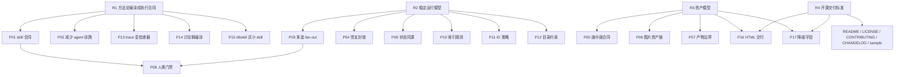

# GitHub 开源上线前 Workflow 修复路线图

> 状态：产品设计草案  
> 目标：把本项目从“agent 扶着能跑通”推进到“陌生用户下载后，人能读懂、AI 能按合同跑、维护者能接手”。  
> 边界：本文件只做产品开发拆解和修复排序；不改业务代码、不接外部 API、不登录平台、不发版。

---

## 1. 产品开发任务卡

```text
产品目标：GitHub 开源上线前的 workflow 稳定化。
核心用户：创作者 / 运营者 / 下载 skill 的 AI 使用者 / 后续维护者。
核心场景：一个用户管理多个账号，每个账号能独立完成选题、Brief、文案、画中画、质检、平台包装和最终交付。
成功标准：用户不需要理解内部全部方法论，也能按引导完成内容；AI 不需要靠临场发挥，也能按交接物继续执行；产物目录不串账号、不串 session。
当前阶段：产品设计，不进入实现。
```

本轮产品判断采用四个优先级：

| 等级 | 含义 |
|---|---|
| P0 | 开源上线前必须解决，否则别人下载后很容易跑偏 |
| P1 | 开源 alpha 必须收敛，否则只能内部试用 |
| P2 | beta 阶段增强，可先用规则和人工验收兜底 |
| P3 | 1.0 后增强，不阻塞首个开源版本 |

---

## 2. 成熟 Workflow 解法参考

这些参考不表示本项目要重写成同类系统，而是用来校准“成熟 workflow 通常怎么避免断链”。

| 成熟做法 | 参考系统 | 对本项目的启发 |
|---|---|---|
| Workflow Definition / 确定性执行 | Temporal Workflow Definition | skill 不能只是方法论文章，必须有固定输入、固定输出、固定停顿点和可恢复状态 |
| Child Workflow / 分支隔离 | Temporal Child Workflows | 用户选择 3 个选题时，应 fan-out 成 3 条独立内容链路，而不是混在同一条链里 |
| Side Effect / 外部副作用记录 | Temporal Side Effects | 出图、联网调研、人工确认这类不可重复动作要记录状态和来源，不能只写在正文里 |
| Dynamic Task Mapping | Apache Airflow | 多选题、多平台包装、多个图片资产，都应声明动态任务集合和 fan-in 汇总规则 |
| Task Runner / 并发执行状态 | Prefect | 并行任务必须有独立状态和错误收口，不应靠 agent 临时判断“做完没” |
| Software-defined Assets | Dagster | HTML、图片、发布物料、manifest 都应该是可追溯资产，不只是散落文件 |
| Persistence / Interrupts | LangGraph | 账号确认、选题确认、最终采用是人类中断点；其他步骤应自动推进并可恢复 |
| dbskill 式编译 | dbskill 方法论 | 讨论稿应编译成小 skill：触发词、边界、输入、输出、下一步，而不是让 agent 每次重读大段理念 |
| Repository Health | GitHub Docs / OpenSSF | 开源不仅是上传文件，还要有 README、License、贡献指南、示例、变更记录、安全边界和可复现样例 |

调研来源：

- Temporal Workflow Definition：https://docs.temporal.io/workflow-definition
- Apache Airflow Dynamic Task Mapping：https://airflow.apache.org/docs/apache-airflow/stable/authoring-and-scheduling/dynamic-task-mapping.html
- Prefect Task Runners：https://docs.prefect.io/v3/concepts/task-runners
- Dagster Assets：https://docs.dagster.io/guides/build/assets
- LangGraph Persistence / Interrupts：https://docs.langchain.com/oss/python/langgraph/persistence
- GitHub 开源仓库健康文档：https://docs.github.com/en/communities/setting-up-your-project-for-healthy-contributions
- OpenSSF Scorecard：https://securityscorecards.dev/

---

## 3. 父问题

17 个问题不是平级的。当前最大的工程问题有四个父问题：

| 父问题 | 说明 | 覆盖问题 |
|---|---|---|
| R1：方法论没有编译成执行合同 | skill 还像“说明书”，不是“可执行契约” | P01、P02、P13、P14、P15，并间接影响 P05、P08、P16 |
| R2：没有稳定运行模型 | 多选、旁支、状态、编号、索引没有统一编排 | P03、P04、P09、P10、P11、P12 |
| R3：资产模型不足 | 画中画、图片、最终 HTML、外部模型降级没有形成资产链 | P05、P06、P07、P16、P17 |
| R4：开源交付标准不足 | 项目能内部跑，但还不是下载即懂、可贡献、可维护的开源包 | P01、P07、P13、P16、P17 |

因此修复时不要从单点补丁开始，先修父问题。父问题修好后，部分子问题会自然消失或变成校验项。

---

## 4. 17 个问题逐项拆解

| ID | 当前现象 | 成熟解法 | 本项目应做到的程度 | 父问题 | 修复产物 | 验收标准 | 优先级 |
|---|---|---|---|---|---|---|---|
| P01 | skill 不是执行合同 | Workflow Definition | 每个 skill 有输入、输出、前置条件、停顿点、失败处理、下一步 | R1 | `skill_contract` 模板 | 新 agent 不问隐藏上下文也能继续 | P0 |
| P02 | 依赖 agent 扶着跑 | Deterministic workflow + validator | agent 可协助表达，但关键流转由规则判断 | R1 | 执行透明度记录 + validator 清单 | 每轮标出 skill 独立完成比例 | P0 |
| P03 | 多选题会把后续流程跑废 | Dynamic Task Mapping / Child Workflow | 多个选题必须拆成多个 content_run_id | R2 | fan-out / fan-in 规则 | “三篇都做”不会混成一篇 | P0 |
| P04 | 旁支任务没有封锁 | State Machine | 产品设计、开源路线、内容生产互不污染 | R2 | branch_lock 规则 | 旁支只改允许文件，不影响生产 session | P0 |
| P05 | 画中画逻辑没有按讨论稿执行 | Asset contract | 每篇内容有明确图片数量、用途、插入段落、生成状态 | R3 | `visual_asset_plan` 合同 | 不是看心情出图 | P0 |
| P06 | 图片资产链路不健壮 | Asset lineage | 图片、提示词、模型、状态、下载路径分开记录 | R3 | image asset manifest | HTML 可下载，MD 可追溯 | P1 |
| P07 | 中间产物和最终产物边界混乱 | Asset materialization | 最终给人 HTML，中间给 AI / 追溯 MD | R3/R4 | deliverables 规则 | 人类验收入口不是一堆 MD | P0 |
| P08 | 人类门禁不合理 | Interrupts | 只在账号确认、选题确认、最终采用停；其他自动到底 | R1/R2 | human_gate 表 | 不再让用户说“继续写口播” | P0 |
| P09 | 状态同步残留旧说法 | Persistent state | `STATUS`、manifest、运行记录同源更新 | R2 | 状态字段规则 | current_stage 不再和真实产物冲突 | P1 |
| P10 | 根目录汇总表靠手工写 | Asset index | 根汇总只做索引，session manifest 才是事实源 | R2 | index 更新规则 | 人看索引，AI 追 manifest | P1 |
| P11 | ID 编号有撞车风险 | Run ID / content ID policy | session、topic、content、asset 分层编号 | R2 | ID 命名规范 | 多账号、多篇并行不撞号 | P0 |
| P12 | 目录治理无自动约束 | Repository structure check | 账号 / session / intermediate / deliverables 强约束 | R2/R4 | 目录验收清单 | 根目录不再散落新旧产物 | P1 |
| P13 | Execution trace 只是记录不是检查器 | Validator / Scorecard | trace 要能判定缺字段、断链、人工扶跑 | R1/R4 | validator 设计 | 失败能指出哪一步不合格 | P0 |
| P14 | 讨论稿没有充分编译成 skill | Skill compiler | 方法论必须进入 skill、字段词典或合同模板 | R1 | skill 编译流程 | 讨论稿不再停留在解释文档 | P0 |
| P15 | dbskill 式编译不足 | Small composable skills | 每个 skill 小而清楚，有触发、边界、下一步 | R1 | skill 粒度标准 | AI 不会读晕，也不靠全文检索猜 | P0 |
| P16 | 最终交付不够产品化 | Human-readable delivery | 每篇交付一个 HTML：选题、文案、图片、平台包、追溯链接 | R3/R4 | final HTML 模板 | 用户可复制文字、下载图片、追溯 MD | P0 |
| P17 | 降级策略只是说明不是链路 | Fallback provider contract | 暂不实现 API，但要保留外部模型入参兼容字段 | R3/R4 | fallback 字段设计 | Codex / Seedream 未来可接同一资产合同 | P2 |

---

## 5. 修复排序

### Phase 0：开源基线确认

目标是让项目先具备 GitHub 开源的最低产品边界。

```text
0.1 明确开源定位：这是内容 workflow / skill 包，不是 SaaS 后台。
0.2 明确不随仓库提交的内容：真实客户数据、平台账号、API key、未授权素材。
0.3 预留 README、LICENSE、CONTRIBUTING、CHANGELOG、SECURITY、示例目录。
0.4 设计 sample account / sample run，避免开源样例暴露真实账号隐私。
```

建议优先级：P0。  
原因：目标是 GitHub 开源上线，仓库健康度是产品的一部分。

### Phase 1：Skill 编译合同

先修 R1，再修它下面的子问题。

```text
1.1 建 `skill_contract` 模板。
1.2 把讨论稿编译规则写清楚：哪些内容进 skill，哪些进字段词典，哪些留 explanation。
1.3 给每个 skill 增加前置条件、输出合同、自动下一步和人类停顿点。
1.4 把 execution trace 升级为可检查清单。
```

覆盖：P01、P02、P13、P14、P15。  
父问题修复后，P02 会明显下降，因为 agent 不再需要靠临场判断扶跑。

### Phase 2：运行模型与分支封锁

再修 R2，解决“三篇都做”和旁支污染。

```text
2.1 定义 session_id、content_run_id、topic_id、asset_id 的层级关系。
2.2 定义 fan-out：一个选题确认可以生成一条内容链，多选必须生成多条独立内容链。
2.3 定义 fan-in：多篇完成后只汇总索引，不合并正文。
2.4 定义 branch_lock：产品设计任务不能改生产 session；内容生产任务不能改产品路线图。
2.5 定义状态同源：manifest 是事实源，根索引只引用。
```

覆盖：P03、P04、P09、P10、P11、P12。  
父问题修复后，P10、P11、P12 会从“结构性风险”降为“校验项”。

### Phase 3：画中画与图片资产模型

修 R3 的核心部分。

```text
3.1 明确每篇内容默认需要几张画中画，以及触发增加 / 减少的规则。
3.2 每张图必须有用途、插入段落、提示词、模型、状态、文件路径。
3.3 区分 visual_plan、image_prompt、image_asset、html_embed。
3.4 暂不实现 Seedream API，但保留 provider、input_schema、fallback_note。
```

覆盖：P05、P06、P17。  
父问题修复后，“画中画看心情”会消失，因为图片数量和用途进入合同。

### Phase 4：最终交付产品化

把 R3 / R4 收到用户看得懂的交付入口。

```text
4.1 每篇内容最终交付必须有 `final-delivery.html`。
4.2 HTML 第一屏给人看：选题、切口、目标、热点来源。
4.3 正文可复制，图片可下载，平台包装可分区查看。
4.4 每个段落和图片保留追溯链接到 MD 中间产物。
4.5 明确 project_local、portable_bundle、standalone_html 三种交付形态。
```

覆盖：P07、P16，并支撑 P06、P17。  
父问题修复后，最终产物不再是散落 MD，而是“HTML 验收页 + MD 追溯链”。

### Phase 5：开源上线包

最后做开源交付，不提前把半成品推上去。

```text
5.1 README 面向新用户重写快速开始。
5.2 增加 examples/sample-account/sample-run。
5.3 增加 CONTRIBUTING、CODE_OF_CONDUCT、SECURITY、CHANGELOG。
5.4 增加 release checklist：无私密路径、无真实账号隐私、无断链、无旧目录冲突。
5.5 标注 alpha / beta / 1.0 能力边界。
```

覆盖：R4。  
开源 alpha 允许部分 validator 先是人工清单，但必须让新用户知道哪些能力已稳定、哪些还在设计。

---

## 6. 开源版本应做到什么程度

### Alpha

```text
一个 sample account 可以完整跑通单篇内容。
账号确认、选题确认、最终采用三个门禁清楚。
选题确认后自动到底，不要求用户说“继续写口播”。
最终交付是 HTML。
中间产物和最终产物分区清楚。
画中画有合同，但允许人工或 Codex 内置出图。
validator 可以是人工清单，但必须可执行。
```

### Beta

```text
支持多选题 fan-out 成多篇内容。
支持多平台包装 fan-in 汇总。
图片资产链完整：提示词、实际图片、下载入口、追溯链。
portable_bundle 可转交，不依赖本地项目路径。
目录和字段断链能被检查出来。
```

### 1.0

```text
skill 合同稳定，文档索引稳定。
示例可复现。
开源贡献规则完整。
版本号、变更记录、兼容性边界清楚。
外部模型降级链路可以接入，但不要求默认启用。
```

---

## 7. 修复依赖图



---

## 8. 下一步建议

建议下一步不直接改各 skill，而是先补四个产品规格：

1. `docs/reference/skill_contract模板.md`
2. `docs/reference/运行模型与分支封锁规范.md`
3. `docs/reference/画中画与图片资产合同.md`
4. `docs/reference/GitHub开源上线检查清单.md`

这四份文档完成后，再回头逐个编译现有 skill。这样修的是父问题，不是继续给子问题打补丁。
