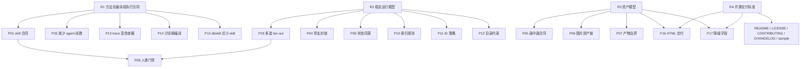

# GitHub 开源上线前 Workflow 修复路线图

> 状态：r1_r4_issue_localization_active
> 目标：把本项目从“agent 扶着能跑通”推进到“陌生用户下载后，人能读懂、AI 能按合同跑、维护者能接手”。
> 边界：本文件只做产品开发拆解和修复排序；不改业务代码、不接外部 API、不登录平台、不发版。

---

## 1. 产品开发任务卡

```text
产品目标：GitHub 开源上线前的 workflow 稳定化。
核心用户：创作者 / 运营者 / 下载 skill 的 AI 使用者 / 后续维护者。
核心场景：一个用户管理多个账号，每个账号能独立完成选题、Brief、文案、画中画、质检、平台包装和最终交付。
成功标准：用户不需要理解内部全部方法论，也能按引导完成内容；AI 不需要靠临场发挥，也能按交接物继续执行；产物目录不串账号、不串 session。
当前阶段：R1-R4 产品定义和规则 / skill 编译已闭合，综合 dry-run 已完成并定位问题；当前进入 checker / validator 产品开发与编译前修复。
```

本轮产品判断采用四个优先级：

| 等级 | 含义 |
|---|---|
| P0 | 开源上线前必须解决，否则别人下载后很容易跑偏 |
| P1 | 开源 alpha 必须收敛，否则只能内部试用 |
| P2 | beta 阶段增强，可先用规则和人工验收兜底 |
| P3 | 1.0 后增强，不阻塞首个开源版本 |

---

## 2. 成熟 Workflow 解法参考

这些参考不表示本项目要重写成同类系统，而是用来校准“成熟 workflow 通常怎么避免断链”。

| 成熟做法 | 参考系统 | 对本项目的启发 |
|---|---|---|
| Workflow Definition / 确定性执行 | Temporal Workflow Definition | skill 不能只是方法论文章，必须有固定输入、固定输出、固定停顿点和可恢复状态 |
| Child Workflow / 分支隔离 | Temporal Child Workflows | 用户选择 3 个选题时，应 fan-out 成 3 条独立内容链路，而不是混在同一条链里 |
| Side Effect / 外部副作用记录 | Temporal Side Effects | 出图、联网调研、人工确认这类不可重复动作要记录状态和来源，不能只写在正文里 |
| Dynamic Task Mapping | Apache Airflow | 多选题、多平台包装、多个图片资产，都应声明动态任务集合和 fan-in 汇总规则 |
| Task Runner / 并发执行状态 | Prefect | 并行任务必须有独立状态和错误收口，不应靠 agent 临时判断“做完没” |
| Software-defined Assets | Dagster | HTML、图片、发布物料、manifest 都应该是可追溯资产，不只是散落文件 |
| Persistence / Interrupts | LangGraph | 账号确认、选题确认、最终采用是人类中断点；其他步骤应自动推进并可恢复 |
| dbskill 式编译 | dbskill 方法论 | 讨论稿应编译成小 skill：触发词、边界、输入、输出、下一步，而不是让 agent 每次重读大段理念 |
| Repository Health | GitHub Docs / OpenSSF | 开源不仅是上传文件，还要有 README、License、贡献指南、示例、变更记录、安全边界和可复现样例 |

调研来源：

- Temporal Workflow Definition：https://docs.temporal.io/workflow-definition
- Apache Airflow Dynamic Task Mapping：https://airflow.apache.org/docs/apache-airflow/stable/authoring-and-scheduling/dynamic-task-mapping.html
- Prefect Task Runners：https://docs.prefect.io/v3/concepts/task-runners
- Dagster Assets：https://docs.dagster.io/guides/build/assets
- LangGraph Persistence / Interrupts：https://docs.langchain.com/oss/python/langgraph/persistence
- GitHub 开源仓库健康文档：https://docs.github.com/en/communities/setting-up-your-project-for-healthy-contributions
- OpenSSF Scorecard：https://securityscorecards.dev/

---

## 3. 父问题

17 个问题不是平级的。当前最大的工程问题有四个父问题：

| 父问题 | 说明 | 覆盖问题 |
|---|---|---|
| R1：方法论没有编译成执行合同 | skill 还像“说明书”，不是“可执行契约” | P01、P02、P13、P14、P15，并间接影响 P05、P08、P16 |
| R2：没有稳定运行模型 | 多选、旁支、状态、编号、索引没有统一编排 | P03、P04、P09、P10、P11、P12 |
| R3：资产模型不足 | 画中画、图片、最终 HTML、外部模型降级没有形成资产链 | P05、P06、P07、P16、P17 |
| R4：开源交付标准不足 | 项目能内部跑，但还不是下载即懂、可贡献、可维护的开源包 | P01、P07、P13、P16、P17 |

因此修复时不要从单点补丁开始，先修父问题。父问题修好后，部分子问题会自然消失或变成校验项。

### 3.1 推进节奏

本项目不采用“17 个问题全部产品化后再编译”，也不采用“破一个小问题就立刻编译一个 skill”。

统一采用：

```text
按 R1-R4 父问题成组推进
-> 产品定义
-> 涛哥确认
-> skill 编译 / 规则编译
-> sample run 验证
-> 再进入下一组
```

原因：

| 方案 | 问题 |
|---|---|
| 17 个问题全部做完再编译 | 周期太长，缺少真实执行反馈，容易写出漂亮但跑不动的规范 |
| 破一个问题就编译一个 | 父子依赖未稳定，容易反复返工，例如 P01 会被 P13 / P14 / P15 / P08 反复影响 |
| 按 R1-R4 成组推进 | 每组有闭环，能确认、编译、验证，也能避免单点补丁污染后续设计 |

因此：

```text
R1 完成并确认后，才进入第一轮 skill 编译。
R2 完成并确认后，再进入运行模型和分支规则编译。
R3 完成并确认后，再进入视觉资产和最终交付规则编译。
R4 完成并确认后，再进入 GitHub 开源上线包整理。
```

### 3.2 SAMPLE-HISTORICAL-005 后的节奏修订

SAMPLE-HISTORICAL-005 证明：R1 单篇主链路能跑通，但只完成 R1 后立刻跑完整真实测试，容易产生“表面跑通、实际靠 agent 扶着补齐”的假阳性。

因此路线修订为：

```text
R1-R4 产品定义
-> R1-R4 skill / 规则编译
-> 静态合同检查
-> 小样本 dry run
-> 完整真实测试
```

这次样本保留为问题样本，不再作为“完整测试通过”的证据。它只证明：

```text
R1 主链路产品方向成立。
R1 编译存在缩水和漏检。
R2-R4 未完成时，完整测试会过早暴露跨组问题。
```

后续判断口径：

| 测试类型 | 前置条件 | 作用 |
|---|---|---|
| R1 sample run | R1 产品确认 + R1 skill 编译完成 | 验证单篇主链路、自动推进、trace 和 HTML 是否闭合 |
| R1 返修样本 | R1 编译后暴露产品 / 编译缺口 | 只验证 R1 修复项，不扩展到多篇、导出包或外部模型 |
| 小样本 dry run | R1-R4 产品定义和编译均完成 | 验证全链路静态合同是否能运行 |
| 完整真实测试 | 小样本通过，且无 P0 阻断 | 用真实账号、真实热点、真实图片和 HTML 做开源前验收 |

也就是说：

```text
R1 通过，不等于可以跑完整真实测试。
R1-R4 编译闭合，才是完整真实测试的前置条件。
```

### 3.3 成熟项目对本轮问题的借鉴

本轮补充调研后，成熟 workflow 对“断流、日志、恢复、人工门禁”的共性做法如下：

| 成熟做法 | 参考项目 | 对本项目的吸收 |
|---|---|---|
| Event History | Temporal | 关键动作、外部副作用和结果必须形成事件历史；断流后先读历史，不盲目重跑 |
| Task as Transaction | Airflow | 每个阶段应避免产出半成品；能重跑的步骤必须有幂等边界 |
| Checkpointer + Interrupt | LangGraph | 人类门禁必须保存状态，用户回来后从同一状态恢复 |
| Flow State + Logs | Prefect | 运行状态和日志要能被单独查看，不能只藏在最终正文里 |

本项目的取舍：

```text
R1：只要求 manifest + execution_trace + current_artifact 能支持 AI / 人工恢复判断。
R2：再做真正的 checkpoint、resume_from、stage 状态、幂等、run lock 和 branch lock。
R3：把图片生成这类外部副作用做成资产状态和重试 / 降级。
R4：把日志样例、恢复说明、validator / checker 放进开源包。
```

因此 R1 不能声称具备“脚本级断点续跑”；R1 只能声称“单篇链路有恢复证据”。如果 R1 文档或测试报告把它说成可脚本级恢复，必须判为测试范围误报。

---

## 3.4 成熟度口径

本路线图采用 `docs/reference/skill执行透明度与成熟度规范.md` 的成熟度等级。

当前 P01 合同草案成熟度判断：

```text
当前成熟度：L2.5
目标成熟度：R1 完成后达到 L3 可发布候选
```

为什么当前不是 L3：

```text
已经有输入、输出、前置条件、路径、人类门禁、自动推进、失败处理和验收样例。
但还没有 validator / scorecard。
还没有把讨论稿到 skill 的编译规则固定下来。
还没有 skill 粒度标准和废弃入口策略。
还没有 sample run 验证合同能被另一个 agent 稳定执行。
```

参考成熟 workflow 的取舍：

| 成熟系统做法 | 本项目吸收 | 本阶段不做 |
|---|---|---|
| Temporal 的 workflow definition 和确定性执行 | 固定输入、输出、状态、失败处理 | 不引入真正 workflow engine |
| Airflow 的 dynamic task mapping | 后续 R2 做 fan-out / fan-in | P01 阶段不解决多选并行 |
| Prefect 的 task runner 和状态 | 后续 R2 做运行状态收口 | 不做并发执行器 |
| Dagster 的 software-defined assets | 后续 R3 做图片和 HTML 资产链 | P01 不做 asset materialization 检查 |
| LangGraph 的 interrupts / persistence | 固化人类门禁和恢复点 | 暂不实现持久化执行图 |

取舍逻辑：

```text
本项目是轻量 skill / 内容 workflow，不是服务端编排平台。
开源 alpha 的目标是“人和 AI 能按合同跑通”，不是“具备企业级 workflow runtime”。
因此先用文档合同 + sample run + validator 清单达到 L3，再决定是否需要脚本化检查或更重的 runtime。
```

---

## 4. 17 个问题逐项拆解

| ID | 当前现象 | 成熟解法 | 本项目应做到的程度 | 父问题 | 修复产物 | 验收标准 | 优先级 |
|---|---|---|---|---|---|---|---|
| P01 | skill 不是执行合同 | Workflow Definition | 每个 skill 有输入、输出、前置条件、停顿点、失败处理、下一步 | R1 | `skill_contract` 模板 | 新 agent 不问隐藏上下文也能继续 | P0 |
| P02 | 依赖 agent 扶着跑 | Deterministic workflow + validator | agent 可协助表达，但关键流转由规则判断 | R1 | 执行透明度记录 + validator 清单 | 每轮标出 skill 独立完成比例 | P0 |
| P03 | 多选题会把后续流程跑废 | Dynamic Task Mapping / Child Workflow | 多个选题必须拆成多个 content_run_id | R2 | fan-out / fan-in 规则 | “三篇都做”不会混成一篇 | P0 |
| P04 | 旁支任务没有封锁 | State Machine | 产品设计、开源路线、内容生产互不污染 | R2 | branch_lock 规则 | 旁支只改允许文件，不影响生产 session | P0 |
| P05 | 画中画逻辑没有按讨论稿执行 | Asset contract | 每篇内容有明确图片数量、用途、插入段落、生成状态 | R3 | `visual_asset_plan` 合同 | 不是看心情出图 | P0 |
| P06 | 图片资产链路不健壮 | Asset lineage | 图片、提示词、模型、状态、下载路径分开记录 | R3 | image asset manifest | HTML 可下载，MD 可追溯 | P1 |
| P07 | 中间产物和最终产物边界混乱 | Asset materialization | 最终给人 HTML，中间给 AI / 追溯 MD | R3/R4 | deliverables 规则 | 人类验收入口不是一堆 MD | P0 |
| P08 | 人类门禁不合理 | Interrupts | 只在账号确认、选题确认、最终采用停；其他自动到底 | R1/R2 | human_gate 表 | 不再让用户说“继续写口播” | P0 |
| P09 | 状态同步残留旧说法 | Persistent state | `STATUS`、manifest、运行记录同源更新 | R2 | 状态字段规则 | current_stage 不再和真实产物冲突 | P1 |
| P10 | 根目录汇总表靠手工写 | Asset index | 根汇总只做索引，session manifest 才是事实源 | R2 | index 更新规则 | 人看索引，AI 追 manifest | P1 |
| P11 | ID 编号有撞车风险 | Run ID / content ID policy | session、topic、content、asset 分层编号 | R2 | ID 命名规范 | 多账号、多篇并行不撞号 | P0 |
| P12 | 目录治理无自动约束 | Repository structure check | 账号 / session / intermediate / deliverables 强约束 | R2/R4 | 目录验收清单 | 根目录不再散落新旧产物 | P1 |
| P13 | Execution trace 只是记录不是检查器 | Validator / Scorecard | trace 要能判定缺字段、断链、人工扶跑 | R1/R4 | validator 设计 | 失败能指出哪一步不合格 | P0 |
| P14 | 讨论稿没有充分编译成 skill | Skill compiler | 方法论必须进入 skill、字段词典或合同模板 | R1 | skill 编译流程 | 讨论稿不再停留在解释文档 | P0 |
| P15 | dbskill 式编译不足 | Small composable skills | 每个 skill 小而清楚，有触发、边界、下一步 | R1 | skill 粒度标准 | AI 不会读晕，也不靠全文检索猜 | P0 |
| P16 | 最终交付不够产品化 | Human-readable delivery | 每篇交付一个 HTML：选题、文案、图片、平台包、追溯链接 | R3/R4 | final HTML 模板 | 用户可复制文字、下载图片、追溯 MD | P0 |
| P17 | 降级策略只是说明不是链路 | Fallback provider contract | 暂不实现 API，但要保留外部模型入参兼容字段 | R3/R4 | fallback 字段设计 | Codex / Seedream 未来可接同一资产合同 | P2 |

---

## 4.1 SAMPLE-HISTORICAL-005 问题归属

本次测试后，问题必须按 R1 / R2 / R3 / R4 拆分，不把所有缺陷都压回 R1。

### 归属 R1 的问题

R1 只负责“单账号、单选题、单篇内容，从选题确认后自动跑到最终 HTML”的执行合同闭合。以下问题属于 R1：

| 问题 | 类型 | 修订方向 |
|---|---|---|
| 选题确认后自动到底 | R1 产品 / 编译共同问题 | 继续保持：选题后不要求用户说继续 |
| account_profile / product_profile 前置 | R1 产品问题 | 保持为 R1 门禁，不下放到 R2 |
| research_run_id 贯穿 | R1 产品问题 | 继续作为 R1 BLOCKER |
| 单 session 单篇内容 | R1 产品问题 | R1 只允许单篇；多篇进入 R2 branch_request |
| 最终交付不得只有 Markdown | R1 产品问题 | R1 必须至少有 project_local HTML |
| execution_trace 区分 skill / agent / user / environment | R1 产品问题 | R1 必须记录执行来源 |
| trace 自洽性冲突 | R1 产品 + 编译问题 | R1CHK 必须能发现“使用 imagegen / 未使用 imagegen”这类矛盾 |
| visual_plan prompt 缩水 | R1 skill 编译问题 | 现有 talking-head-image-pip 规则已足够，编译时必须完整落盘 |
| quality_review 没拦住缩水画中画 | R1 skill 编译问题 | 质检必须按画中画验收清单判定，而不是只看“有图” |

### 归属 R2 的问题

| 问题 | 归属原因 |
|---|---|
| 任务太长导致 stream disconnected | 运行模型韧性，不是单篇合同本身 |
| 断流后如何恢复 | 需要 checkpoint / resume 协议 |
| 每个阶段是否可重复执行 | 需要阶段提交和幂等规则 |
| 用户说“三篇都做”如何处理 | 多分支 fan-out / fan-in，不塞回 R1 |
| 已完成阶段不重跑 | R2 运行状态模型 |

### 归属 R3 的问题

| 问题 | 归属原因 |
|---|---|
| 一篇到底几张画中画 | 图片数量和用途属于资产合同 |
| 图片失败怎么办 | pending_external / generation_failed / manual_required 属于图片资产链 |
| Seedream 4.0 / 5.0 兼容 | 外部模型旁路，不属于 R1 |
| 图片实际质量验收 | R3 要把“像素材库”变成可检查标准 |
| 图片和 HTML 下载关系 | 图片资产归 R3，交付形态和 R4 交界 |

### 归属 R4 的问题

| 问题 | 归属原因 |
|---|---|
| GitHub 开源包怎么摆 | 开源交付工程 |
| 真实账号资料脱敏 | 开源净化 |
| sample-run 怎么给别人看 | 示例工程 |
| HTML 离开本地目录后链接可用 | portable_bundle / standalone_html |
| skill 合集和方法论如何索引 | 开源读者和外部 AI 可读性 |

R1 返修时只处理 R1 内的问题。R2-R4 的问题进入对应阶段，避免 R1 膨胀到无法完成。

---

## 5. 修复排序

### Phase 0：开源基线确认

目标是让项目先具备 GitHub 开源的最低产品边界。

```text
0.1 明确开源定位：这是内容 workflow / skill 包，不是 SaaS 后台。
0.2 明确不随仓库提交的内容：真实客户数据、平台账号、API key、未授权素材。
0.3 预留 README、LICENSE、CONTRIBUTING、CHANGELOG、SECURITY、示例目录。
0.4 设计 sample account / sample run，避免开源样例暴露真实账号隐私。
```

建议优先级：P0。
原因：目标是 GitHub 开源上线，仓库健康度是产品的一部分。

### Phase 1：R1 Skill 执行合同组

先修 R1，再修它下面的子问题。

```text
1.1 建 `skill_contract` 模板。
1.2 把讨论稿编译规则写清楚：哪些内容进 skill，哪些进字段词典，哪些留 explanation。
1.3 给每个 skill 增加前置条件、输出合同、自动下一步和人类停顿点。
1.4 把 execution trace 升级为可检查清单。
```

覆盖：P01、P02、P13、P14、P15。
父问题修复后，P02 会明显下降，因为 agent 不再需要靠临场判断扶跑。

R1 的确认门：

```text
P01：核心 skill 有 CONTRACT.md。
P14：讨论稿 / 方法论进入 skill、字段词典、合同或 explanation 的编译规则明确。
P15：skill 粒度标准明确，兼容入口和废弃入口有处理口径。
P13：execution trace 至少能作为可执行检查清单，后续可升级为 validator。
P08：人类门禁和自动推进规则进入合同，不再靠临场引导。
内容创作质量：Hook 路由、正文信息密度、共鸣与兑现进入 draft / review 合同。
```

只有 R1 整组确认后，才进入第一轮 `skills/*/SKILL.md` 编译。

R1 补充产品定义：

```text
docs/product/内容创作质量方法论编译补充-R1.md
docs/product/R1-P14-方法论编译规则.md
docs/product/R1-P15-skill粒度与入口治理规则.md
docs/product/R1-P13-execution-trace检查清单与validator草案.md
docs/product/R1-P02-agent扶跑收敛与可编译判定.md
docs/product/R1-skill执行合同组可编译总验收.md
docs/product/R1-合同版本与变更治理.md
docs/product/R1-字段级输入输出矩阵.md
docs/product/R1-人类门禁决策枚举与恢复规则.md
docs/product/R1-trace-check注册表.md
docs/product/R1-产品确认清单.md
```

### Phase 2：R2 运行模型与分支封锁

再修 R2，解决“三篇都做”和旁支污染。

```text
2.1 定义 session_id、content_run_id、topic_id、asset_id 的层级关系。
2.2 定义 fan-out：一个选题确认可以生成一条内容链，多选必须生成多条独立内容链。
2.3 定义 fan-in：多篇完成后只汇总索引，不合并正文。
2.4 定义 branch_lock：产品设计任务不能改生产 session；内容生产任务不能改产品路线图。
2.5 定义状态同源：manifest 是事实源，根索引只引用。
2.6 定义 parent / child 生命周期和 parent close policy。
2.7 定义 state_transition、checkpoint、human interrupt payload 和 branch ledger。
2.8 定义 R2 操作合同：每个动作有输入、输出、状态变化、失败处理和恢复提示。
```

覆盖：P03、P04、P09、P10、P11、P12。
父问题修复后，P10、P11、P12 会从“结构性风险”降为“校验项”。

R2 产品真源：

```text
docs/product/R2-产品总览.md
docs/product/R2-运行模型与分支封锁规则.md
docs/product/R2-产品确认清单.md
```

R2 确认门：

```text
R2-C01：确认 R2 只解决运行模型，不解决 R3/R4。
R2-C02：确认多选题必须 fan-out 成多个 child session。
R2-C03：确认 fan-in 只汇总索引，不合并正文。
R2-C04：确认 product_development / content_production / workflow_governance / opensource_preparation / status_recovery 有 branch_lock。
R2-C05：确认 manifest 是事实源，根索引只引用。
R2-C06：确认恢复字段进入 manifest 产品定义，但不实现自动 resume runner。
R2-C07：确认幂等口径明确，重跑不默认覆盖已确认产物。
R2-C08：确认轻量 run_lock 字段用于避免同一 session 被不同任务同时改写。
R2-C09：确认 ID 层级防止多篇串台。
R2-C10：确认索引冲突时以 session manifest 修正账号 index、all_runs 和根目录汇总。
R2-C11：确认 R2 不做自动发布、平台登录、外部 API、并发调度器。
R2-C12：确认 R2 经涛哥确认后，才允许进入 skill / reference 编译。
R2-C13：确认父 session 完成、归档、取消、失败时 child session 的默认处理。
R2-C14：确认 run / stage / branch 状态变化必须追加 state_transition。
R2-C15：确认断流、人类停顿、阶段完成时用 checkpoint 支持恢复证据。
R2-C16：确认用户自然语言必须转成 human_interrupt / human_decision_payload。
R2-C17：确认 branch-request-ledger.md 以追加式记录分支过程。
R2-C18：确认 R2 关键动作都有输入、输出、状态变化、失败处理和恢复提示。
R2-C19：确认接续恢复必须按固定顺序读状态、manifest、checkpoint、台账和实际产物。
R2-C20：确认 R2 编译后只做 static check / dry-run / sample run，不做完整真实测试。
```

### Phase 3：R3 画中画与图片资产模型

修 R3 的核心部分。

```text
3.1 明确每篇内容默认需要几张画中画，以及触发增加 / 减少的规则。
3.2 每张图必须有用途、插入段落、提示词、provider、生成记录、状态、文件路径。
3.3 区分 visual_plan、image_prompt_set、image_generation_record、image_asset_set、image_quality_gate、html_embed_manifest。
3.4 generated 图片必须有 metadata_sidecar；pending / failed / manual 图片必须有生成记录或人工任务说明。
3.5 暂不实现 Seedream API，但保留 provider、input_schema、fallback_note。
3.6 图片资产不可覆盖，重做必须生成新 asset；样本模式先验证最小资产链，再进入多篇 / 多图批量。
```

覆盖：P05、P06、P17。
父问题修复后，“画中画看心情”会消失，因为图片数量和用途进入合同。

### Phase 4：R3 / R4 最终交付产品化

把 R3 / R4 收到用户看得懂的交付入口。

```text
4.1 每篇内容最终交付必须有 `final-delivery.html`。
4.2 HTML 第一屏给人看：选题、切口、目标、热点来源。
4.3 正文可复制，图片可下载，平台包装可分区查看。
4.4 每个段落和图片保留追溯链接到 MD 中间产物。
4.5 明确 project_local、portable_bundle、standalone_html 三种交付形态。
```

覆盖：P07、P16，并支撑 P06、P17。
父问题修复后，最终产物不再是散落 MD，而是“HTML 验收页 + MD 追溯链”。

### Phase 5：R4 开源上线包

最后做开源交付，不提前把半成品推上去。

```text
5.1 README 面向新用户重写快速开始。
5.2 增加 examples/sample-account/sample-run。
5.3 增加 CONTRIBUTING、CODE_OF_CONDUCT、SECURITY、CHANGELOG。
5.4 增加 release checklist：无私密路径、无真实账号隐私、无断链、无旧目录冲突。
5.5 标注 alpha / beta / 1.0 能力边界。
5.6 增加 public-manifest.yaml：机器可读记录能力边界、样例索引、检查状态和不支持能力。
5.7 增加 VERSION 与 CHANGELOG 对齐规则。
5.8 增加 build-public-release 构建器或等价手工清单，禁止直接发布工作母仓。
5.9 增加 release scorecard：社区健康文件、链接、隐私、密钥、样例、成熟度逐项打分。
```

覆盖：R4。
开源 alpha 允许部分 validator 先是人工清单，但必须让新用户知道哪些能力已稳定、哪些还在设计。R4 产品真源为：

```text
docs/product/R4-产品总览.md
docs/product/R4-开源交付与净化规则.md
docs/product/R4-产品确认清单.md
```

---

## 6. 开源版本应做到什么程度

### Alpha

```text
一个 sample account 可以完整跑通单篇内容。
账号确认、选题确认、最终采用三个门禁清楚。
选题确认后自动到底，不要求用户说“继续写口播”。
最终交付是 HTML。
中间产物和最终产物分区清楚。
画中画有合同，但允许人工或 Codex 内置出图。
validator 可以是人工清单，但必须可执行。
```

### Beta

```text
支持多选题 fan-out 成多篇内容。
支持多平台包装 fan-in 汇总。
图片资产链完整：提示词、实际图片、下载入口、追溯链。
portable_bundle 可转交，不依赖本地项目路径。
目录和字段断链能被检查出来。
```

### 1.0

```text
skill 合同稳定，文档索引稳定。
示例可复现。
开源贡献规则完整。
版本号、变更记录、兼容性边界清楚。
外部模型降级链路可以接入，但不要求默认启用。
```

---

## 7. 修复依赖图



---

## 8. R1-R4 完成后的问题定位

> 定位时间：2026-07-07
> 当前输入：R1-R4 产品定义、规则 / skill 编译、R2 / R3 dry-run、R1-R4 综合 dry-run 样本 `SR1R4DR-001`。
> 当前结论：R1-R4 已完成“结构闭合”，但仍未完成“开源上线就绪”。

本节只定位问题，不直接修复。后续每个问题必须先判断属于产品开发、skill / reference 编译、样本验证、checker 工具化，还是 R4 public release。

### 8.1 成熟项目对照后的分层口径

| 成熟项目做法 | 解决的问题 | 本项目对应层 |
|---|---|---|
| Temporal Event History / Child Workflow / Side Effects | 长任务、分支、外部副作用和断流恢复 | R2 运行模型 + execution_trace |
| Airflow Dynamic Task Mapping | 运行时按输入展开多任务 | R2 fan-out / fan-in |
| LangGraph Persistence / Interrupts | 人类中断点保存状态并恢复 | R1 人类门禁 + R2 checkpoint |
| Dagster Software-defined Assets / Asset Checks | 把最终结果当资产，给资产加元数据和检查 | R3 图片资产链 + R4 checker |
| MLflow Artifact Store | 区分 run metadata 和大文件 artifacts | R3 image_generation_record / image_asset_set / metadata_sidecar |
| DVC metadata file | 用小型可读元数据追踪大资产 | R3 sidecar / manifest / html_embed_manifest |
| GitHub Community Health / OpenSSF Scorecard | 开源包有健康文件、风险检查和评分 | R4 public_release + release-checklist |

吸收原则：

```text
不引入重型 workflow engine。
不实现服务端运行时。
不把 checker 伪装成成熟 CI。
先用产品合同 + reference + sample + 只读 checker 达到 alpha 可验证。
```

### 8.2 当前问题定位表

| 问题 | 当前现象 | 成熟解法 | 本项目当前落点 | 应回到哪一层 | 下一步判断 |
|---|---|---|---|---|---|
| 状态旧口径残留 | 部分产品确认文档顶部状态仍像旧阶段，但 STATUS / 工作流记录已进入后续阶段 | Persistent state / 单一事实源 | R2 已定义 manifest / STATUS / 工作流状态读序，但产品文档自身状态仍需收敛 | 产品开发层 + 文档治理 | 先做状态真源扫表，修状态口径；再把检查纳入 checker |
| checker / validator 缺失 | trace-check 仍是人工 / 半自动清单 | Scorecard / Asset Checks | P13 已产品化，R1/R3/R4 有检查项，但没有只读执行器 | 产品开发层 -> checker 编译层 | 先定义 checker scope，再实现只读检查，不修改业务文件 |
| R3 generated 图片路径未验证 | pending_external 能闭合，但真实图片、checksum、sidecar 未验证 | Artifact materialization + metadata | R3 产品 / reference / skill 已编译，样本只验证 pending_external | 样本验证层 | 先加测 generated 路径；若失败再回 R3 产品或 skill 编译 |
| R4 public_release 未生成 | 模板和清单存在，但 License、社区健康文件、远端、tag 未确认 | Repository Health / Release Checklist | R4 产品 / reference / templates 已编译 | R4 public release 产品确认层 | 先确认 License 和公开样例范围，再生成候选包 |
| 真实多分支未压力验证 | R2 dry-run 有 parent / child 样本，但真实多篇内容未跑 | Child Workflow / Dynamic Mapping | R2 产品 / reference / dry-run 已完成 | 样本验证层 | 后续用脱敏多题样本验证，不直接跑真实账号多篇 |
| 真实热点调研未在综合样本验证 | `SR1R4DR-001` 使用 synthetic source | Research log / provenance | R1/R2/R3/R4 综合样本刻意避开真实联网调研 | 样本验证层 | 完整真实测试前必须验证真实来源、时间、事实等级 |
| portable_bundle / standalone_html 未验证 | project_local HTML 能打开，转交包未生成 | Artifact packaging / release bundle | 最终交付策略已有产品说明，final-delivery-builder 合同有边界 | R4 / final-delivery 编译验证层 | 先用 sample 生成 portable_bundle，再决定 standalone_html |
| execution_trace 不能自动阻断 | trace 能记录 agent 扶跑，但不能自动判断 L3 | Scorecard / Validator | 透明度规范有等级和检查项 | checker 编译层 | checker 输出 blocking / warning / maturity，不直接改文件 |
| sample scaffold 仍靠 agent 手工 | 综合样本是 agent 手工按合同创建 | Workflow scaffold / template generator | 模板存在，但没有 scaffold 工具 | P2 工具层 | alpha 可接受；beta 前考虑 scaffold |

### 8.3 产品开发到 skill 编译的定位规则

以后发现问题时，按下面顺序定位，避免把所有问题都塞回 skill：

| 判断问题 | 归属 |
|---|---|
| 字段、状态、门禁、目录、边界没定义清楚 | 产品开发层 |
| 产品定义清楚，但 `SKILL.md` / `CONTRACT.md` 没写进去 | skill 编译层 |
| skill / reference 已写，但样本没有验证该路径 | 样本验证层 |
| 样本能人工验证，但每次都靠 agent 肉眼扫 | checker / validator 层 |
| checker 通过，但公开包缺 README / License / sample / health files | R4 public release 层 |
| 真实内容、真实热点、真实图片没跑 | 完整真实测试层 |

禁止定位方式：

```text
一发现问题就直接改 skill。
一条样本通过就宣称完整真实测试通过。
把 pending_external 路径通过说成 generated 路径通过。
把人工清单说成 validator 已实现。
把工作母仓说成 public_release。
```

### 8.4 当前最小修复顺序

当前不是继续扩写方法论，而是补验证和工具化缺口：

```text
Step 1：状态真源扫表
  目标：解决 P09 残留，让 STATUS、工作流状态、产品确认文档顶部状态不互相打架。
  层级：产品开发层 / 文档治理。

Step 2：只读 checker 产品定义
  目标：把 P13 从清单推进到只读检查器规格。
  层级：产品开发层。
  当前：已获涛哥确认，并完成 Step 3 编译。

Step 3：只读 checker 编译
  目标：检查路径、ID、状态、HTML 链接、required_visuals、image status、public_release 阻断项。
  层级：checker 编译层。
  当前：已编译为 `docs/reference/R1-R4只读checker执行规范.md`、`templates/checker/workflow-check-report.template.md` 和 `propagation-router` 路由规则；尚未跑正式 checker 报告样本。

Step 4：R3 generated 图片路径加测
  目标：验证真实图片文件、metadata sidecar、checksum、html_embed_manifest 和 final-delivery 展示。
  层级：样本验证层。

Step 5：R4 public_release candidate 设计
  目标：在 License 和公开样例范围确认后生成候选包。
  层级：R4 public release 层。
```

### 8.5 当前成熟度再判断

```yaml
current_maturity: L2.8
reason:
  - R1-R4 产品定义和编译已闭合
  - 脱敏综合样本已 pass_with_warnings
  - pending_external 图片路径已验证
  - public_release 模板和检查清单已编译
not_l3_because:
  - checker / validator 未实现
  - generated 图片路径未验证
  - public_release candidate 未生成
  - 完整真实内容测试未跑
```

L3 候选门槛调整为：

```text
只读 checker 能跑出稳定报告。
R3 generated 路径至少有一个脱敏样本通过。
R4 public_release candidate 至少生成一次并被 release-checklist 阻断或通过。
真实内容测试前置条件全部明确。
```

### 8.6 状态真源扫表记录

> 扫表时间：2026-07-07
> 扫表结果：fixed_known_header_status_residue
> 边界：只修正文档顶部状态、当前结论和项目状态真源；不改 skill 规则、不补样本、不生成 public_release。

本次扫表处理的是 P09 的状态残留问题：R1-R4 已经产品确认、编译和综合 dry-run，但部分文档顶部仍停留在“草案 / 待确认 / 待 dry-run”。

| 范围 | 处理结果 |
|---|---|
| 路线图 | 顶部状态从产品设计草案改为 R1-R4 问题定位中 |
| R1 产品文档 | 同步为已确认、已编译、综合样本 pass_with_warnings |
| R2 产品文档 | 同步为已确认、运行模型已编译、dry-run 已采样 |
| R3 产品文档 | 同步为已确认、已编译、pending_external dry-run 已通过；generated 路径仍未验证 |
| R4 产品文档 | 同步为已确认、开源规则 / 包装已编译并静态检查；真实 public_release 仍未生成 |
| skill contract 模板 | 从“待确认草案”同步为 R1 已采用的合同模板基线 |
| STATUS / 工作流状态记录 | 当前最小下一步从“状态真源扫表”推进到“只读 checker 产品定义” |

扫表后仍保留的限制：

```text
不宣称 L3。
不宣称完整真实测试通过。
不宣称 generated 图片路径已验证。
不宣称 public_release 已生成。
不宣称 GitHub 开源上线完成。
```

### 8.7 只读 Checker 产品定义记录

> 定义时间：2026-07-07
> 当前产物：`docs/product/R1-R4只读checker产品定义.md`
> 当前状态：confirmed_and_compiled
> 边界：只做产品定义；不写脚本，不自动修文件，不生成图片，不生成 public_release。

本轮把 Step 2 拆成可确认的产品规格：

| 项目 | 结论 |
|---|---|
| checker 类型 | 只读 checker |
| 覆盖范围 | R1 内容链路、R2 运行模型、R3 图片资产、R4 开源边界、文档治理 |
| 输入范围 | `session` / `sample` / `project` |
| 标准输出 | `workflow_check_report` |
| 结果等级 | `pass` / `pass_with_warnings` / `fail` / `blocked` |
| 问题等级 | `blocker` / `warn` / `info` |
| 禁止动作 | auto_fix、auto_publish、auto_generate_image、auto_create_public_release、auto_push_github |

已进入 Step 3：该产品定义已编译为 reference / 模板 / 路由规则。下一步应先做 checker 静态检查或最小 project-scope dry-run，不能直接宣称 validator 已实现。

### 8.8 只读 Checker 编译记录

> 编译时间：2026-07-07
> 编译结果：checker_rules_compiled_static_checked
> 边界：本轮只做 reference / 模板 / 路由规则编译；未写脚本，未生成正式 `workflow_check_report` 样本，未生成 public_release。

| 编译项 | 结果 |
|---|---|
| 产品定义 | `docs/product/R1-R4只读checker产品定义.md` 状态改为 confirmed_and_compiled |
| 执行规范 | 新增 `docs/reference/R1-R4只读checker执行规范.md` |
| 报告模板 | 新增 `templates/checker/workflow-check-report.template.md` |
| 字段词典 | 已新增 `workflow_check_report` |
| 路由 skill | `skills/propagation-router/SKILL.md` 已新增 checker 路由 |
| 路由合同 | `skills/propagation-router/CONTRACT.md` 已升级到 checker runtime |
| 索引 | README / PROJECT_MAP 已索引新增 reference 和 template |
| 静态检查 | 关键字段可检索，本轮链接检查 BROKEN_COUNT=0 |

编译后仍未完成：

```text
project-scope workflow_check_report 已完成：`docs/product/checks/CHECK-project-20260707-001.md`，结果为 `pass_with_warnings`。
session-scope workflow_check_report 已完成：`accounts/示例行业观察号/runs/SAMPLE-HISTORICAL-005/intermediate/checks/CHECK-session-SAMPLE-HISTORICAL-005-001.md`，结果为 `fail`，用于识别旧真实 session 的 R3 历史缺口。
sample-scope workflow_check_report 已完成：`docs/tutorials/r3-generated-image-sample/accounts/sample-account/runs/SR3GEN-001/checks/CHECK-sample-SR3GEN-001-001.md`，结果为 `pass`。
未脚本化 validator。
未接 CI。
```

### 8.9 Project-scope Checker Dry-run 记录

> dry-run 时间：2026-07-07
> 报告路径：`docs/product/checks/CHECK-project-20260707-001.md`
> 结果：pass_with_warnings
> 边界：只检查项目级状态、索引、checker 编译闭合和开源边界声明；不检查真实 session，不生成 public_release。

检查结论：

```text
blocking_count: 0
warning_count: 4
maturity_observed: l2_8
```

warning 汇总：

| warning | 下一步 |
|---|---|
| R3 generated 图片路径仍未验证 | 已通过 `docs/tutorials/r3-generated-image-sample/` 补样本验证 |
| public_release candidate 未生成 | 后续进入 R4 candidate 前确认 License 和公开样例范围 |
| checker 尚未脚本化 / 未接 CI | 当前只能称为只读 checker，不称 validator |
| 只跑了 project scope | 已补 session-scope 和 R3 generated sample-scope 报告 |

本报告证明 checker 编译能产出稳定 `workflow_check_report`，但不证明完整真实测试通过，也不把项目提升到 L3。

### 8.10 R3 Generated 图片路径样本记录

> 样本时间：2026-07-07
> 样本入口：`docs/tutorials/r3-generated-image-sample/README.md`
> 样本报告：`docs/tutorials/r3-generated-image-sample/accounts/sample-account/runs/SR3GEN-001/checks/CHECK-sample-SR3GEN-001-001.md`
> 结果：pass
> 边界：只验证一张 generated 样本图，不代表完整真实内容测试通过，不生成 public_release。

验证结论：

```text
image_path_mode: generated
generated_path_verified: true
image_file_exists: true
metadata_sidecar_exists: true
checksum_algorithm: sha256
html_link_check: pass
```

本样本补上了 R3 的 generated 路径证据：

| 链路 | 结果 |
|---|---|
| 图片文件 | `IMG-SR3GEN-001-001.png` 存在 |
| generation record | 已落 `GEN-SR3GEN-001-001.md` |
| metadata sidecar | 已落 `IMG-SR3GEN-001-001.metadata.yaml` |
| checksum | sha256 已记录且匹配 |
| final HTML | 能预览、下载并追溯图片 |
| sample-scope checker | `pass` |

R3 generated 路径 warning 可从“未验证”降为“已有最小样本证据”。剩余未完成项仍包括：public_release candidate、脚本化 validator / CI。

### 8.11 Session-scope Checker 真实样本记录

> 检查时间：2026-07-07
> session：`accounts/示例行业观察号/runs/SAMPLE-HISTORICAL-005/`
> 报告路径：`accounts/示例行业观察号/runs/SAMPLE-HISTORICAL-005/intermediate/checks/CHECK-session-SAMPLE-HISTORICAL-005-001.md`
> 结果：fail
> 边界：只读检查真实 session，不自动修 manifest、trace、图片、HTML 或交付记录。

检查结论：

```text
blocking_count: 2
warning_count: 2
html_broken_link_count: 0
required_file_missing_count: 0
```

通过项：

| 链路 | 结果 |
|---|---|
| manifest / execution_trace | 存在 |
| current_artifact | 指向 session 内 `final-delivery.html` |
| research_run_id | 贯穿到 content_delivery_record |
| 自动推进 | 未错停在“继续写口播 / 继续做分发包” |
| final HTML | 存在且本地链接断链 0 |
| 图片文件 | 两张 generated 图片均存在 |

阻断项：

| blocker | 说明 | 处理建议 |
|---|---|---|
| CHECK-R3-003 | 图片 prompt 未按 R3 编译后的完整 prompt_card 结构落盘 | 不回改旧 session；作为 R1 历史样本保留 |
| CHECK-R3-005 | generated 图片缺 metadata sidecar / checksum 追溯 | 不回改旧 session；R3 generated 证据使用 `SR3GEN-001` |

本检查证明 checker 能读真实 session 并识别 R3 编译前历史缺口。它不代表完整真实测试通过，也不要求把旧 session 强行改成新规范样本。

### 8.12 R4 public_release candidate 前置确认记录

> 记录时间：2026-07-07
> 当前产物：`docs/product/R4-开源交付与净化规则.md#11-r4-public_release-candidate-前置确认记录`、`docs/product/R4-产品确认清单.md#7-r4-public_release-candidate-前置确认`
> 当前状态：waiting_human_confirmation
> 边界：只确认 License 和公开样例范围，不生成 `public_release/`，不创建远端仓库，不推 GitHub。

本轮把 Step 5 前的人类闸门补清楚：

| 确认项 | 推荐口径 | 状态 |
|---|---|---|
| License | MIT | pending_human_confirmation |
| 备选 License | Apache-2.0 | optional |
| 公开样例范围 | 脱敏 sample、tutorial、template、规则文档 | pending_human_confirmation |
| R3 generated 样本 | 可作为公开图片链路样例候选 | pending_human_confirmation |
| 真实账号 runs | 不进入公开候选包 | pending_human_confirmation |
| release_channel | alpha | pending_human_confirmation |
| workflow_maturity | l2_8 | pending_human_confirmation |

进入 `public_release/` 候选包生成前，必须先完成：

```text
涛哥确认 R4-C36 到 R4-C40。
确认后只生成净化候选包。
不得把工作母仓直接发布到 GitHub。
不得把候选包生成说成 GitHub 开源上线完成。
```

### 8.13 SAMPLE-SESSION-001 真实大循环与反写记录

> 测试时间：2026-07-07
> session：`accounts/示例行业观察号/runs/SAMPLE-SESSION-001/`
> 最终 HTML：`accounts/示例行业观察号/runs/SAMPLE-SESSION-001/deliverables/final-delivery.html`
> checker 报告：`accounts/示例行业观察号/runs/SAMPLE-SESSION-001/intermediate/checks/CHECK-session-SAMPLE-SESSION-001-001.md`
> 日志复盘：`accounts/示例行业观察号/runs/SAMPLE-SESSION-001/intermediate/checks/LOG-REVIEW-SAMPLE-SESSION-001.md`
> 结果：pass_with_warnings
> 边界：本轮由 agent 代替涛哥做测试选择，不自动发布，不作为 GitHub 公开样例。

本轮真实大循环验证了：

```text
真实热点来源可追溯。
research_run_id 可贯穿到最终交付。
选题确认后可以自动跑到 Brief、口播、画中画、质检、平台包装和最终 HTML。
两张 required 画中画均为 generated，并有 generation_record、metadata sidecar、checksum。
final-delivery.html 本地链接断链 0。
```

本轮暴露的问题：

| 问题 | 对标成熟项目 | 已反写位置 |
|---|---|---|
| 人工代测不能冒充真实用户确认 | LangGraph interrupt / checkpoint | 人类引导规范、字段词典、checker |
| HTML 构建仍由 agent 手工拼装 | Prefect artifact / GitHub release asset 要可重复 | final-delivery-builder SKILL / CONTRACT、字段词典 |
| checker 仍非脚本化 validator | Prefect state / logs、Temporal event history | R1-R4 只读 checker 执行规范 |
| 图片质量不能只看文件存在 | 资产检查要同时看目的和质量 | R3 图片资产执行规范 |
| 线下测试包和公开候选包不能混 | GitHub release / source package 边界 | R4 开源交付与净化规则 |

新增说明图：

```text
docs/how-to/workflow-business-state-flow.md
docs/how-to/workflow-business-state-flow.html
```

下一步：

```text
构建 offline tester package，给外部测试者线下试用。
该包不是 public_release candidate，不进入 GitHub 发布。
```

### 8.14 R0 首次账号建档与发版前审计记录

> 记录时间：2026-07-07
> 触发问题：外部测试者没有账号档案时，原 workflow 只能要求用户先准备账号，不能像成熟产品一样引导建档。
> 当前状态：R0 产品定义已确认并编译到 skill；线下测试包边界已固定；仍未生成 `public_release/`。

本轮对标成熟项目后的结论：

| 对标对象 | 成熟做法 | 本项目吸收方式 |
|---|---|---|
| CLI / SaaS onboarding wizard | 首次使用先问少量关键问题，快速产生可运行配置 | 新增 `account-onboarding`，最多三问，生成账号目录与 P0 档案 |
| Prefect deployment / state / logs | deployment、state、artifact、log 分离，便于断点和审计 | 继续保留 manifest、execution_trace、checker、delivery record 分层 |
| Temporal safe deployment | 版本化 worker / workflow，不破坏旧运行 | R0 以 `r0-onboarding-v0.1` 独立编译，不回改旧 session |
| GitHub release / collaboration-ready repo | 发布物、源码、样例、License、贡献说明和检查清单分开 | `offline_tester_packages/` 仅用于线下测试；`public_release/` 仍需单独生成 |

已修订：

| 项 | 结果 |
|---|---|
| R0 产品层 | 新增 `docs/product/R0-首次账号建档与入口Onboarding.md` |
| R0 skill | 新增 `skills/account-onboarding/SKILL.md` |
| R0 合同 | 新增 `skills/account-onboarding/CONTRACT.md` |
| 账号模板 | 新增 `templates/account/account_profile.template.md` |
| 主路由 | `propagation-router` 已能把“第一次用 / 没账号 / 新建账号”转入 R0 |
| 人类引导 | `account_onboarding` 纳入引导规范 |
| 字段词典 | 新增 `account_onboarding` artifact 字段 |
| 目录索引 | `README.md`、`PROJECT_MAP.md` 已索引 R0 与新 skill |
| Git 边界 | `.gitignore` 与版本治理文档已标明测试包 / 公开包边界 |

审计发现：

| 等级 | 问题 | 当前处理 |
|---|---|---|
| P0 | 无账号的新用户不能被 workflow 接住 | 已修复：R0 onboarding |
| P0 | 测试包不能混入真实账号生产目录 | 本轮构建前强制脱敏扫描 |
| P1 | 测试包与 GitHub 公开候选包容易混淆 | 已修订版本治理；测试包只进 `offline_tester_packages/` |
| P1 | `final-delivery-builder` 仍偏 agent 手工 HTML | 保留为后续发版前阻断项 |
| P1 | checker 仍不是完整脚本化 validator / CI | 保留为后续发版前阻断项 |
| P2 | 旧兼容 skill 合同覆盖不完全 | 不阻断线下测试；公开前再统一处理 |

下一步必须区分：

```text
offline tester package：给别人线下试用，收集反馈。
public_release candidate：GitHub 开源候选包，必须另走 R4 净化和确认。
GitHub release：远端仓库、tag、release notes，经涛哥确认后才做。
```

### 8.15 产品化 P1-P5 路线

> 记录时间：2026-07-07
> 触发问题：当前 workflow 已能跑通并生成 public_release candidate，但和 dbskill 对比后，仍偏“工程可解释”，不够“用户一拿就会用、用的时候能感知 AI 做了什么”。
> 当前状态：product_definition_draft
> 边界：本节只做产品层定义，不直接进入 skill 编译、不重打 GitHub release、不推远端。

#### 8.15.1 产品化原则

本轮产品化目标不是继续加功能，而是让用户更好用、更可感知：

```text
用户知道怎么开始。
用户知道 AI 探索了什么。
用户知道为什么推荐这几个选题。
用户知道选不同候选的代价。
用户知道 HTML 之后怎么验收、返工、导出和记录发布。
外部 AI 下载后知道入口、样例、检查和发布边界。
```

与 dbskill 的差距转化为 5 条产品化主线：

| 产品化项 | 对标 dbskill 差距 | 本项目要补到什么程度 | 用户可感知结果 |
|---|---|---|---|
| P1 选题候选反馈产品化 | dbskill 诊断报告会解释判断依据；本项目候选题像“AI 灵感” | 选题反馈必须展示探索范围、筛选过程、三候选角色和推荐理由 | 用户能明白为什么是这 3 个，而不是 AI 拍脑袋 |
| P2 入口 Quickstart 产品化 | dbskill `/dbs` 心智短、入口清楚 | 固化一句唤醒、首次建档、已有账号、换账号、接着上次的入口话术 | 用户不用懂字段也能启动 workflow |
| P3 validator / build 脚本化产品化 | dbskill 有构建脚本和发布包；本项目仍靠 agent 扫描 | 把 public_release 构建、链接/隐私/密钥/manifest 检查产品化 | 外部用户和 AI 能判断包是否能用 |
| P4 三个 sample 产品化 | dbskill 用 README / gif / skill 表讲清用途；本项目样例分散 | 固定 3 个样例：新建账号、单篇生产、HTML 后返工 | 用户看样例就懂主链路 |
| P5 GitHub release 产品化 | dbskill 有版本、安装、更新和 release 历史 | release commit、tag、安装说明、更新说明、release notes 分清楚 | 下载者知道怎么安装、怎么升级、当前不支持什么 |

#### 8.15.2 P1：选题候选反馈产品化

问题现象：

```text
当前 Topic Gate 能产出 3 个候选，但用户看到的是题目和简短优缺点。
用户不知道本轮探索了什么、筛掉了什么、为什么剩这 3 个、每个候选承担什么策略角色。
这会削弱信任感，让研究结果看起来像 AI 灵感。
```

产品目标：

```text
把“给 3 个题”升级为“给一份可判断的选题决策面板”。
```

P1 用户可感知输出必须包含：

| 模块 | 必须回答的问题 | 展示方式 |
|---|---|---|
| 探索范围 | 本轮搜了哪些来源、时间窗、热点池、关键词方向 | 3-6 行摘要 |
| 候选漏斗 | 原始候选多少、进入评分多少、主推荐多少、降级/淘汰多少 | 漏斗数字 |
| 筛掉原因 | 哪类热点被过滤，为什么 | 过滤原因 Top 3 |
| 三候选角色 | 这 3 个分别适合稳转化、传播讨论、试验锋利还是低风险 | 角色标签 |
| 推荐排序 | 默认建议选哪个，为什么 | 主推荐 + 备选 |
| 选择代价 | 用户选不同候选，会换来什么和牺牲什么 | 一句话 tradeoff |
| 下一步话术 | 用户怎么回复 | 可复制短句 |

标准输出模板：

```text
## 本轮热点探索做了什么

- 账号：
- 产品 / 活动对象：
- 探索时间窗：
- 来源范围：
- 候选漏斗：原始候选 X 个 -> 进入评分 Y 个 -> 主推荐 Z 个 -> 降级 A 个 -> 淘汰 B 个
- 主要过滤原因：事实等级不足 / 桥接太虚 / 时效不够 / 风险不可控 / 和既有选题重复

## 我为什么只给你这 3 个

| topic_id | 角色 | 适合目标 | 为什么入选 | 主要代价 |
|---|---|---|---|---|
| Txxx-001 | 主推稳转化 | 信任 / 转化 / 账号长期资产 | 桥接强、风险低、产品承接自然 | 传播爆点可能不如热点题 |
| Txxx-002 | 传播讨论 | 涨粉 / 评论 / 观点表达 | 情绪更强、讨论度更高 | 需要更克制地处理争议 |
| Txxx-003 | 试验锋利 | 追热点 / 做差异化 | 时效更强、切口更新 | 风险或广告味更高 |

## 我的推荐

默认推荐：选 Txxx-001。
原因：它在账号匹配、桥接质量、风险可控和产品承接上最稳。

如果你想：
- 更稳：选 Txxx-001
- 更有讨论：选 Txxx-002
- 更追热点：选 Txxx-003
- 都不满意：回复“重找一轮”
- 只要低风险行业趋势：回复“只要行业趋势”

选中后我会自动进入 Brief、口播、画中画、质检、平台包装和最终 HTML，不需要你再说“继续”。
```

P1 状态与交接字段：

| 字段 | 说明 |
|---|---|
| `topic_selection_panel_id` | 本轮选题决策面板 ID |
| `panel_status` | panel_draft / panel_ready_waiting_human / panel_selected / panel_needs_rerun / panel_archived |
| `exploration_scope_summary` | 本轮探索范围摘要 |
| `source_scope_summary` | 本轮来源范围摘要 |
| `time_window_summary` | 本轮时效窗口摘要 |
| `raw_candidate_count` | 进入热点候选池的原始候选数 |
| `scored_candidate_count` | 进入热点评分表的候选数 |
| `main_recommendation_count` | 进入主推荐区的候选数 |
| `degraded_candidate_count` | 降级候选数 |
| `rejected_candidate_count` | 淘汰候选数 |
| `filtered_reason_summary` | 过滤原因摘要 |
| `topic_option_ids` | 本面板展示的 topic_id 列表 |
| `topic_role_map` | topic_id 到 topic_role 的映射 |
| `selection_tradeoff_map` | topic_id 到选择收益 / 代价的映射 |
| `recommended_topic_id` | 默认推荐 |
| `recommendation_reason` | 默认推荐理由 |
| `human_prompt` | 面向用户的选题引导语 |
| `human_reply_examples` | 用户可直接回复的话 |
| `decision_type` | select / branch_request，用于区分单选和多选分支请求 |
| `next_skill` | Topic Gate 等待人选时为 human_confirm；选中 topic_id 后进入 content-brief-compiler |
| `artifact_path` | 选题决策面板落盘路径 |

字段统一结论：

```text
P1 新增标准交接物为 topic_selection_panel。
topic_selection_panel 只负责给人解释候选反馈，不替代 topic_card。
候选漏斗不再使用 candidate_funnel 这种不可拆字段，统一拆成 raw_candidate_count / scored_candidate_count / main_recommendation_count / degraded_candidate_count / rejected_candidate_count。
topic_role 只作为 topic_role_map 的值使用，不在 topic_card 里临时造同义字段。
```

P1 编译目标：

```text
skills/hotspot-topic-research/SKILL.md
skills/hotspot-topic-research/CONTRACT.md
交接物字段词典.md
docs/reference/自媒体选题库.md 选题卡模板
docs/reference/热点评分表.md Topic Gate 区
docs/reference/人类引导与任务后导航规范.md
```

P1 验收标准：

```text
不再只输出 3 个选题标题。
必须让用户看到探索范围、候选漏斗、筛掉原因、三个候选的角色和默认推荐。
用户只需回复 topic_id 或“重找一轮 / 只要行业趋势”。
用户选中 topic_id 后自动进入 content-brief-compiler。
新增字段必须先进入交接物字段词典，再进入 SKILL / CONTRACT / 模板编译。
```

#### 8.15.3 P2：入口 Quickstart 产品化

问题现象：

```text
dbskill 的 `/dbs` 很容易记，本项目入口还偏文档化。
外部用户不知道应该说“涛哥 skill”、还是“涛哥创作工作流”、还是直接说账号。
```

产品目标：

```text
把入口压缩成一句主唤醒词 + 5 个场景话术。
```

P2 标准入口：

```text
用涛哥创作工作流，帮我做一条内容。
```

P2 场景话术：

| 场景 | 用户可以这样说 | workflow 应该做什么 |
|---|---|---|
| 第一次使用 | 我第一次用涛哥创作工作流，帮我新建一个账号 | 进入 account-onboarding |
| 已有账号 | 用涛哥创作工作流，给 {账号} 做一条内容 | 读账号档案并摘要确认 |
| 换账号 | 换成 {账号} 来做 | 强制账号档案对齐 |
| 接着上次 | 接着上次 / 活了吗 / 刚才到哪了 | R2 resume，读 manifest / trace / checkpoint |
| 只做检查 | 检查这个 workflow / 做只读 checker | 进入 R1-R4 checker |

P2 编译目标：

```text
README.md Quickstart
AGENTS.md 入口表
skills/propagation-router/SKILL.md
public_release/README.md
examples/README.md
```

P2 验收标准：

```text
README 第一屏能告诉人怎么开始。
用户不用理解 account_profile / product_profile 字段。
外部 AI 只读 README + AGENTS + PROJECT_MAP 能判断入口。
入口说明必须讲清图片能力边界：如果当前环境支持出图，会按统一提示词直接生成画中画；如果不支持，会在最终 HTML 里交付可复制提示词、插入位置和外部生成说明。
```

P2 产品开发细化：

```yaml
product_scope: entry_quickstart_productization
target_user:
  - 第一次下载本 workflow 的人
  - 已有多个账号、想快速指定账号的人
  - 断流后回来想继续的人
  - 只想检查包是否能用的人
entry_goal: 用户不用懂字段，也能用一句话进入正确路线
primary_entry_phrase: 用涛哥创作工作流，帮我做一条内容。
```

P2 入口路由必须覆盖：

| entry_case | user_phrase_examples | required_route | stop_or_auto |
|---|---|---|---|
| first_use_no_account | 第一次用 / 没有账号 / 新建账号 / 新增账号 | `account-onboarding` | 停在账号摘要确认 |
| existing_account_run | 给 {账号} 做一条内容 | `propagation-router` -> 账号档案对齐 -> 产品对象检查 | 账号确认后自动继续 |
| switch_account | 换成 {账号} | 账号档案强制对齐 | 人类确认后继续 |
| resume_last | 接着上次 / 活了吗 / 刚才到哪了 | R2 resume / checkpoint | 读状态后给恢复摘要 |
| checker_only | 检查这个 workflow / 做只读 checker | R1-R4 checker | 输出检查报告 |
| image_capability_question | 这个环境能不能直接出画中画 | 图片能力边界说明 | 不进入生产链路 |

P2 字段候选：

```text
entry_intent
entry_phrase
entry_case
entry_route
account_resolution_status
entry_confidence
entry_resolution_reason
entry_preflight_status
safe_start_mode
sample_run_offered
first_response_card_status
resume_requested
checker_requested
image_generation_capability_notice
next_visible_step
output_location_hint
next_skill
human_prompt
human_reply_examples
```

P2 产品边界：

```text
本阶段只定义入口心智和路由说明，不改变内容生产合同。
如新增 entry_* 字段，进入 P2 skill 编译前必须先写入字段词典或入口合同。
P2 不实现 validator，不生成 sample，只给 P3 / P4 留接口。
```

P2 成熟产品补强：能力边界与故障入口

成熟开源工具通常会把“能做什么 / 不能做什么 / 出问题先看哪里”放在入口附近。本项目 P2 需要补一个轻量能力矩阵和故障入口，避免用户第一次使用时被内部字段劝退。

P2 能力矩阵：

| capability | supported_now | user_visible_message | fallback |
|---|---|---|---|
| 多账号管理 | yes | 每个账号有独立文件夹和 runs | 未指定账号时先选择账号 |
| 首次建档 | yes | 没账号也能开始 | 进入 account-onboarding |
| 热点到 HTML | partial | 选题确认后自动到底，但仍需人工验收 | 高风险时停下说明 |
| Codex 直接出图 | environment_dependent | 支持时直接生成画中画 | 不支持时交付 prompt |
| 非 Codex 图片生成 | prompt_only | 提供统一提示词、插入位置、外部生成说明 | 不调用外部 API |
| 断流恢复 | partial | 读取状态、manifest、trace 后给恢复摘要 | 信息不足时给最小恢复点 |
| 自动发布 | no | 不登录、不发布、不评论、不私信 | 只记录人工发布结果 |

P2 故障入口：

| user_problem | user_can_say | workflow_response |
|---|---|---|
| 找不到产物 | 产出物在哪里 | 读 STATUS / 工作流状态记录，给 final HTML / export / session 路径 |
| 不知道怎么开始 | 怎么用 | 给主唤醒词和 5 个场景入口 |
| 换账号怕串台 | 换成某账号 | 读账号档案并让用户确认 |
| 不能出图 | 这个环境不能生成图片怎么办 | 说明 pending_external，并交付 prompt |
| 断线了 | 活了吗 / 刚才到哪了 | 读 checkpoint / trace，给恢复摘要 |
| 想只检查不生产 | 检查这个包 | 进入 checker-only 路线 |

P2 成熟项目对标优化：

| 成熟做法 | 参考项目 | P2 吸收 |
|---|---|---|
| Quickstart 第一屏先给最小可行动作 | GitHub Docs / 健康仓库文档 | README 第一屏保留一句主唤醒词，并提供 sample-first 路径 |
| Help / usage 要能回答“我现在能做什么” | Command Line Interface Guidelines | 总控第一轮回应固定输出第一响应卡，不让用户猜字段 |
| 人类中断后必须能从保存状态恢复 | LangGraph persistence / interrupts | `resume_last` 入口优先读状态、manifest、trace、checkpoint |
| 长流程的失败要有可恢复边界 | Temporal workflow history / failure handling | P2 只给恢复摘要和最小下一步，不把恢复说成已重跑 |
| 示例和试用路径降低首次成本 | 成熟开源项目 examples / tutorials | 新增 `safe_start_mode=run_sample`，用户不想建账号时可先跑样例 |

P2 第一响应卡：

```text
用户触发入口后，propagation-router 第一轮必须用人话输出：
1. 我理解你现在要做什么。
2. 我还缺什么，或已确认什么。
3. 我会自动推进哪些步骤。
4. 最终产物会在哪里。
5. 你现在可以直接回复什么。
```

第一响应卡不替代结构化字段，必须同步写入：

```text
entry_preflight_status
safe_start_mode
first_response_card_status
next_visible_step
output_location_hint
```

P2 safe start 策略：

| safe_start_mode | 适用场景 | 用户体验 |
|---|---|---|
| create_account | 没有账号或用户明确新增账号 | 用 3 个以内口语问题建档 |
| use_existing_account | 已有账号但本轮未确认 | 摘要账号档案，请用户回复认可 / 修改 |
| run_sample | 用户只想试一下或不想先建账号 | 跑 `examples/sample-01-onboarding` 或 `sample-02-single-content-run` 的脱敏样例 |
| resume_last | 用户说接着上次 / 活了吗 | 读状态和 trace，给恢复摘要 |
| check_only | 用户只想检查包 | 进入只读 checker |
| capability_answer | 用户问能不能出图 / 能做什么 | 给能力边界和降级方式 |
| ask_clarifying_question | 意图不清且不能安全默认 | 最多问 1 个问题，不抛字段表 |

P2 优化后的验收标准：

```text
陌生用户第一句话之后，能知道：这套 workflow 能做什么、不能做什么、要不要建账号、能不能先看 sample、最终产物在哪里。
AI 第一轮路由之后，能落下 entry_router_request，不靠聊天记忆继续猜。
不能出图、断线、只想检查、找不到产物这四类问题，都能从入口直接处理。
```

#### 8.15.4 P3：validator / build 脚本化产品化

问题现象：

```text
当前 public_release candidate 是 agent 按清单构建和扫描。
可用，但不够产品化，也不适合每次发版复用。
```

产品目标：

```text
把“我帮你检查过”升级为“项目自带可重复检查入口”。
```

P3 最小能力：

| 工具 | 输入 | 输出 |
|---|---|---|
| build-public-release | 工作母仓 | public_release/、zip、sha256 |
| validate-public-release | public_release/ | release-check-report |
| validate-sample-run | sample-run 路径 | sample-check-report |

P3 检查项：

```text
必需入口文件
README / AGENTS / PROJECT_MAP / VERSION / manifest / LICENSE
真实账号名和真实 session ID
secrets / token / cookie / API key
本机绝对路径
Markdown / HTML 本地链接
manifest 字段
sample final-delivery.html 是否存在
字段一致性门禁 field_gate_status
图片环境能力字段：environment_capability.image_generation
图片生成决策字段：image_generation_decision = render_now / deliver_prompt_only / manual_required
provider_mode 与 image_status 一致：codex_builtin 必须有 generated 或失败记录；not_available 必须有 pending_external / manual_required 和可复制 prompt
pending_external 图片必须在 HTML 中展示 prompt、插入位置、外部生成说明，不得伪装成 generated
```

P3 产品边界：

```text
先定义产品和命令形态，不急着实现复杂 CI。
脚本只做检查和打包，不自动 push、不自动创建 GitHub release。
```

P3 编译目标：

```text
tools/build-public-release.*
tools/validate-public-release.*
docs/reference/GitHub开源上线检查清单.md
templates/public-release/
public-manifest.yaml
release-checklist.md
```

P3 验收标准：

```text
新候选包不再只靠 agent 手动复制。
每次发版能产出同格式 check report 和 sha256。
失败项必须 blocked，不能只 warning。
```

P3 产品开发细化：

```yaml
product_scope: validator_and_build_script_productization
target_user:
  - 维护者
  - 下载后想自查的外部用户
  - 接手项目的 AI
primary_goal: 把“agent 帮忙扫过”变成“项目自带可重复检查入口”
non_goal:
  - 不自动 push
  - 不创建 GitHub release
  - 不调用外部图片 API
```

P3 命令产品形态：

| command | input | output | failure_mode |
|---|---|---|---|
| `build-public-release` | 工作母仓 | `public_release/`、zip、sha256 | 构建失败时不产出 release-ready |
| `validate-public-release` | `public_release/` | `release-check-report` | blocker 数 > 0 时 fail |
| `validate-sample-run` | sample run 路径 | `sample-check-report` | 必需 artifact 缺失时 fail |

P3 检查分层：

| check_group | blocker 示例 | warning 示例 |
|---|---|---|
| repo_entry | README / AGENTS / PROJECT_MAP 缺失 | README 快速入口不够明显 |
| privacy | 真实账号、真实 session、本机绝对路径、密钥命中 | 样例名不够示例化 |
| links | 本地链接断链 | 外链不可访问但非核心 |
| field_gate | `field_gate_status` 缺失或 fail | pass_with_warnings |
| contract_sync | 字段词典 / CONTRACT / SKILL 字段不同名 | 旧别名仍存在但有解释 |
| image_asset | generated 无文件或无 sidecar | pending_external 有 prompt 但缺外部模型说明 |
| final_delivery | sample 缺 final-delivery.html 或占位说明 | HTML 缺某个平台小标题 |

P3 输出报告字段候选：

```text
check_report_id
check_scope
checked_at
checked_by
input_path
overall_result: pass / pass_with_warnings / fail
blocker_count
warning_count
blockers
warnings
privacy_scan_result
link_check_result
field_gate_result
image_asset_check_result
sample_run_check_result
zip_path
sha256_path
next_action
```

P3 图片环境检查候选字段：

```text
environment_capability.image_generation: available / unavailable / unknown
image_generation_decision: render_now / deliver_prompt_only / manual_required
provider_mode: codex_builtin / external_api / manual_upload / not_available
prompt_delivery_mode: html_copyable_prompt / prompt_card_md / external_model_payload
```

P3 产品边界：

```text
P3 先定义检查入口和报告结构，再进入脚本化实现。
所有检查只读，不修改源文件，除 build-public-release 只写 public_release / zip / sha256。
发现 fail 时只给报告和修复建议，不自动修。
```

P3 成熟产品补强：分层检查矩阵

成熟 workflow 不把所有问题混在一个“检查通过 / 不通过”里，而是分 preflight、release、sample、privacy、asset 等层级。本项目 P3 采用分层检查矩阵，后续脚本化时每层都能独立报告。

P3 分层检查矩阵：

| check_layer | command_scope | must_check | output_section |
|---|---|---|---|
| product_preflight | 编译前 | 字段候选是否已进入字段词典或明确不结构化；P2-P5 是否仍停在产品层 | product_preflight_result |
| skill_contract_check | skill 编译后 | 字段词典 / CONTRACT / SKILL / 模板同名；状态值一致 | contract_sync_result |
| release_package_check | 发包前 | README / AGENTS / PROJECT_MAP / LICENSE / VERSION / manifest / zip / sha256 | release_package_result |
| privacy_security_check | 发包前 | 真实账号、真实 session、本机路径、secret、token、cookie | privacy_security_result |
| link_check | 发包前 / sample | Markdown / HTML 本地链接闭合 | link_check_result |
| image_asset_check | sample / final HTML | generated 文件、sidecar、pending prompt、provider_mode、image_status | image_asset_result |
| sample_behavior_check | sample | input -> expected behavior -> artifacts 是否闭合 | sample_behavior_result |
| release_state_check | P5 | release candidate / commit / tag / remote / push 状态不能混说 | release_state_result |

P3 fail 策略：

```text
BLOCKER：真实隐私泄露、本机绝对路径、密钥、核心入口缺失、字段门禁 fail、generated 图片无文件、HTML 断链。
WARNING：说明不够清楚、外链不可访问、sample 缺非核心截图、候选字段尚未编译但已明确为产品层。
INFO：统计项、成熟度说明、后续建议。
```

P3 报告必须给人类下一步：

```text
如果 fail：列出最小修复路径。
如果 pass_with_warnings：说明能否继续产品复核、能否进入 skill 编译、能否发候选包。
如果 pass：说明下一步是编译 / sample / release 哪一层。
```

P3 成熟项目对标优化：可重复 Validator 合同

| 成熟做法 | 参考项目 | P3 吸收 |
|---|---|---|
| 检查结果必须能被 CI / 人类同时消费 | GitHub Actions / pytest JUnit XML | 报告分 `machine_readable_report_path` 和 `human_readable_report_path` |
| 退出码是自动化门禁的一部分 | CLI / pytest / pre-commit | 固定 `exit_code=0/1/2/3/4`，不能只写“通过 / 不通过” |
| 安全和仓库健康要有可重复 score | OpenSSF Scorecard | P3 把 privacy / secret / link / release_state 变成可重复 check_layer |
| 本地提交前先跑轻量检查 | pre-commit | P3 支持 fast / standard / release 三种检查模式 |
| 每条失败要能追证据和修复建议 | 成熟 CI 报告 | 每个 blocker / warning 必须带 evidence_paths 和 remediation_items |

P3 命令模式：

| mode | 使用时机 | 必跑层 | 允许跳过 |
|---|---|---|---|
| fast | 日常产品 / skill 编译后 | field_gate、contract_sync、README / PROJECT_MAP 索引 | zip / sha256 |
| standard | sample dry-run 前后 | fast + sample_behavior、link_check、image_asset_check | public_release zip |
| release | public_release candidate 前 | standard + privacy_security、release_package、release_state、zip_hash | 不允许跳过 blocker |

P3 exit code 合同：

```text
0：pass，无 blocker，warning 不阻断。
1：fail，至少一个 blocker fail。
2：blocked，必要输入缺失，检查未完成。
3：tool_error，checker 自身异常，不能据此判定项目通过。
4：usage_error，命令参数或路径错误。
```

P3 报告双轨：

```text
machine_readable_report_path：JSON / YAML，供后续 CI、AI 或脚本读取。
human_readable_report_path：Markdown，供人复核和决策。
两者必须使用同一个 check_run_id，不能出现机器报告 pass、人类报告 fail。
```

P3 证据链要求：

```text
每个 blocker / warning 必须至少包含：
check_item_id
severity
status
evidence_paths
evidence_summary
remediation_items
owner_area
```

P3 字段补强：

```text
check_run_id
command_name
command_version
exit_code
severity_policy
machine_readable_report_path
human_readable_report_path
artifact_manifest_path
evidence_paths
remediation_items
reproducibility_status
```

P3 优化后的验收标准：

```text
一个外部维护者不看聊天，也能知道该运行哪个检查、输入路径是什么、为什么 fail、应该修哪个文件。
同一份检查结果既能给人读，也能给后续脚本 / AI 接续。
checker 自身失败时不能误判为项目失败或项目通过。
```

#### 8.15.5 P4：三个 sample 产品化

问题现象：

```text
当前 sample 分散在 examples 和 docs/tutorials。
对外部用户来说，不够像“看这三个就懂”的产品样例。
```

产品目标：

```text
固定 3 个样例，分别展示开始、生产、返工。
```

P4 样例定义：

| 样例 | 说明 | 用户学会什么 |
|---|---|---|
| sample-01-onboarding | 第一次使用，新建账号档案 | 没账号也能开始 |
| sample-02-single-content-run | 从热点探索到最终 HTML | 主链路怎么自动到底 |
| sample-03-final-review-revision | HTML 后局部返工、追加画中画、导出、发布记录 | 出 HTML 后不是沉默结束；图片数量不满意也能回到视觉链路追加 |

每个 sample 必须包含：

```text
README.md
input-prompt.md
expected-agent-behavior.md
manifest.yaml
execution-trace.md
final-delivery.html 或占位说明
check-report.md
```

sample-03 必须额外覆盖：

```text
用户在 final-delivery.html 后说“画中画太少，再加一张”。
系统不得覆盖原图片资产；必须回到 talking-head-image-pip。
visual_budget.final_required_count 增加。
新增 image_task / prompt_card / image_generation_record / image_asset_id。
若环境支持 Codex 出图，直接生成新增图片；若不支持，交付统一标准提示词并标 pending_external / manual_required。
重跑视觉质检、平台包装必要字段和 final-delivery-builder，重新生成 HTML。
```

P4 编译目标：

```text
examples/sample-01-onboarding/
examples/sample-02-single-content-run/
examples/sample-03-final-review-revision/
README.md 样例入口
public_release/examples/
```

P4 验收标准：

```text
用户只看 examples/README.md 就知道先试哪个。
三个样例不含真实账号和真实 session。
每个样例都有“输入话术 -> AI 应该做什么 -> 产物在哪里”。
```

P4 产品开发细化：

```yaml
product_scope: three_samples_productization
target_user:
  - 第一次阅读项目的人
  - 外部 AI
  - 维护者回归测试
primary_goal: 三个样例讲清主链路，而不是让用户翻完整方法论
```

P4 样例目录合同：

```text
examples/
  README.md
  sample-01-onboarding/
    README.md
    input-prompt.md
    expected-agent-behavior.md
    expected-artifacts.md
    manifest.yaml
    execution-trace.md
    check-report.md
  sample-02-single-content-run/
    README.md
    input-prompt.md
    expected-agent-behavior.md
    expected-artifacts.md
    manifest.yaml
    execution-trace.md
    final-delivery.html
    check-report.md
  sample-03-final-review-revision/
    README.md
    input-prompt.md
    expected-agent-behavior.md
    expected-artifacts.md
    manifest.yaml
    execution-trace.md
    before-final-delivery.html
    after-final-delivery.html
    check-report.md
```

P4 样例验收字段候选：

```text
sample_id
sample_goal
sample_status: draft / ready_for_review / accepted / needs_fix
input_prompt_path
expected_behavior_path
manifest_path
execution_trace_path
final_delivery_path
check_report_path
sample_privacy_status
sample_link_status
sample_field_gate_status
```

P4 每个样例必须回答：

```text
用户输入了什么。
AI 应该先读哪些文件。
AI 应该停在哪里，哪里自动推进。
会生成哪些中间产物。
最终人类看哪个文件。
如果环境不能出图，用户怎么拿 prompt 自己生成。
```

P4 产品边界：

```text
P4 不使用真实账号和真实 session。
P4 样例是教学与回归，不是生产内容。
sample-03 的追加画中画必须展示“新增资产不覆盖旧资产”。
```

P4 成熟产品补强：失败样例与恢复样例

成熟项目的 examples 不只展示 happy path，还会展示失败、降级和恢复。本项目仍保留 3 个主样例，但每个样例都必须带一个 failure-case 和 expected-recovery。

P4 failure / recovery 要求：

| sample | happy_path | failure_case | expected_recovery |
|---|---|---|---|
| sample-01-onboarding | 新用户建账号并确认 | 用户只说“帮我做内容”，没有账号 | 引导新建或选择账号，不进入热点 |
| sample-02-single-content-run | 选题确认后自动到 HTML | 非 Codex 环境不能出图 | HTML 展示 pending_external、可复制 prompt、插入位置 |
| sample-03-final-review-revision | HTML 后局部返工并重建 | 用户说“画中画太少，再加一张” | 新增 image_task / image_asset_id，不覆盖旧图，重建 HTML |

每个 sample 的 `check-report.md` 必须包含：

```text
happy_path_result
failure_case_result
expected_recovery_result
privacy_status
link_status
field_gate_status
image_asset_status
human_guidance_status
```

P4 样例阅读体验：

```text
examples/README.md 第一屏只告诉用户先看哪三个样例。
每个 sample 的 README 只讲输入、预期行为、产物位置、失败恢复。
详细字段放 manifest / execution-trace / check-report，不堆在 README 第一屏。
```

P4 成熟项目对标优化：样例即产品入口

| 成熟做法 | 参考项目 / 方法 | P4 吸收 |
|---|---|---|
| 文档按学习目标分层 | Diátaxis tutorials / how-to / reference / explanation | 三个 sample 明确 sample_type、sample_level 和学习目标 |
| 示例必须能被复制运行 | Google / Microsoft developer samples | 每个 sample 固定 How to run、input prompt、expected output、success criteria |
| 示例要有预期输出和失败恢复 | 成熟 SDK examples / tutorials | 每个 sample 都补 golden path、failure prompt、expected recovery |
| 回归样例要能被工具验证 | CI / test fixture 思路 | 每个 sample 写 validator_command 和 machine report 路径 |
| 用户不应该先读完整方法论 | 开源 README / examples 最佳实践 | examples/README 第一屏给推荐路径和选择理由 |

P4 sample 元数据要求：

```text
sample_persona：谁适合看这个样例。
sample_type：tutorial / how_to / regression / failure_recovery / reference_sample。
sample_level：beginner / intermediate / maintainer。
estimated_time：预计阅读 / 运行时间。
prerequisites：需要什么前置条件。
run_mode：read_only / agent_simulated / human_interactive / validator_only。
golden_path_prompt：正常路径输入。
failure_prompt：失败 / 降级路径输入。
expected_output_summary：用户应该看到什么结果。
success_criteria：什么算通过。
known_limitations：样例不证明什么。
validator_command：如何用 P3 validator 检查。
```

P4 优化后的验收标准：

```text
外部用户只看 examples/README.md 能选对第一个 sample。
每个 sample README 的第一屏都回答：适合谁、学会什么、怎么跑、看哪个结果。
每个 sample 都有 golden path 和 failure / recovery，不只展示顺利路径。
每个 sample 都能被 validate-sample-run.ps1 检查，并写出机器可读报告。
```

#### 8.15.6 P5：GitHub release 产品化

问题现象：

```text
当前已有 public_release candidate，但没有 release commit、tag、remote、release notes 和安装 / 更新说明。
```

产品目标：

```text
把候选包推进到“可公开发布的版本动作”，但每一步都经人确认。
```

P5 发版动作分层：

| 阶段 | 动作 | 是否自动 |
|---|---|---|
| release candidate | 生成 public_release、zip、sha256、checklist | 可以脚本化 |
| release commit | 提交净化后的公开候选或发布目录 | 需用户确认 |
| tag | `v0.1.0-alpha.1` | 需用户确认 |
| remote | 配置 GitHub 仓库 | 需用户确认 |
| push / GitHub release | 推送并创建 release notes | 需用户确认 |

P5 必备文档：

```text
INSTALL.md
UPDATE.md
RELEASE_NOTES.md
NOTICE.md 或 README 致谢 dbskill
```

P5 验收标准：

```text
任何时候都不把 public_release candidate 说成 GitHub release。
VERSION、CHANGELOG、tag、release notes 一致。
README 讲清安装、更新、边界和成熟度。
README / RELEASE_NOTES 必须讲清图片能力边界：Codex 环境可直接生成；非 Codex 环境交付统一提示词和外部生成任务，不内置 Seedream API。
```

P5 产品开发细化：

```yaml
product_scope: github_release_productization
target_user:
  - GitHub 下载者
  - 贡献者
  - 维护者
primary_goal: 把 public_release candidate 变成可被人理解、安装、更新、反馈的开源版本动作
```

P5 发布状态分层：

| release_state | 含义 | 能否对外说 |
|---|---|---|
| `release_candidate_built` | 已生成 public_release / zip / sha256 | 只能说候选包 |
| `release_commit_ready` | 待用户确认提交 | 不能说已发布 |
| `tag_ready` | 待用户确认 tag | 不能说已发布 |
| `remote_ready` | GitHub remote 已确认 | 不能说已发布 |
| `github_release_published` | 已 push 并创建 release | 可以说 GitHub release 完成 |

P5 必备文件职责：

| file | 必须说明 |
|---|---|
| `INSTALL.md` | 如何安装 / 放到哪里 / 如何唤醒 |
| `UPDATE.md` | 从旧版本升级时要注意什么 |
| `RELEASE_NOTES.md` | 本版本新增、修复、已知限制 |
| `NOTICE.md` | 方法论参考和致谢边界 |
| `CHANGELOG.md` | 版本历史 |
| `SECURITY.md` | 不处理账号登录、平台后台、私信评论、密钥 |

P5 字段候选：

```text
release_id
release_state
version
tag_name
release_candidate_path
zip_path
sha256_path
release_notes_path
remote_url
commit_hash
publish_status
human_approval_required
```

P5 产品边界：

```text
P5 不自动提交、不自动 tag、不自动 push。
没有用户明确确认 remote / tag / push 时，只能停在 release_candidate_built。
发布说明必须标注当前成熟度和未完成能力：脚本化 validator、样例覆盖、图片外部模型 API 均按实际状态说明。
```

P5 成熟产品补强：开源协作健康文件与反馈入口

成熟开源项目不只给 zip，还要让下载者知道如何安装、升级、反馈、贡献和报告安全问题。本项目 P5 要把 GitHub 社区健康文件作为 release 产品的一部分。

P5 开源健康文件矩阵：

| file | 当前是否已有 | P5 要求 |
|---|---|---|
| README.md | yes | 第一屏讲安装、唤醒、主流程、边界、成熟度 |
| LICENSE | yes | MIT 保持一致 |
| CONTRIBUTING.md | yes | 说明如何提 issue、如何贡献 sample / skill 修订 |
| SECURITY.md | yes | 说明不处理平台账号登录、密钥、私信评论 |
| CODE_OF_CONDUCT.md | yes | 保持开源协作底线 |
| CHANGELOG.md | yes | 和 VERSION / tag / release notes 对齐 |
| INSTALL.md | candidate | 说明下载后放哪里、如何启动、如何验证 |
| UPDATE.md | candidate | 说明从旧版升级、样例和字段迁移 |
| RELEASE_NOTES.md | candidate | 本版本能力、限制、已知问题 |
| NOTICE.md | candidate | 方法论参考、dbskill 致谢、边界说明 |
| ISSUE_TEMPLATE | candidate | bug report / feature request / workflow feedback |

P5 反馈入口：

```text
bug_report：用于断链、字段不一致、包无法使用。
workflow_feedback：用于选题、文案、画中画、HTML 验收体验。
feature_request：用于新平台、新图片模型、新样例。
security_report：用于隐私、密钥、账号安全问题。
```

P5 发布前必须回答：

```text
用户下载后怎么安装。
第一次怎么启动。
没有 Codex 图片能力怎么办。
如何验证包没有真实账号信息。
如何提交反馈。
哪些能力还不是 L3。
```

P5 成熟项目对标优化：Release 是产品承诺

| 成熟做法 | 参考项目 / 方法 | P5 吸收 |
|---|---|---|
| 版本号遵守语义化版本，预发布版本必须显式标注 | Semantic Versioning | 增加 `VERSION`，`0.1.0-alpha.1` 只能表示 alpha 候选，不代表稳定版 |
| 变更历史按 Added / Changed / Fixed / Known limits 让人读懂 | Keep a Changelog | `CHANGELOG.md` / `RELEASE_NOTES.md` 必须讲清新增、限制、升级注意 |
| GitHub release 与本地候选包不是一回事 | GitHub Releases | `release_state` 必须区分 candidate、commit、tag、remote、published |
| 开源项目要有社区健康文件 | GitHub Community Health | `LICENSE`、`CONTRIBUTING`、`SECURITY`、`CODE_OF_CONDUCT`、issue templates 纳入 P5 |
| 发版产物必须有机器可读 manifest | 成熟 SDK / CLI release | `public-manifest.yaml` 和 `release-record.json` 同时存在，供人和 AI 检查 |
| 发版前检查要能重复运行 | CI / release checklist | `release-checklist.md` + `validate-public-release.ps1` 检查版本、隐私、链接、字段和 zip hash |

P5 优化后的文件合同：

| file | 角色 | 必须回答 |
|---|---|---|
| `VERSION` | 单一版本号来源 | 当前版本是什么 |
| `public-manifest.yaml` | 公开包 manifest | 包含什么、不包含什么、发布状态是什么 |
| `release-record.json` | 机器可读 release 状态 | 是否发布、zip / sha256 / notes 在哪里、是否需要人工确认 |
| `release-checklist.md` | 人类发版清单 | 哪些检查通过，哪些仍是 warning |
| `INSTALL.md` | 安装入口 | 下载后放哪里、怎么启动、怎么校验 |
| `UPDATE.md` | 更新入口 | 如何升级、如何回滚、哪些私有目录不能覆盖 |
| `RELEASE_NOTES.md` | 本版说明 | 新增、限制、升级注意、图片能力边界 |
| `.github/ISSUE_TEMPLATE/*` | 反馈入口 | 样例问题、workflow 反馈、功能建议、安全隐私报告 |

P5 release_state 硬规则：

```text
release_candidate_built：只代表本地候选包生成并通过本地检查。
release_commit_ready：只代表等待用户确认 commit。
tag_ready：只代表等待用户确认 tag。
remote_ready：只代表 GitHub remote 已确认，仍不能说发布。
github_release_published：只有 push 并创建 GitHub release 后才能使用。
```

P5 validator 必须新增检查：

```text
VERSION / CHANGELOG / RELEASE_NOTES / public-manifest / release-record version 一致。
release_state 和 publish_status 不冲突。
release-record.json 必须在 zip 内。
release-record 不能写本机绝对路径。
GitHub 未发布时，README / RELEASE_NOTES / STATUS 不能宣称已 release。
```

#### 8.15.7 产品化优先级

建议顺序：

```text
P1 -> P2 -> P3 -> P4 -> P5
```

原因：

| 优先级 | 为什么 |
|---|---|
| P1 先做 | 选题是用户第一次真正判断 workflow 是否靠谱的位置 |
| P2 第二 | 入口清楚后，外部用户才知道怎么启动 |
| P3 第三 | 候选包和检查要可重复，减少 agent 扶跑 |
| P4 第四 | 样例帮助用户建立心智，也帮助 AI 学会边界 |
| P5 最后 | GitHub release 是结果，不是替代产品体验的捷径 |

#### 8.15.8 P1-P5 整体 dry-run 与成熟 workflow 审计

> 记录时间：2026-07-07
> 触发问题：P1-P5 已分别完成产品化和编译优化后，需要整体 dry-run，并按 AGENTS 对产品、代码 / 工具、skill 编译做一次成熟 workflow 对标审计。
> 审计边界：不跑真实热点、不生成真实账号内容、不自动发布、不接平台、不推 GitHub；本轮只做公开候选包、样例、字段、skill 合同和工具链的 dry-run / 静态审计。

本轮 dry-run 结果：

| 检查项 | 命令 / 对象 | 结果 | 说明 |
|---|---|---|---|
| P4 sample-01 | `validate-sample-run.ps1 -SamplePath examples/sample-01-onboarding` | pass / exit_code=0 | 无账号首次建档样例可读、可检 |
| P4 sample-02 | `validate-sample-run.ps1 -SamplePath examples/sample-02-single-content-run` | pass / exit_code=0 | 选题确认后自动到底的样例可读、可检 |
| P4 sample-03 | `validate-sample-run.ps1 -SamplePath examples/sample-03-final-review-revision` | pass / exit_code=0 | 最终 HTML 后局部返工样例可读、可检 |
| P5 build | `build-public-release.ps1` | pass / exit_code=0 | 可生成 `public_release/`、zip、sha256、release-record |
| P5 release validate | `validate-public-release.ps1` | pass / exit_code=0 | 隐私、链接、字段存在、版本一致性、release_state 均通过 |
| 候选包 | `taoge-creative-workflow-0.1.0-alpha.1-public-release.zip` | pass | 最新 SHA256 以根目录 `.sha256` 文件为准 |

本轮审计结论：

```text
当前 P1-P5 已达到“公开候选包可重复构建 + 样例可读可检 + release 状态不混说”的 L2.8 水平。
还没有达到成熟 workflow 项目的 L3 水平。
主要差距不是文档数量，而是可执行性、schema 强校验、真实 runner、CI 和真实样本证据不足。
```

成熟 workflow 对标：

| 成熟做法 | 参考项目 / 方法 | 本项目当前状态 | 差距 |
|---|---|---|---|
| workflow 有可执行 history / event / state，支持确定性恢复 | Temporal workflow history / replay / determinism | 有 manifest、execution_trace、工作流状态记录 | 没有统一 runner，恢复仍靠 AI 读文档判断 |
| DAG / flow 可被测试框架加载和验证 | Airflow DAG validation、Prefect flow / state | 有 sample validator 和 release validator | validator 只做浅层结构 / 文本检查，不真正执行 skill |
| 资产和结果有机器可验证的 check | Dagster asset checks、CI checks | 有 release_check_report、sample_check_report | 还缺字段枚举、source_id 链路、状态迁移的强校验 |
| examples 既是教学，也是回归测试 fixture | 成熟 SDK examples / tutorials | P4 三个样例已有 Sample Card | 样例是 agent_simulated，不是自动 runner 产物 |
| release 由 CI 产生、校验、打包、发布 | GitHub Actions / release workflow | 本地 build / validate 已可重复 | 未接 CI、未 tag、未 remote、未 GitHub Release |
| 模板化输出可复现 | CLI / static site generator / report renderer | final-delivery-builder 有合同 | HTML 仍存在 `agent_handcrafted_html` 风险，未形成固定 renderer |

审计发现：

| 编号 | 问题现象 | 所属层 | 严重度 | 原因 | 建议 |
|---|---|---|---|---|---|
| AUD-001 | 三份 sample 均能通过，但 validator 主要检查文件和关键字 | 工具 / 验收 | P0 | 当前 `validate-sample-run.ps1` 不是 skill runner，只是样例结构检查 | 下一步做 `workflow-runner-lite` 或 sample trace replay，至少能按 manifest 检查每个 expected artifact 是否真的存在 |
| AUD-002 | `validate-public-release.ps1` 的字段门禁仍是 `fieldNeedles` 存在性检查 | 工具 / 字段 | P0 | 没有把字段词典解析成可执行 schema | 增加字段枚举、状态值、`source_*_id`、`next_skill`、artifact path 的结构化校验 |
| AUD-003 | `final-delivery-builder` 仍承认 `agent_handcrafted_html`，STATUS 也记录未到 L3 | skill 编译 | P0 | 没有固定 HTML 模板渲染器和渲染后检查 | 优先把最终交付页改为 `skill_template_rendered`，配套 link / asset / copyable text 检查 |
| AUD-004 | `hotspot-copywriting-research` 是兼容入口但没有 CONTRACT | skill 编译 | P1 | 旧入口已降级为 compatibility skill，但字段门禁要求所有入口可审计 | 增加最小 CONTRACT，说明 handoff_only、禁止产物、输出字段和 next_skill |
| AUD-005 | `tools/README.md` 仍写 `build-public-release` 是合同说明、`release-record.yaml`，和实际脚本不一致 | 文档 / 工具 | P1 | P5 优化后未同步工具说明 | 修订为 `build-public-release.ps1` 已实现，机器报告为 `release-record.json` |
| AUD-006 | P1 选题候选反馈已产品化，但 dry-run 没验证真实热点探索和候选漏斗质量 | 产品 / 内容质量 | P1 | 当前样例不联网、不跑真实调研 | 增加脱敏 research fixture，固定 raw/scored/degraded/rejected 候选，验证 topic_selection_panel |
| AUD-007 | 图片链路能诚实标 `pending_external`，但图片质量、prompt_alignment_score、retention_task_score 未自动验 | R3 / 视觉资产 | P1 | 当前图片检查偏“有无与状态”，不是质量评估 | 增加 image quality checklist / 视觉任务评分样例，Codex 环境可生成时增加真实生成样本 |
| AUD-008 | R2 运行模型有 dry-run 样本，但 P1-P5 整体包没有自动验证 run_lock、checkpoint、fan-in | 运行模型 | P1 | R2 样本和 P1-P5 release validator 尚未合流 | 在 release validator 中增加 R2 sample manifest / branch ledger / checkpoint 检查 |
| AUD-009 | P5 已有 release_state 检查，但 release 仍完全本地化 | 发布工程 | P1 | 尚未配置 GitHub Actions、remote、tag、release job | 发版前增加 CI workflow，至少跑 public validate 和 sample validate |
| AUD-010 | 当前成熟度标 L2.8 是诚实的，但用户下载后仍可能误以为“可以生产” | 产品表达 | P2 | README / INSTALL 虽有边界，但 Quickstart 可能弱化 alpha 风险 | 在 README 第一屏和 sample README 增加 alpha candidate / not production runner 的一句话提醒 |

父问题判断：

| 父问题 | 会带走哪些子问题 | 说明 |
|---|---|---|
| 缺少可执行 runner / replay | AUD-001、AUD-006、AUD-008 | 成熟 workflow 最终靠执行记录和 replay，不靠 AI 解释 |
| 缺少 schema / contract 强校验 | AUD-002、AUD-004、AUD-005 | 字段词典目前是文档真源，还不是机器真源 |
| final-delivery 未模板化 | AUD-003、AUD-007 | 最终 HTML 是人类验收入口，必须比后台 MD 更稳定 |
| release 未 CI 化 | AUD-009 | 本地 pass 还不能代表开源项目发版质量 |
| alpha 体验表达还可加强 | AUD-010 | 降低用户误解，避免把候选包当生产工具 |

建议修复顺序：

| 优先级 | 修复项 | 理由 |
|---|---|---|
| 1 | 修 `tools/README.md` 和 `hotspot-copywriting-research/CONTRACT.md` | 小修，能立刻消除编译 / 文档不一致 |
| 2 | final-delivery-builder 模板化 renderer | 最终 HTML 是产品验收核心，影响最大 |
| 3 | 字段词典 -> schema validator | 把字段门禁从人工审计推进到机器检查 |
| 4 | sample trace replay / runner-lite | 让 sample 不只是“说明书”，而是回归测试 |
| 5 | P1 research fixture + R2 sample 合流 | 验证选题漏斗和运行模型，不只验证 release 包 |
| 6 | CI / GitHub Actions | 前面检查稳定后再接 CI，避免 CI 只是重复浅检查 |

产品开发 -> 代码 / skill 编译批次：

| 批次 | 包含问题 | 层级判断 | 本批动作 | 进入开发条件 |
|---|---|---|---|---|
| A：编译一致性快修 | AUD-004、AUD-005 | 产品定义已清楚，属于 skill / 工具编译缺口 | 直接补 CONTRACT 与工具说明 | 无需新增产品确认，按本节执行 |
| B：最终交付模板化 | AUD-003、AUD-007 的 HTML 部分 | 产品目标清楚，但模板最小组件需补齐 | 先定义 final_delivery_renderer 最小合同，再开发模板 / 检查 | 明确模板输入、输出、失败状态和检查项 |
| C：Schema validator | AUD-002 | 产品目标清楚，但 schema 范围需切小 | 先定义 v0.1 schema 覆盖字段，再开发只读 validator | 明确首批字段、枚举、路径和 fail 策略 |
| D：Runner / replay 产品化 | AUD-001、AUD-006、AUD-008 | 主要是产品层问题 | 先定义 workflow-runner-lite / trace replay 合同，不直接写大 runner | 明确什么算 replay pass、什么算 agent assist、如何记录失败 |
| E：Sample 回归测试 | AUD-004 后续、AUD-006、AUD-008 | 产品层 + 开发层 | 基于 D 批 runner，把样例升级为 regression fixture | D 批 replay 合同通过 |
| F：CI / GitHub Actions | AUD-009 | 发布工程 | 接入稳定后的 validator / sample replay | A-C 至少完成，D/E 至少有最小可跑入口 |
| G：Alpha 体验表达 | AUD-010 | 产品表达 + 文档 | 强化 README / INSTALL / sample 首屏边界提醒 | 可穿插，不阻塞 A-C |

当前执行策略：

```text
先执行 A 批，消除已知文档 / skill 编译不一致。
再进入 B 批，把 final-delivery-builder 从 agent_handcrafted_html 推进到 skill_template_rendered。
C 批 schema validator 与 B 批可并行设计，但开发顺序排在 B 批之后。
D/E 是真正的 workflow engine 能力，必须重新走产品开发小循环，不能直接开代码。
F 只能在本地检查稳定后接入。
```

B 批产品合同：final_delivery_renderer v0.1

```yaml
renderer_id: final_delivery_renderer
renderer_version: 0.1.0
target_builder_mode: skill_template_rendered
template_source: templates/final-delivery/final-delivery.template.html
checker: tools/validate-final-delivery-template.ps1
scope: project_local final-delivery.html first
out_of_scope:
  - full standalone HTML bundling
  - video rendering
  - external image API
  - browser visual QA automation
```

B 批最小输入：

| 输入 | 来源 | 最低要求 |
|---|---|---|
| `content_delivery_record` | `deliverables/content-delivery-record.md` | 有 delivery_id、source_research_run_id、final script / platform package 指向 |
| `draft` / `final-script` | `intermediate/` 或 `deliverables/` | 能提取正式文案和 copy block |
| `visual_plan` / `html_embed_manifest` | `intermediate/` / `deliverables/` | 能说明图片、占位、插入位置和追溯链接 |
| `platform_package` | `intermediate/` 或 `deliverables/` | 能展示多平台标题、描述、标签 |
| `manifest` / `execution_trace` | session 根目录 / intermediate | 能恢复来源、状态和 builder_mode |

B 批模板必须有 7 个区块：

```text
1. delivery meta：账号、session、research_run_id、delivery_page_mode、发布边界。
2. topic rationale：选题、切口、为什么做、内容目标、热点 / 来源摘要。
3. final script：正式文案、Hook、完整口播、可复制文本块。
4. picture-in-picture：generated 图片或 pending_external 占位、下载、插入位置、prompt / generation record 追溯。
5. platform package：抖音 / 快手 / 小红书 / 视频号等标题、描述、话题。
6. trace links：topic_card、brief、draft、visual_plan、quality_review、platform_package、delivery_record。
7. human final review：认可、局部返工、导出、人工发布记录、归档的可回复选项。
```

B 批模板检查项：

| check_id | 检查 | fail 条件 |
|---|---|---|
| FDR-001 | 模板存在 | `templates/final-delivery/final-delivery.template.html` 缺失 |
| FDR-002 | 必备区块 | 7 个区块 marker 缺任一项 |
| FDR-003 | 模板字段 | 缺 `html_builder_mode`、`html_template_source`、`final_delivery_status`、`image_assets_status` |
| FDR-004 | 人类验收菜单 | 缺认可、局部返工、导出、人工发布记录、归档 |
| FDR-005 | 图片诚实状态 | 缺 generated / pending_external / generation_failed / manual_required 展示口径 |
| FDR-006 | 复制与下载 | 缺 copy block 或 download assets 区 |
| FDR-007 | 自动发布边界 | 未说明不自动发布 / 不登录平台 / 不自动互动 |

B 批完成定义：

```text
final-delivery-builder 的 SKILL / CONTRACT 指向模板路径。
模板文件存在，并能被 checker 静态检查。
checker 通过时，只说明模板合同成立，不说明某个真实 session 已渲染成功。
真实 session 只有记录 html_builder_mode=skill_template_rendered，且 html_link_check_result / html_asset_check_result 通过，才能作为 L3 证据。
```

C 批产品合同：field_schema_validator v0.1

```yaml
schema_id: taoge-workflow-field-schema
schema_version: 0.1.0
schema_path: templates/schema/field-schema.v0.1.json
checker: tools/validate-field-schema.ps1
scope: p1_p5_release_candidate_minimal
target:
  - release_record
  - sample_record
  - final_delivery_template
  - public_manifest
out_of_scope:
  - full markdown artifact parsing
  - real session execution replay
  - source_research_run_id end-to-end proof
  - all historical root documents
```

C 批最小检查：

| artifact | 检查 |
|---|---|
| `release_record` | 必填字段、`release_state`、`publish_status`、`release_channel`、`next_skill` 枚举 |
| `sample_record` | 三个 P4 sample manifest 的必填字段、`sample_type`、`sample_level`、`run_mode` 枚举 |
| `final_delivery_template` | 模板必备 token、`html_builder_mode` / `final_delivery_status` / `image_assets_status` 枚举说明 |
| `public_manifest` | version / release_channel / publish 状态文本 |

C 批完成定义：

```text
schema 文件存在，并且进入 public_release。
validate-field-schema.ps1 能对 public_release 返回 exit_code=0。
validate-public-release.ps1 会调用 validate-field-schema.ps1，并把 schema fail 视为 release blocker。
build-public-release.ps1 必须清空旧 public_release 后重建，不能靠旧文件残留通过链接检查。
```

D 批产品定义：workflow-runner-lite / trace replay

```yaml
runner_id: workflow_runner_lite
runner_version: 0.1.0
mode: trace_replay_readonly
scope: sample_and_dry_run_artifact_replay
primary_goal: 把“样例能看懂”升级为“样例能被回放判定”
non_goal:
  - 不自动调用 AI 写作
  - 不联网调研
  - 不生成图片
  - 不修改样例产物
  - 不替代真实 workflow engine
```

D 批为什么是产品层：

```text
runner / replay 不是简单脚本。
它要先定义“什么算一次运行”“哪些动作可回放”“哪些动作只能检查证据”“agent 扶跑如何计入成熟度”“失败后归因给 skill、样例还是环境”。
这些口径不清楚时，直接写脚本只会把 agent 扶跑固化成假自动化。
```

D 批输入对象：

| 输入 | 来源 | 用途 |
|---|---|---|
| `sample manifest` | `examples/sample-*/manifest.yaml` 或 `docs/tutorials/**/manifest.yaml` | 样例身份、目标、预期路径、run_mode |
| `input-prompt.md` | sample 根目录 | 起始用户意图 |
| `expected-agent-behavior.md` | sample 根目录 | 预期动作序列 |
| `expected-artifacts.md` | sample 根目录 | 应存在的产物列表 / 关键状态 |
| `execution-trace.md` 或 `intermediate/00-execution-trace.md` | sample 根目录或 run 目录 | 实际动作、expected_skill、execution_source、result |
| `actual artifacts` | sample / run 目录 | 回放证据 |

D 批输出对象：

```text
workflow_replay_report
```

字段：

```text
replay_report_id
runner_id
runner_version
replay_mode
sample_id
sample_path
manifest_path
trace_path
expected_artifacts_path
overall_result
blocker_count
warning_count
step_count
passed_step_count
warning_step_count
failed_step_count
agent_assist_level_observed
replay_evidence_status
missing_artifacts
unexpected_artifacts
step_results
maturity_impact
next_action
artifact_path
```

D 批 replay_mode：

```text
trace_replay_readonly：只读回放 manifest、trace、expected artifacts 和实际文件，不执行 skill。
artifact_replay：只检查 expected_artifacts 列出的文件、状态和链接是否存在。
guided_replay：未来可让 AI 根据 input-prompt 重新跑，但当前不做。
```

D 批判定规则：

| 结果 | 条件 |
|---|---|
| `pass` | manifest、trace、expected artifacts 存在；关键 expected artifact 全部存在；trace step 有 expected_skill / output_artifact / result；无 blocker |
| `pass_with_warnings` | 关键文件存在，但有 pending_external、agent_assist_level 非 low、trace step warning、样例声明不验证真实调研 / 真实图片质量 |
| `fail` | 缺 manifest / trace / expected artifacts；关键产物缺失；trace 指向不存在文件；final_delivery 声称 html_ready 但 HTML 缺失 |
| `blocked` | 输入路径不清、sample 类型不支持、manifest 无法读取 |

D 批 agent 扶跑规则：

| agent_assist_level_observed | 含义 | 成熟度影响 |
|---|---|---|
| `none` | trace 未显示 agent 临场补规则 | 可作为较强 L3 证据 |
| `low` | agent 只做格式整理 / 读取 / 汇报 | 可作为 L3 candidate 证据 |
| `medium` | agent 补了样例文件、追溯说明或局部判断 | 只能 pass_with_warnings |
| `high` | agent 临场决定核心流程、补齐缺失产物或替 skill 产出 | 不得作为 L3 证据 |
| `unknown` | trace 不足以判断 | warning，要求补 trace |

D 批 scope 切分：

| scope | 当前是否纳入 v0.1 | 说明 |
|---|---|---|
| P4 三个 examples | yes | sample-01/02/03 是 D 批首要对象 |
| R1-R4 integrated dry-run | yes | 作为复杂 trace replay 参考 |
| R2 dry-run sample | no，D+ | 等 v0.1 通过后纳入 run_lock / checkpoint / fan-in |
| 真实账号 session | no | 真实内容涉及隐私和质量，不作为首批 replay |
| public_release | no | 仍由 release validator 管 |

D 批最小验收：

```text
产品定义明确 replay 输入、输出、状态和 fail 策略。
不写大 runner，不执行 AI 写作。
下一步开发只允许实现 readonly trace replay。
runner 输出必须能被 P4 / E 批 sample regression fixture 消费。
```

D 批进入开发前确认项：

```text
D-C01：认可 runner v0.1 只做 trace_replay_readonly。
D-C02：认可 pass 不代表真实内容质量，只代表样例证据闭合。
D-C03：认可 agent_assist_level=medium / high 会降低成熟度证据。
D-C04：认可 P4 三个 examples 和 R1-R4 integrated dry-run 是首批对象。
D-C05：认可缺产物时只报 fail，不自动补产物。
D-C06：认可 D 批不接 CI、不接 GitHub Actions；CI 放到 F 批。
```

当前判定：

```yaml
p1_p5_dry_run_status: pass
release_candidate_status: pass
product_audit_status: pass_with_findings
skill_compile_audit_status: pass_with_findings
tooling_audit_status: pass_with_findings
maturity_level: L2.8
github_release_ready: no
next_recommended_action: 进入 E 批 Sample 回归测试产品化
```

D 批开发结果：workflow-runner-lite v0.1

```yaml
runner_script: tools/validate-workflow-replay.ps1
runner_id: workflow_runner_lite
runner_version: 0.1.0
implemented_mode: trace_replay_readonly
output_artifacts:
  - workflow-replay-report.md
  - workflow-replay-report.json
readonly_boundary:
  - 不执行 AI 写作
  - 不联网
  - 不生成图片
  - 不自动修补样例产物
expected_artifact_source_priority:
  - expected-artifacts.md
  - manifest.yaml artifacts.path
validation_targets:
  - examples/sample-01-onboarding
  - examples/sample-02-single-content-run
  - examples/sample-03-final-review-revision
  - docs/tutorials/r1-r4-integrated-dry-run-sample/accounts/sample-account/runs/SR1R4DR-001
validation_result: pass_with_warnings
blocking_count: 0
warning_reason:
  - P4 examples 仍是声明型样例，部分 expected artifacts 属于 declared_only_artifacts
  - integrated dry-run 通过 manifest artifacts 回放，但缺独立 expected-artifacts.md
  - agent_assist_level_observed 为 medium 或 unknown 时，只能作为成熟度带警告证据
maturity_impact: 可支撑 E 批 sample regression fixture，但不能宣称 L3 或完整 workflow engine
next_recommended_action: 进入 E 批 Sample 回归测试产品化
```

E 批产品定义：sample regression fixture

```yaml
regression_suite_id: sample-regression-suite-v0.1
suite_version: 0.1.0
scope: p4_examples_plus_d_runner_outputs
primary_goal: 把多个 sample 从“单个样例可检查”升级为“套件级回归证据”
non_goal:
  - 不执行真实热点调研
  - 不执行 AI 内容重写
  - 不调用图片生成
  - 不接 GitHub Actions
  - 不替代真实生产大循环
```

E 批为什么不是直接接 CI：

```text
D 批 runner 已能回放单个样例，但成熟 workflow 还需要一个 suite 层：
1. 明确哪些样例属于回归范围。
2. 明确每个样例的 sample validator 和 replay runner 都要跑。
3. 明确哪些 warning 是当前 alpha 可接受，哪些 warning 会阻断成熟度升级。
4. 明确 suite 结果如何被 release validator / CI 消费。
没有 suite 层就接 CI，CI 只能证明“命令跑过”，不能证明“回归范围和成熟度口径成立”。
```

E 批输入对象：

| 输入 | 来源 | 用途 |
|---|---|---|
| `regression-suite.yaml` | `examples/regression-suite.yaml` | 定义 fixture 清单、允许 warning、目标成熟度 |
| `sample manifest` | `examples/sample-*/manifest.yaml` | 每个样例的身份、目标、输入输出和 validator 命令 |
| `sample_check_report` | `examples/sample-*/sample-check-report.json` | 样例结构、隐私、链接、元数据、图片状态 |
| `workflow_replay_report` | `examples/sample-*/workflow-replay-report.json` | trace replay、artifact 存在性、agent assist、warning |

E 批输出对象：

```text
regression_suite_report
```

字段：

```text
regression_suite_report_id
suite_id
suite_version
suite_manifest_path
runner_id
runner_version
fixture_count
passed_fixture_count
warning_fixture_count
failed_fixture_count
overall_result
blocker_count
warning_count
allowed_warning_policy
fixture_results
maturity_impact
next_action
artifact_path
machine_readable_report_path
```

E 批判定规则：

| 结果 | 条件 |
|---|---|
| `pass` | 所有 fixture 的 sample validator 和 replay runner 均通过，且无 warning |
| `pass_with_warnings` | 无 blocker，但存在 allowlist 内 warning，例如 declared_only_artifacts、agent_assist_level_observed、expected_artifacts_missing_using_manifest_artifacts |
| `fail` | 任一 fixture sample validator 失败、replay blocker、未登记 warning、缺 report 或 suite manifest 不一致 |
| `blocked` | suite manifest 缺失、输入路径不清、runner 不存在 |

E 批首批 fixture：

| fixture_id | sample | regression_goal | 当前允许 warning |
|---|---|---|---|
| `REG-001` | `examples/sample-01-onboarding` | 首次账号建档入口不跳热点 | `declared_only_artifacts`、`trace_step_warnings`、`agent_assist_level_observed` |
| `REG-002` | `examples/sample-02-single-content-run` | 选题确认后自动到底，图片缺失时诚实降级 | `declared_only_artifacts`、`trace_step_warnings`、`agent_assist_level_observed` |
| `REG-003` | `examples/sample-03-final-review-revision` | 最终 HTML 后局部返工，不重跑热点 | `declared_only_artifacts`、`trace_step_warnings`、`agent_assist_level_observed` |

E 批完成定义：

```text
examples/regression-suite.yaml 存在并能被人读懂。
tools/validate-regression-suite.ps1 存在，只读运行 sample validator + replay runner。
suite 报告能输出 Markdown 和 JSON。
三份 P4 examples 的 suite 结果为 pass_with_warnings 且 exit_code=0。
public_release 包含 regression suite 清单和 checker。
```

E 批开发结果：sample regression fixture v0.1

```yaml
suite_manifest: examples/regression-suite.yaml
suite_checker: tools/validate-regression-suite.ps1
suite_report:
  - examples/regression-suite-report.md
  - examples/regression-suite-report.json
release_validator_check: P3REL-009
field_schema_artifact: regression_suite
implemented_scope:
  - sample-01-onboarding
  - sample-02-single-content-run
  - sample-03-final-review-revision
validation_result: pass_with_warnings
blocking_count: 0
warning_reason:
  - declared_only_artifacts
  - trace_step_warnings
  - agent_assist_level_observed
public_release_validation: pass
maturity_impact: 可支撑 F 批 CI / GitHub Actions 接入；仍不能宣称真实生产大循环或 L3
next_recommended_action: 进入 F 批 CI / GitHub Actions 产品定义
```

F 批产品定义：CI / GitHub Actions 最小验证链

```yaml
ci_workflow_id: public-release-candidate-check
ci_workflow_version: 0.1.0
workflow_path: .github/workflows/public-release-candidate-check.yml
local_checker: tools/validate-ci-workflow.ps1
scope: validation_only
primary_goal: 把本地可重复检查链接到 GitHub PR / push 的只读验证入口
non_goal:
  - 不 push
  - 不 tag
  - 不创建 GitHub Release
  - 不上传真实账号资料
  - 不调用 AI / 网络调研 / 图片生成
  - 不替代人工 release approval
```

F 批成熟项目取舍：

```text
成熟开源项目通常把 CI 分成 test、lint、build、package、release。
本项目当前是 alpha workflow skill 包，不是服务端工程，所以 F 批只做 validation CI：
1. checkout 代码。
2. 跑 final-delivery template checker。
3. 跑 regression suite。
4. 构建 public_release candidate。
5. 跑 validate-public-release。
6. 保持 permissions: contents: read。
Release、tag、push、GitHub Release 页面仍停在人工门禁。
```

F 批输入对象：

| 输入 | 来源 | 用途 |
|---|---|---|
| `.github/workflows/public-release-candidate-check.yml` | GitHub Actions | 定义只读验证链 |
| `tools/validate-ci-workflow.ps1` | 本地 checker | 检查 workflow 是否只读、是否包含必须命令、是否没有发布动作 |
| `tools/build-public-release.ps1` | P5 build | 生成 public_release 和 zip/hash |
| `tools/validate-public-release.ps1` | P3/P5 release checker | 校验公开候选包、schema、regression suite |

F 批判定规则：

| 结果 | 条件 |
|---|---|
| `pass` | workflow 文件存在；只读权限；包含 final template、regression suite、build、public release validate；没有 push/tag/release/publish/token 写入动作 |
| `fail` | 缺 workflow、缺关键命令、含 release/push/tag/publish 动作、权限超过 read |
| `blocked` | `.github/workflows/` 不存在或 checker 无法读取 |

F 批完成定义：

```text
.github/workflows/public-release-candidate-check.yml 存在。
tools/validate-ci-workflow.ps1 存在并通过。
build-public-release.ps1 把 CI checker 纳入公开包。
validate-public-release.ps1 增加 CI workflow 静态检查项。
本地构建后的 public_release 通过 release validator。
仍不得宣称 GitHub release 已完成，因为没有 push、tag、remote 或 GitHub Release 页面。
```

F 批开发结果：CI / GitHub Actions validation-only v0.1

```yaml
workflow_path: .github/workflows/public-release-candidate-check.yml
local_checker: tools/validate-ci-workflow.ps1
release_validator_check: P3REL-010
permissions: contents_read_only
implemented_steps:
  - validate-final-delivery-template.ps1
  - validate-regression-suite.ps1
  - build-public-release.ps1
  - validate-public-release.ps1
forbidden_actions_checked:
  - git push
  - git tag
  - gh release
  - contents write
  - package write
  - publish
  - deploy
validation_result: pass
public_release_validation: pass
zip_sha256: be34663029007161b2130e89c857fb641ed3192611f79013b235ebf1debf8d60
maturity_impact: 可作为 GitHub PR / push 的候选验证入口；仍未实际 push 到 GitHub，不能宣称 CI 已在远端运行
next_recommended_action: 进入 G 批 Alpha 体验表达，或人工确认是否创建 release commit / tag / remote
```

G 批产品定义：Alpha 体验表达

```yaml
alpha_expression_id: alpha-boundary-expression-v0.1
scope: readme_install_samples_release_notes
primary_goal: 让下载者第一屏就知道这是 alpha 候选包、可验证范围和不可用边界
non_goal:
  - 不改变 workflow 能力
  - 不宣称 L3
  - 不宣称 GitHub Release 已发布
  - 不替代外部测试者验收
```

G 批必须表达：

```text
当前版本是 0.1.0-alpha.1 local candidate。
不是已发布 GitHub Release。
不是生产级自动化 runner。
可以阅读、跑 sample、跑只读 checker、人工验证。
不能自动发布、登录平台、评论 / 私信 / 互动。
不能证明真实热点质量、真实图片质量或真实账号生产效果。
```

G 批开发结果：alpha expression checker v0.1

```yaml
checker: tools/validate-alpha-expression.ps1
release_validator_check: P3REL-011
checked_files:
  - README.md
  - INSTALL.md
  - RELEASE_NOTES.md
  - examples/README.md
  - examples/sample-01-onboarding/README.md
  - examples/sample-02-single-content-run/README.md
  - examples/sample-03-final-review-revision/README.md
validation_result: pass
public_release_validation: pass
zip_sha256: 12df65c4c514989dee092c51847f4d788a41cec20002f839c68f67ade70c6012
maturity_impact: 降低下载者误解风险；仍需人工确认 release commit / tag / remote / GitHub Release
next_recommended_action: A-G 批完成，进入总体验收 / release commit 人工门禁
```

Release Gate 产品定义：总体验收 / release commit 人工门禁

```yaml
release_gate_id: release-gate-v0.1
gate_script: tools/validate-release-gate.ps1
scope: local_candidate_to_release_action_gate
primary_goal: 区分“本地公开候选包检查通过”和“是否可以进入 commit/tag/remote/push/GitHub Release 动作”
non_goal:
  - 不自动 commit
  - 不自动 tag
  - 不自动配置 remote
  - 不 push
  - 不创建 GitHub Release
  - 不宣称远端 CI 已运行
```

Release Gate 检查项：

| gate | 检查 |
|---|---|
| `GATE-001` | public_release 的 `release_check_report.overall_result` 必须为 pass |
| `GATE-002` | zip 和 sha256 必须存在且匹配 |
| `GATE-003` | `release_record` 必须保持 `release_candidate_built` / `not_published` / `human_approval_required=true` |
| `GATE-004` | Git 工作区是否干净，决定能否准备 release commit |
| `GATE-005` | Git remote 是否已配置 |
| `GATE-006` | tag `v0.1.0-alpha.1` 是否已存在 |
| `GATE-007` | commit / tag / remote / push / GitHub Release 必须等待人工显式批准 |

Release Gate 判定：

```text
ready：无 blocker，且无需人工补决策。
ready_waiting_human：候选包已通过，但 remote / tag / release 动作等待人工确认。
blocked：候选包、hash、release_record 或 Git 工作区存在阻断。
```

当前预期：由于工作母仓存在大量未提交修订，Release Gate 应输出 `blocked`，这不是失败，而是诚实地告诉我们还不能创建 release commit。

#### 8.15.9 当前确认口径

```yaml
productization_plan_id: PROD-P1-P5-20260707
status: p1_skill_compiled
next_recommended_step: P1_topic_candidate_feedback_productization
compile_allowed: completed_for_p1
human_gate: passed_for_p1
```

需要涛哥确认的是：

```text
是否认可 P1-P5 作为下一阶段产品化路线。
是否同意先做 P1：选题候选反馈产品化。
已确认并进入 P1 的 skill / 字段 / 模板编译。
```
